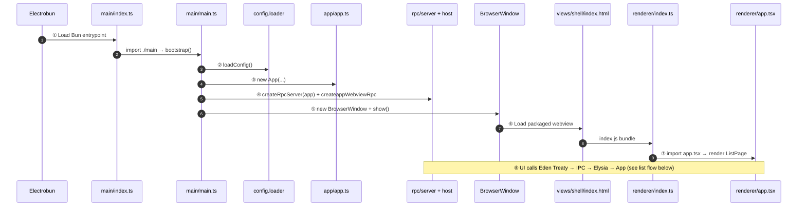
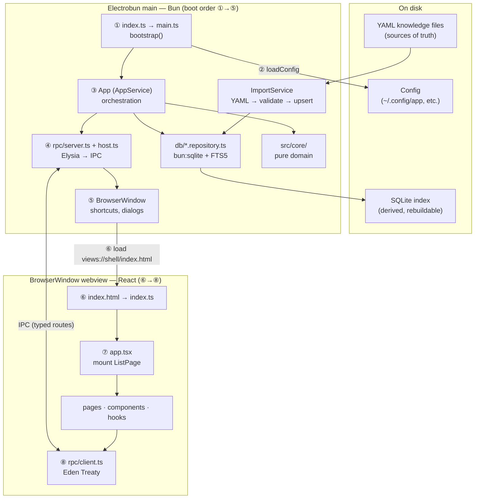
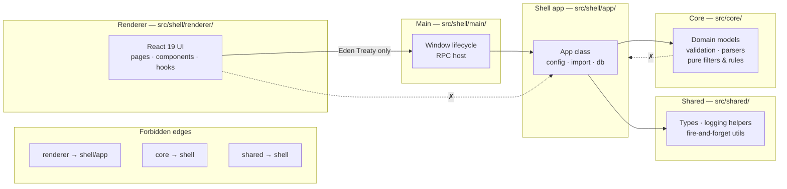
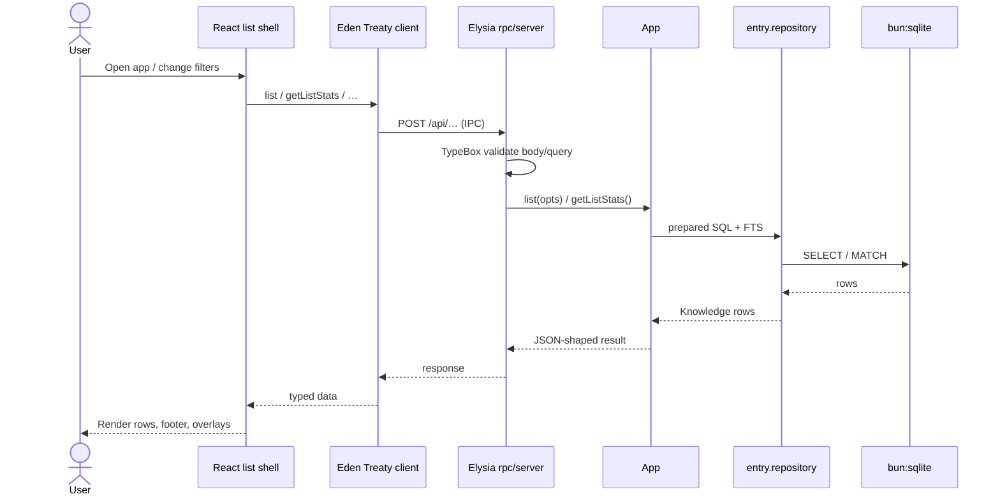
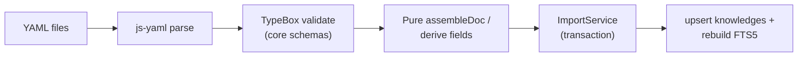

# kb

[](https://github.com/roalcantara/kb/actions/workflows/review.yml) [](https://github.com/roalcantara/kb/actions/workflows/release.yml) [](https://github.com/roalcantara/kb/actions/workflows/publish.yml)

A native desktop knowledge management app built on [Electrobun][12].

[](LICENSE) [][2] [][3] [][4] [][9] [][13]

## INSTALLATION

```sh
git clone https://github.com/roalcantara/kb
cd kb
mise run project setup
bun run install:macos
# or: mise run app install
bun run startup:enable   # optional: open kb automatically at login
# or: mise run app startup --enable
open /Applications/kb.app

To remove the installed copy later:

bun run uninstall:macos
# or: mise run app uninstall
```

## DEVELOPMENT

```sh
bun run dev       # Build and launch in dev mode (Electrobun window)
bun run build     # Production build — dist/kb.app (macOS)
bun run test      # Run unit tests
bun run e2e:smoke       # Playwright smoke (@smoke, incl. shortcuts list)
bun run e2e:regression  # Playwright regression (@regression, incl. overlay)
bun run typecheck # Type-check without emitting
bun run lint      # Run the full Phase-1 quality chain
bun run lint:fix  # Auto-fix what can be fixed (Biome / Knip / ast-grep)
mise run perf workflow-observability extract-dataset --feature tools/__tests__/fixtures/000-feature-demo
```

## CODE REVIEW GRAPH

KB uses [code-review-graph](https://github.com/tirth8205/code-review-graph)
(CRG) to maintain a local, queryable code graph for coding agents. After
cloning, run `mise run graph setup` so repo MCP configs point at your checkout
and the local graph is built. Re-run setup when moving the repo to another path.
See
[`assets/guides/CRG.md`](assets/guides/CRG.md) for purpose, setup, agent
coverage, hooks, common commands, best practices, and troubleshooting.

## Architecture

**app** is an [Electrobun][12] desktop app: a **Bun** main process owns the window,
database, filesystem, and RPC server; a **React** webview is the UI. Business rules
live in a pure **functional core**; all I/O stays in the **imperative shell**.
The renderer never touches SQLite or YAML directly — only typed RPC calls.

Normative detail: [`assets/guides/FCIS.guide.md`](assets/guides/FCIS.guide.md) ·
[`assets/guides/ELECTROBUN.md`](assets/guides/ELECTROBUN.md).

### Startup sequence (which file runs first?)

Electrobun starts the **Bun main process** first; the **React webview** loads only after
`main.ts` creates the window. `app.ts` is constructed on the main side **before** the
webview bundle runs — the renderer never imports it.

| Step | File(s)                                                                                           | What happens                                                                                |
| ---: | ------------------------------------------------------------------------------------------------- | ------------------------------------------------------------------------------------------- |
|    1 | [`electrobun.config.ts`](electrobun.config.ts) `build.bun.entrypoint`                             | Declares the Bun entry: [`src/shell/main/index.ts`](src/shell/main/index.ts).               |
|    2 | [`src/shell/main/index.ts`](src/shell/main/index.ts) → [`main.ts`](src/shell/main/main.ts)        | `index.ts` only re-exports `./main`; `main.ts` runs `bootstrap()`.                          |
|    3 | [`config.loader`](src/shell/app/config/config.loader.ts)                                          | `loadConfig()` — paths and settings before any window.                                      |
|    4 | [`app.ts`](src/shell/app/app.ts)                                                                  | `new App(config, syncEmitter, verbosity, shellHooks)` — DB, import, orchestration.          |
|    5 | [`rpc/server.ts`](src/shell/main/rpc/server.ts) + [`rpc/host.ts`](src/shell/main/rpc/host.ts)     | `createRpcServer(app)` then IPC bridge (`createappWebviewRpc`).                             |
|    6 | [`main.ts`](src/shell/main/main.ts)                                                               | `new BrowserWindow({ url: 'views://shell/index.html', rpc })` then `show()`.                |
|    7 | [`index.html`](src/shell/renderer/index.html) → bundled [`index.ts`](src/shell/renderer/index.ts) | Webview loads HTML; script runs the `shell` view entry from `build.views.shell.entrypoint`. |
|    8 | [`app.tsx`](src/shell/renderer/app.tsx)                                                           | `createRoot(#root).render(<ListPage />)` — first React paint.                               |
|    9 | [`rpc/client.ts`](src/shell/renderer/rpc/client.ts)                                               | Eden Treaty calls (e.g. list entries) — **after** mount, over IPC to step 5.                |



**Takeaway:** `main.ts` always runs before `app.tsx`. `app.ts` runs on the **main**
process during bootstrap; `app.tsx` runs in the **webview** once the window loads HTML.

### Process model (runtime)

Two OS processes cooperate: Electrobun’s **main** (Bun) and the **webview**
(Chromium). They talk over Electrobun IPC; the app-level contract on top of that
is an **Elysia** HTTP-style API consumed by **Eden Treaty** in the renderer.



Numbers **①–⑧** match [Startup sequence](#startup-sequence-which-file-runs-first) above.
Arrows inside the main box are **construction order**; YAML → import and UI → client
are **runtime data paths** after boot.

### FCIS layers (code layout)

This diagram shows **import / dependency** direction (who may call whom in code), not
**process startup order** — see [Startup sequence](#startup-sequence-which-file-runs-first).
Imports are enforced so **core** and **shared** stay free of I/O; the **renderer**
cannot import `shell/app` (use `@rpc/client` instead).



### Typical flow: open the list and load entries

Runs **after** startup step ⑧ (React mounted, Eden Treaty ready). Enough detail to
see who calls whom; not every route is shown.



Side paths (same pattern): **sync** hits `App.sync` → `ImportService`; **tasks**
and **config** use their routes; **open external / dialog / terminal** go through
`App` into Electrobun `Utils` hooks registered in `main.ts`.

### Sync path: YAML → index

The index is disposable; re-import rebuilds it. IDs are stable (`crc32(type:key)`).



### Preview server (development)

`tools/preview/server.script.ts` runs the **same Elysia `RpcApp`** over HTTP so you can
exercise list/filter behaviour in a browser without the full desktop shell. Any new
route in `rpc/server.ts` must be mirrored there ([`CLAUDE.md`](CLAUDE.md)).

### Glossary

| Term                        | Layer / location                     | Role in app                                                                                                                                                                                                                     |
| --------------------------- | ------------------------------------ | ------------------------------------------------------------------------------------------------------------------------------------------------------------------------------------------------------------------------------- |
| **Functional Core (FCIS)**  | `src/core/`                          | Pure functions: entry/knowledge models, YAML validation schemas, parsers, task-view filters, tag ranking, list options. No `fetch`, no `fs`, no `bun:sqlite`.                                                                   |
| **Shared**                  | `src/shared/`                        | Cross-cutting **pure** utilities and types (e.g. RPC payload shapes, `getLogger`, `fireAndForget`). No shell imports.                                                                                                           |
| **Imperative Shell — app**  | `src/shell/app/`                     | **App** orchestrator, config load/save, **ImportService**, `bun:sqlite` repositories, OG fetch, shell-only helpers. All durable I/O except native UI.                                                                           |
| **Imperative Shell — main** | `src/shell/main/`                    | Electrobun boot: **BrowserWindow**, global shortcuts, native dialogs/external open, **Elysia** `createRpcServer`, IPC **host** wiring sync progress events to the webview.                                                      |
| **Renderer**                | `src/shell/renderer/`                | React UI: pages (`list`, `detail`, `settings`), components, hooks. Calls **`@rpc/client`** (Eden Treaty) only.                                                                                                                  |
| **App / AppService**        | `src/shell/app/app.ts`               | Facade used by every Elysia route: list/query entries, sync, config, tasks, previews, tag suggest, window resize, etc.                                                                                                          |
| **RpcApp**                  | `src/shell/main/rpc/server.ts`       | Exported Elysia app type — single source of truth for main↔renderer API (replaces a hand-written shared schema).                                                                                                                |
| **Eden Treaty**             | `src/shell/renderer/rpc/client.ts`   | Type-safe RPC client generated from `RpcApp`; `treaty` + thin wrappers (`getList`, `getEntry`, …).                                                                                                                              |
| **TypeBox (`t.*`)**         | Routes + `src/core/**/**.schema.ts`  | Sole validation library (transport + domain + config). **Zod is not used.**                                                                                                                                                     |
| **Knowledge / entry**       | Core types + DB row                  | Bookmark, command, cheat, task, or **shortcut** row; YAML on disk, row in `knowledges`, optional FTS hit. Shortcut entries store per-app keymaps (`bindings`, optional `platform`) plus collision metadata in `entry_bindings`. |
| **ImportService**           | `src/shell/app/db/import.service.ts` | Walks sources dir, validates YAML, upserts SQLite, rebuilds FTS — transactional bulk path.                                                                                                                                      |
| **Repository**              | `src/shell/app/db/*.repository.ts`   | Typed SQL accessors; routes must not import repositories directly (go through **App**).                                                                                                                                         |
| **Electrobun IPC**          | `rpc/host.ts`                        | Bridges Elysia handlers to the webview RPC channel (`app-app`).                                                                                                                                                                 |
| **Preview server**          | `tools/preview/server.script.ts`     | HTTP mirror of production RPC for Playwright / local UI smoke tests.                                                                                                                                                            |

### Project definitions and agent routing

The canonical engineering and agent definitions are split by purpose:

| File / guide             | Purpose                                                                                                   |
| ------------------------ | --------------------------------------------------------------------------------------------------------- |
| [CLAUDE.md][24]          | Primary agent instructions: stack, FCIS layers, required skills, and reference docs.                      |
| [AGENTS.md][23]          | Repo-wide agent guardrails, commit workflow, prototype gate, and Electrobun process rules.                |
| [SKILLS.md][21]          | Skill adoption ledger: owned skills, Skills CLI-managed project skills, global companions, and rationale. |
| [SKILLS.yaml][26]        | Structured skill registry used by `mise run skill sync` and `mise run skill install`.                     |
| [MISE_GUIDE.md][22]      | Task-runner policy: prefer mise tasks for project workflows and avoid ad-hoc project scripts.             |
| [Electrobun routing][25] | Which Electrobun skill to read for desktop shell, build, platform, RPC, and automation work.              |

Skill routing follows one rule of thumb: project-specific guidance wins. Load
`app-context` for any project task, then add narrower skills such as `app-rpc`,
`app-testing`, `app-quality-gate`, or the routed Electrobun skill when the work
calls for them.

After a **worker completes a handoff prompt** (`handoff.md` or
`tmp/handoffs/*.md`), load **`app-review-handoff`** to verify AC Evidence and
emit terse findings before merge. It complements — does not replace —
`app-quality-gate` and `mise run spec gate`.

| Skill                                                              | When                                          |
| ------------------------------------------------------------------ | --------------------------------------------- |
| [`app-context`](.agents/skills/app-context/SKILL.md)               | Any project task                              |
| [`app-rpc`](.agents/skills/app-rpc/SKILL.md)                       | Elysia routes, Eden Treaty, TypeBox transport |
| [`app-testing`](.agents/skills/app-testing/SKILL.md)               | Specs, fixtures, BDD harnesses                |
| [`app-quality-gate`](.agents/skills/app-quality-gate/SKILL.md)     | Before commit or declaring done               |
| [`app-review-handoff`](.agents/skills/app-review-handoff/SKILL.md) | After worker handoff — AC + Evidence review   |
| [SDD workflow](assets/guides/SDD_WORKFLOW_GUIDE.md)                | Spec Kit phases, orchestrated-handoff, gates  |

Review-handoff CLI (deterministic prep before the LLM review pass):

```bash
mise run spec review-handoff classify --json
mise run spec review-handoff extract-evidence --feature <feature-dir>
mise run spec review-handoff prepare --feature <feature-dir> --json
mise run spec review-handoff scaffold-audit --feature <feature-dir>
```

`mise run skill install` restores Skills CLI-managed project skills from
[skills-lock.json][27] into `.agents/skills/`. Optional global companions stay
under `$HOME/.agents/skills/` unless the skill registry marks them as project
skills.

### Keyboard — command palette (⌘P) and filter (⌘K)

Product rules for the list shell (normative for implementation). Visual reference (non-normative): [raycast.list_filter_opened.png](assets/wireframe/references/raycast.list_filter_opened.png).

| Shortcut                                                     | Action                                                                                                                                                                                                                                   |
| ------------------------------------------------------------ | ---------------------------------------------------------------------------------------------------------------------------------------------------------------------------------------------------------------------------------------- |
| **⌘P** / **Ctrl+P**                                          | Toggle **command palette**. Opening the palette **closes** the filter overlay if it is open.                                                                                                                                             |
| **⌘K** / **Ctrl+K**                                          | Toggle **filter** overlay. Opening the filter **closes** the palette if it is open.                                                                                                                                                      |
| **⌘P** / **⌘K** while **settings** or **task sheet** is open | **No-op** (same suppression family as list nav).                                                                                                                                                                                         |
| **Filter** — live apply                                      | Changes apply immediately (`onChange`). **Esc**, **click-outside**, and **⌘K** only **close** the overlay — **no** staged undo of filter state.                                                                                          |
| **Filter** — **↑/↓**                                         | Move highlight in a **flat** filter list only; **do not** change main list **`selectedId`**.                                                                                                                                             |
| **Filter** — **Enter** (commit path)                         | Compare current `{ types, tags, taskView }` to a **snapshot taken when the overlay opened** (tags sorted for equality). **Unchanged** → neutral toast, close, restore focus. **Changed** → optional success toast, close, restore focus. |
| **Full detail** + filter **Enter** + **changed**             | Same as commit path, and **also** leave full detail for **list view** (e.g. `closeToList`). **Esc** / toggle / click-outside without that Enter path → close overlay only, **no** forced list view.                                      |
| **Palette** — **↑/↓**                                        | Palette internal navigation only (unchanged); **not** main list selection.                                                                                                                                                               |
| **Palette** — actions                                        | **Entry-first** sections: This entry → Clipboard → Source → Library → App. With **`selectedId === null`**: Library (Sync, New Task) then App (Quit). Headers are non-selectable.                                                         |
| **Implementation**                                           | Prefer **`keydown` capture** on `window` (or one coordinator). Rename legacy **`cmdk_palette`** / **`app-cmdk-*`** to **`command_palette`** / **`app-command-palette-*`**.                                                               |

### Keyboard — shortcuts quick-lookup (⌘/)

Global overlay for finding keymap bindings by action text or chord, with
collision analysis. See [`assets/guides/TESTING_GUIDE.md`](assets/guides/TESTING_GUIDE.md) for e2e policy; shipped behavior is registered in the feature catalog (`mise run catalog list`).

| Shortcut                           | Action                                                                                                     |
| ---------------------------------- | ---------------------------------------------------------------------------------------------------------- |
| **⌘/** / **Ctrl+/**                | Toggle **quick-lookup overlay** from the list shell (focused search input).                                |
| **Esc**                            | Close overlay; focus returns to the main list search field.                                                |
| **⌘K** / **Ctrl+K** (overlay open) | Open overlay **filter modal** (app scope) — does not open the list filter overlay.                         |
| **Text mode**                      | Type an action name (e.g. `go to file`) to search bindings via FTS.                                        |
| **Chord mode**                     | Type a canonical chord (e.g. `meta+p`) to show a conflicts-first card across apps.                         |
| **List integration**               | Filter by type **shortcut**; open keymap detail; drill into chord detail with **↵** and return with **←**. |

Shortcut YAML lives under a top-level `shortcuts:` block in source files; import
upserts `knowledges.bindings` / `platform` and rebuilds FTS (including binding
action text). E2e coverage: `@spec:shortcuts` in `shortcuts_list.feature` (smoke)
and `shortcuts_overlay.feature` (regression).

### CI mirror tasks

The same checks GitHub Actions runs are mirrored locally via [Mise][6]:

```sh
mise run ci review              # lint + test + Linux smoke build
mise run ci release --dry-run   # preview the next release-it run
mise run ci release --notes     # preview only the next CHANGELOG entry
  mise run ci publish package --version=0.1.0 --target=linux-x64  # build + package + checksum
```

See the [CI / CD guide][20] for the full task table.

### Debug logging

Enable verbose request tracing and SQL logging:

```sh
LOG_LEVEL=verbose bun run dev   # RPC start/complete lines
LOG_LEVEL=debug bun run dev     # + SQL queries with duration
LOG_LEVEL=trace bun run dev     # + SQL bind values, row data
```

See `assets/guides/LOGGING_GUIDE.md` for the full reference.

### Miscellaneous mise tasks

Run `mise tasks ls` for the live task list. These tasks cover local setup,
agent skill wiring, UI smoke checks, and maintenance workflows:

| Task                             | Use when                                                                                                 |
| -------------------------------- | -------------------------------------------------------------------------------------------------------- |
| `mise run project setup`         | Installing tool versions, dependencies, and hooks after cloning.                                         |
| `mise run prepare`               | Refreshing Bun dependencies and commit hooks without reinstalling tools.                                 |
| `mise run skill sync`            | Rewriting generated skill routing snippets from `assets/catalog/SKILLS.yaml`.                            |
| `mise run skill install`         | Restoring Skills CLI-managed project skills from `skills-lock.json`.                                     |
| `mise run test e2e --smoke`      | Playwright smoke suite (`bun run e2e:smoke`) — list nav, filters, shortcuts list.                        |
| `mise run test e2e --regression` | Playwright regression suite — overlay, tasks, settings, shortcuts overlay.                               |
| `mise run test e2e-preview`      | Legacy preview list-nav Playwright spec (`e2e/preview_list_nav.e2e.spec.ts`).                            |
| `mise run project icons`         | Auditing SVG contrast against the list shell background; use `--fix` only for curated safe replacements. |
| `mise run project repo setup`    | Creating the GitHub repo and required CI secrets / variables.                                            |
| `mise run project repo prune`    | Deleting the GitHub repo, releases, and tags for a reset. Use with care.                                 |
| `mise run project repo reset`    | Rebuilding the CI fix branch from the scripted recovery path.                                            |

### DEPENDENCIES

- [Git][5] — version control
- [Mise][6] — tool version management
  - [Bun][11] — runtime, package manager, bundler, test runner
    - [Electrobun][12] — desktop app framework
    - [React][13] — renderer
    - [TypeScript][10] — type safety
    - [Biome][13] — lint and format
    - [Knip][14] — unused files and dependencies
    - [dependency-cruiser][15] — dependency rules ([`.dependency-cruiser.cjs`](.dependency-cruiser.cjs))
    - [ls-lint][16] — file and folder naming convention enforcement ([`.ls-lint.yml`](.ls-lint.yml))
    - [jscpd][17] — copy-paste / duplication detection
  - [hk][7] — git hook manager
  - [ast-grep][18] — code structural search, lint, rewriting at large scale
  - HK commit-message policy — `bun packages/ops/src/governance/policies/hooks/commit_message.script.ts`

## CI / CD

Three workflows handle review, release, and publishing:

| Workflow      | Trigger                                         | Outcome                                   |
| ------------- | ----------------------------------------------- | ----------------------------------------- |
| `review.yml`  | PR opened / synchronized                        | Lint + test + Linux smoke build           |
| `release.yml` | Push to `main` (squash-merged PR)               | Draft GitHub Release via [release-it][19] |
| `publish.yml` | After Release succeeds (or `workflow_dispatch`) | Native binaries → un-drafted Release      |

Build targets:

| Target         | Runner             | Artifact                                                  |
| -------------- | ------------------ | --------------------------------------------------------- |
| `linux-x64`    | `ubuntu-latest`    | `kb-<ver>-linux-x64.tar.gz`                               |
| `linux-arm64`  | `ubuntu-24.04-arm` | `kb-<ver>-linux-arm64.tar.gz`                             |
| `darwin-arm64` | `macos-latest`     | `kb-<ver>-darwin-arm64.dmg` (or `-unsigned.dmg` fallback) |

macOS code signing is gated by `ELECTROBUN_DEVELOPER_ID`; if unset, the mac
leg produces an unsigned `.dmg` that can be installed with
`xattr -d com.apple.quarantine /Applications/kb.app`.

See the [CI / CD guide][20] for full operational detail (secrets,
provisioning, troubleshooting, local mirroring).

## ACKNOWLEDGEMENTS

- [Standard Readme][4]
- [Conventional Commits][9]

## CONTRIBUTING

- Bug reports and pull requests are welcome on [GitHub][0]
- Do follow [Editor Config][3] rules.
- Everyone interacting in the project's codebases, issue trackers, chat rooms and mailing lists is expected to follow the [Contributor Covenant][2] code of conduct.

## LICENSE

The project is available as open source under the terms of the [MIT][1] [License](LICENSE)

[0]: https://github.com/roalcantara/kb 'kb'
[1]: https://opensource.org/licenses/MIT 'Open Source Initiative'
[2]: https://contributor-covenant.org 'A Code of Conduct for Open Source Communities'
[3]: https://editorconfig.org 'EditorConfig'
[4]: https://github.com/RichardLitt/standard-readme 'Standard Readme'
[5]: https://git-scm.com 'Distributed version control system'
[6]: https://mise.jdx.dev 'Manages dev tools like node, python, cmake, terraform, and hundreds more'
[7]: https://github.com/brpylko/hk 'Git hook manager for monorepos'
[9]: https://conventionalcommits.org 'Conventional Commits'
[10]: https://typescriptlang.org
[11]: https://bun.sh
[12]: https://blackboard.sh/electrobun
[13]: https://react.dev
[14]: https://github.com/webpro/knip 'Dependency analysis'
[15]: https://github.com/sverweij/dependency-cruiser 'Dependency graphing and circular-dep detection'
[16]: https://github.com/ls-lint/ls-lint 'File and folder naming convention enforcement'
[17]: https://github.com/kucherenko/jscpd 'Copy-paste / duplication detection'
[18]: https://ast-grep.github.io 'Code structural search, lint, rewriting at large scale'
[19]: https://github.com/release-it/release-it 'release-it'
[20]: assets/guides/CI_GUIDE.md 'CI / CD operational guide'
[21]: assets/guides/SKILLS.md 'Project skill guide'
[22]: assets/guides/MISE_GUIDE.md 'Mise task guidelines'
[23]: AGENTS.md 'Agent notes'
[24]: CLAUDE.md 'Claude Code instructions'
[25]: .cursor/electrobun-skill-routing.md 'Electrobun skill routing'
[26]: assets/catalog/SKILLS.yaml 'Structured skill registry'
[27]: skills-lock.json 'Skills CLI project lock file'
