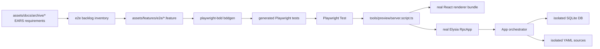

<!-- markdownlint-disable-file -->
# End-to-end regression suite - Design

## Overview

The recommended approach is a deterministic Playwright BDD suite built on the
existing preview server, not a second e2e stack. The current repo already has:

- `playwright.config.ts` pointing at `e2e/`.
- `e2e/preview_list_nav.e2e.spec.ts` proving Chromium can exercise the real
  renderer bundle.
- `tools/preview/server.script.ts` building the renderer and mounting the same Elysia
  `RpcApp` used by the desktop main process.
- Extensive unit/component specs that identify high-risk flows.

The current weakness is trust: preview e2e reads the developer's real app
config and skips when the DB is empty. The suite SHALL first make e2e state
deterministic, then add Gherkin and Screenplay-style automation on top.

## Approach comparison

### Option A - Playwright BDD on the preview harness

Use `playwright-bdd` for `.feature` files, generated Playwright tests, tags,
and Playwright traces. Keep Playwright as the runner.

Pros:

- Reuses current Playwright config and preview harness.
- Keeps traces, HTML report, fixtures, projects, and CI behavior in one runner.
- Maps naturally from EARS to Gherkin.
- Lowest dependency and migration cost.

Cons:

- Requires disciplined step design to avoid bloated step definitions.
- Browser-preview e2e still does not prove native Electrobun-only behavior.

Decision: choose this as the foundation.

### Option B - Cucumber.js plus `@cucumber/screenplay`

Run Cucumber directly and model flows through actors, abilities, tasks, and
questions.

Pros:

- Strong acceptance-test vocabulary.
- Step definitions can become very small.

Cons:

- Adds a second runner beside Playwright Test.
- More integration work for traces, preview server lifecycle, and CI reports.
- More risk during the release-stabilization window.

Decision: use the Screenplay shape inside Playwright BDD first. Add the package
only if a spike proves it works cleanly with Playwright BDD fixtures.

### Option C - CodeceptJS with Playwright helper

Use CodeceptJS as the e2e DSL and Playwright as its browser automation backend.

Pros:

- Human-readable actor-like test code.
- Mature Playwright helper.

Cons:

- Introduces another runner, config format, assertion model, and reporting
  stack.
- Duplicates value already covered by Playwright BDD plus local Screenplay
  conventions.
- Higher maintenance cost for a team already invested in Bun, Playwright, and
  SDD.

Decision: defer. Reconsider only if Playwright BDD produces high maintenance
cost after the P0/P1 suite is implemented.

### External references and rationales

The approach comparison above is not arbitrary. It follows conventions from
widely used BDD and Screenplay sources. Implementors SHOULD read these before
writing step definitions or changing feature files.

| Source                    | URL                                                                                               | What kb adopts                                                                                                                    | What kb defers                                                                         |
| ------------------------- | ------------------------------------------------------------------------------------------------- | --------------------------------------------------------------------------------------------------------------------------------- | -------------------------------------------------------------------------------------- |
| Cucumber docs             | [cucumber.io/docs](https://cucumber.io/docs)                                                      | Gherkin as executable spec; Given=state, When=action, Then=observable outcome; unique step text across keywords; short Background | Ruby/JVM runners; World hooks as primary harness                                       |
| Serenity Screenplay       | [Screenplay fundamentals](https://serenity-bdd.github.io/docs/screenplay/screenplay_fundamentals) | Actor, abilities, tasks, questions; group browser work into business tasks                                                        | Serenity reports, WebDriverManager, Java stack                                         |
| `@cucumber/screenplay.js` | [github.com/cucumber/screenplay.js](https://github.com/cucumber/screenplay.js)                    | Thin step defs (`actor.attemptsTo`, `actor.ask`); `remember`/`recall`; `eventually` for async                                     | `ActorWorld` + Cucumber.js runner until T1.1 spike proves Playwright BDD compatibility |
| CodeceptJS                | [codecept.io/tutorial](https://codecept.io/tutorial)                                              | Role/name locator priority; actor-shaped readable steps                                                                           | Second runner, config, and assertion stack (Option C)                                  |
| Playwright BDD            | project skill `playwright-bdd-gherkin-syntax`                                                     | `bddgen`, tag inheritance, `@skip`/`@fixme` mapping                                                                               | —                                                                                      |

**Rationale for local Screenplay inside Playwright BDD:** kb already commits to
Playwright Test for traces, webServer lifecycle, and CI. `@cucumber/screenplay`
targets Cucumber.js World, which duplicates runner responsibilities. T1.1 SHALL
confirm whether the package integrates with Playwright BDD fixtures; until then,
implement `e2e/screenplay/*` with the same vocabulary (`attemptsTo`, `asksWhether`,
`remember`, `recall`, `eventually`) without adding a second test runner.

**Rationale for deferring CodeceptJS:** Codecept's `I` actor pattern overlaps
Screenplay + thin step defs. kb would maintain Playwright config, Codecept config,
and Gherkin generation in parallel. The Codecept tutorial's locator guidance
(role/name first) is copied into kb's interaction layer policy instead.

**Normative companion docs (this spec):**

- [`fixture-manifest.md`](fixture-manifest.md) — seeded titles, tags, ordering, actor memory keys.
- [`step-catalog.md`](step-catalog.md) — every Gherkin phrase, Screenplay mapping, scenario IDs.
- [`scenario-scores.schema.json`](scenario-scores.schema.json) — sidecar for quality scores merged into metrics.

## Architecture



The suite has four layers:

| Layer      | Role                                                  | Files                                                     |
| ---------- | ----------------------------------------------------- | --------------------------------------------------------- |
| Behavior   | Living Gherkin scenarios and tags                     | `assets/features/e2e/*.feature`                           |
| Glue       | Thin step definitions                                 | `e2e/steps/*.steps.ts`                                    |
| Screenplay | Reusable abilities, tasks, questions, interactions    | `e2e/screenplay/*.{ability,task,question,interaction}.ts` |
| Harness    | Deterministic config, fixture seed, preview lifecycle | `e2e/support/*.support.ts`, `tools/preview/server.script.ts`     |

No production code under `src/` is required for the first task unless the
preview server cannot accept an isolated config through existing inputs.

### Feature path decision

Canonical Gherkin files SHALL live in `assets/features/e2e/`.

This is the middle ground between the usual root-level `features/` convention
and keeping everything under `assets/docs/`. It follows the working Dots shape
of `assets/features/<domain>/`, avoids making the project root busier, and keeps
executable living documentation separate from SDD planning documents.

The execution glue stays in `e2e/` because Playwright, traces, generated tests,
and harness code are test infrastructure rather than product-facing living
documentation.

## Database environments (structural isolation)

kb adopts the Rails convention of **one database world per environment**,
selected by configuration profile — not by remembering a one-off env var in a
single shell session.

| Profile         | `NODE_ENV`             | Config                                    | SQLite database                            | Sources                   | Typical commands                                                                      |
| --------------- | ---------------------- | ----------------------------------------- | ------------------------------------------ | ------------------------- | ------------------------------------------------------------------------------------- |
| **development** | `development` or unset | `~/.config/kb/config.yaml`                | `~/.config/kb/knowledge.sqlite`            | `~/.config/kb/sources/`   | `bun dev`, `electrobun dev`, ad-hoc preview                                           |
| **test**        | `test`                 | Isolated test config (see below)          | Isolated file under temp or `tmp/kb-test/` | Release fixture YAML only | `mise run test e2e --smoke`, `mise run test e2e --regression`, Playwright `webServer` |
| **production**  | `production`           | Packaged or explicit prod config (future) | User or release path                       | User sources              | Stable/desktop distribution (out of e2e scope)                                        |

**Normative rules:**

1. WHEN `NODE_ENV` is `test`, the app and preview server SHALL load the **test**
   profile and SHALL NOT read or write `~/.config/kb/knowledge.sqlite` unless the
   operator explicitly overrides with a documented escape hatch (maintainer-only).
2. WHEN `NODE_ENV` is not `test`, default config resolution SHALL remain
   **development** (`~/.config/kb/…`) so `bun dev` never shares the e2e database.
3. All project entrypoints that run browser e2e (`mise run test e2e …`,
   Playwright `webServer`, `bun e2e/support/preview_with_fixture.support.ts`)
   SHALL set `NODE_ENV=test` in the child process environment.
4. Unit and integration tests under `bun test` already use `:memory:` SQLite per
   [`TESTING_GUIDE.md`](../../../guides/TESTING_GUIDE.md); that layer is unchanged.
   Browser e2e uses **file-backed** isolated SQLite in the test profile (sync
   deletes and re-imports the file; plain `:memory:` is not compatible with the
   current sync lifecycle — see notes in prior design review).

**Config resolution order (target, after T2.4):**

```txt
explicit path argument
  → APP_CONFIG_PATH (override, any profile)
  → NODE_ENV === 'test' ? test profile paths : development defaults
```

**Test profile layout (target):**

- Harness creates temp dir `kb-e2e-*` (or gitignored `tmp/kb-test/` per run) with
  `config.yaml`, `knowledge.sqlite`, and `sources/` seeded from
  [`fixture-manifest.md`](fixture-manifest.md).
- `APP_CONFIG_PATH` MAY still point at that `config.yaml` for compatibility, but
  e2e commands SHALL NOT depend on the operator exporting it manually.

**Why this matters:** The interim `APP_CONFIG_PATH`-only hook isolates e2e when
the harness runs correctly, but `bun dev` still uses development paths. Fixture
rows such as `Release Bookmark` in the dev app mean **development was synced or
imported with fixture data**, not that e2e failed to isolate during a proper run.

**Optional guard (T2.4):** WHEN `NODE_ENV` is not `test` and a sync request targets
sources that match the release fixture manifest (for example titles tagged
`regression` in the seed), the server SHOULD refuse or warn before mutating the
development database.

### Implementation status

| Piece                                                    | Status                                 |
| -------------------------------------------------------- | -------------------------------------- |
| Temp fixture + seed YAML                                 | Done (T2.1, `seed_fixture.support.ts`) |
| `APP_CONFIG_PATH` in `loadConfig`                        | Done (T2.2)                            |
| `preview_with_fixture.support.ts` as `webServer` command | Done                                   |
| `NODE_ENV=test` profile in `loadConfig` / main / preview | **Pending — T2.4**                     |
| `mise run test e2e` exports `NODE_ENV=test`              | **Pending — T2.4**                     |
| Sync guard for development profile                       | **Optional — T2.4**                    |

## Deterministic harness

The preview server calls `loadConfig()`. For e2e, the **test** profile supplies
an isolated config path, database, and sources directory.

**Interim (implemented):**

- `preview_with_fixture.support.ts` calls `createFixture()`, sets
  `APP_CONFIG_PATH` to the temp `config.yaml`, and starts the preview server.
- Playwright `webServer` uses that script so steps and server share one temp dir.
- Steps read `e2e/.fixture-paths.json` for sync `sourcesDir`.

**Target (T2.4):** the same behavior, but `NODE_ENV=test` is always set by mise
and Playwright, and `loadConfig()` selects the test profile even if
`APP_CONFIG_PATH` was left unset in the parent shell.

The seed SHALL match [`fixture-manifest.md`](fixture-manifest.md). Summary:

| Entry                                    | Purpose                                 |
| ---------------------------------------- | --------------------------------------- |
| Bookmark with URL and tags               | list, detail, open/copy, tag filter     |
| Command with shell text                  | list, copy/paste action, source section |
| Cheat with markdown notes                | detail rendering and search             |
| Task todo/mid/no due date                | task base rendering                     |
| Task doing/high/today                    | status and priority filters             |
| Task done/urgent/overdue with dependency | task views and dependency graph         |

### Legacy preview smoke

`e2e/preview_list_nav.e2e.spec.ts` predates the BDD harness. It uses stale
`.theme-*` selectors, skips when the DB is empty, and reads the developer's
real config. T1.0 SHALL port its behavior to Gherkin or delete it before T4.4
claims keyboard navigation coverage. Release smoke SHALL NOT skip on empty data
(R1, R3).

Footer copy for list batches uses **total + showing** semantics (not `Page N of
M`). Step catalog and search scenarios SHALL assert filtered counts accordingly.

## BDD conventions

Feature files SHALL use these tags:

| Tag                 | Meaning                                                       |
| ------------------- | ------------------------------------------------------------- |
| `@e2e`              | Browser-level scenario                                        |
| `@smoke`            | Fast release smoke scenario                                   |
| `@regression`       | Full regression scenario                                      |
| `@p0`, `@p1`, `@p2` | Priority                                                      |
| `@spec:<slug>`      | Source SDD spec slug                                          |
| `@todo`             | Not automated yet, excluded from gates                        |
| `@native`           | Requires packaged Electrobun/native behavior later            |
| `@visual`           | Contains stable screenshot assertion                          |
| `@fixture-mutation` | Harness writes YAML/config before the scenario (catalog only) |

Playwright BDD also recognizes `@skip`, `@fixme`, and `@fail`. kb maps `@todo`
to gate exclusion; do not use `@skip` for planned work — use `@todo` so metrics
can count automation debt.

### Generation pipeline

```sh
bunx bddgen --tags "@smoke and not @todo"
bunx playwright test --project=chromium
```

Generated tests SHALL live under `e2e/.generated/` (gitignored, knip-excluded).
Feature-level tags inherit to scenarios for `bddgen` filtering and metrics
parsing. Undefined steps SHALL fail at generation time, not at runtime.

Optional Gherkin polish: group related scenarios with `Rule:` blocks (Cucumber
reference) when a feature grows beyond ~5 scenarios — see
`search_and_filter.feature` type vs task-view groups.

Scenario text SHALL stay user-facing:

```gherkin
@e2e @smoke @p0 @spec:renderer-nav-flow
Feature: List and detail navigation

  Background:
    Given the app is running with the release e2e fixture

  Scenario: Keyboard navigation cycles list, split, full detail, and list
    Given I am viewing the knowledge list
    When I move to the first entry
    And I open the detail preview
    And I expand the detail view
    And I return to the list view
    Then the list search is focused
    And no detail panel is visible
```

## Screenplay conventions

Full phrase inventory: [`step-catalog.md`](step-catalog.md).

Step definitions SHALL remain one or two lines where possible:

```ts
When('I open the detail preview', async ({ actor }) => {
  await actor.attemptsTo(OpenDetailPreview.forSelectedEntry())
})
```

The point is not ceremony. The point is to make each layer answer one question:

- Feature file: what behavior matters?
- Step definition: which business action/question is being invoked?
- Screenplay task: how does a user perform that action?
- Screenplay question: how do we observe the result?
- Locator layer: where are stable browser targets defined?

### Actor memory and async (from `@cucumber/screenplay.js`)

Cross-step state SHALL use explicit recall keys from
[`fixture-manifest.md#actor-memory-keys`](fixture-manifest.md#actor-memory-keys),
not closure variables inside step files:

```ts
await actor.remember('selectedEntryTitle', title)
const selected = await actor.recall<string>('selectedEntryTitle')
```

Async UI (sync modal, frecency reorder, toast feedback) SHALL use an
`eventually` helper with Playwright expect polling — not fixed `sleep()`.

**When vs Then:** mutating work uses `actor.attemptsTo(task)`; assertions use
`actor.asksWhether(question)` (equivalent to screenplay.js `actor.ask`). Do not
assert inside tasks except when a task is explicitly a composite workflow used
only from other tasks.

### Screenplay examples

#### Example 1 - a high-quality step

```gherkin
When I open the detail preview
Then the detail panel shows the selected entry
```

```ts
When('I open the detail preview', async ({ actor }) => {
  await actor.attemptsTo(OpenDetailPreview.forSelectedEntry())
})

Then('the detail panel shows the selected entry', async ({ actor }) => {
  await actor.asksWhether(DetailPanel.matchesSelectedEntry())
})
```

The step has no selectors, no keyboard mechanics, and no assertion details. It
names a user-visible action and a user-visible outcome.

#### Example 2 - task and interaction split

```ts
export class OpenDetailPreview {
  static forSelectedEntry() {
    return new OpenDetailPreview()
  }

  async performAs(actor: Actor) {
    await actor.attemptsTo(PressKey.named('ArrowRight'))
  }
}

export class PressKey {
  static named(key: string) {
    return new PressKey(key)
  }

  constructor(private readonly key: string) {}

  async performAs(actor: Actor) {
    const page = BrowseApp.as(actor).page
    await page.keyboard.press(this.key)
  }
}
```

`OpenDetailPreview` knows the business action. `PressKey` knows the browser
interaction. If the UI later changes from ArrowRight to Enter or a button click,
the scenario and step definition stay stable.

#### Example 3 - question with meaningful assertion

```ts
export class DetailPanel {
  static matchesSelectedEntry() {
    return new DetailPanel()
  }

  async answeredBy(actor: Actor) {
    const page = BrowseApp.as(actor).page
    const selected = await EntryList.selectedEntryName().answeredBy(actor)
    await expect(page.getByRole('region', { name: 'Entry detail' })).toContainText(selected)
  }
}
```

This proves that the detail panel reflects the selected row. A weaker assertion
such as `expect(page.locator('.cmp-detail')).toBeVisible()` only proves that a
container exists.

#### Example 4 - poor implementation to reject

```ts
When('I open the detail preview', async ({ page }) => {
  await page.locator('.cmp-list-row').first().click()
  await page.keyboard.press('ArrowRight')
  await expect(page.locator('.cmp-detail')).toBeVisible()
})
```

Reject this shape because it mixes setup, action, selector details, and
assertion in one step; it uses implementation classes; and it checks a weak
container-level outcome.

Recommended artifact suffixes:

| Artifact         | Pattern                 | Example                          |
| ---------------- | ----------------------- | -------------------------------- |
| Step definitions | `<flow>.steps.ts`       | `list_navigation.steps.ts`       |
| Ability          | `<name>.ability.ts`     | `browse_app.ability.ts`          |
| Task             | `<name>.task.ts`        | `open_detail_preview.task.ts`    |
| Question         | `<name>.question.ts`    | `visible_entry_rows.question.ts` |
| Interaction      | `<name>.interaction.ts` | `press_shortcut.interaction.ts`  |
| Support          | `<name>.support.ts`     | `seed_fixture.support.ts`        |

Selectors SHALL prefer:

1. `page.getByRole(...)` with accessible names.
2. Stable `data-testid` attributes if role/name cannot express the target.
3. CSS classes only when asserting a styling contract and the class is
   intentionally stable.

If adding test ids under `src/` becomes necessary, each addition must be
minimal, user-invisible, and covered by existing component intent.

## Quality model

Each implemented scenario SHALL be scored during task review. The command can
be green and the scenario can still fail review if it is low quality.

| Category                   | Points | How to measure                                                                                         |
| -------------------------- | -----: | ------------------------------------------------------------------------------------------------------ |
| Business priority coverage |     20 | P0/P1 backlog item is implemented, not just tagged; source specs are referenced with `@spec:<slug>`    |
| Scenario quality           |     15 | Gherkin uses user-facing language, clear Given/When/Then boundaries, no selectors/RPC names/classes    |
| Assertion strength         |     20 | Then steps prove meaningful user-visible or public persistence/RPC outcomes, not only element presence |

Assertion strength tiers (Cucumber Then guidance + kb policy):

| Tier    | Example                                        | P0 smoke         |
| ------- | ---------------------------------------------- | ---------------- |
| Strong  | Detail region contains selected title and tags | Required         |
| Medium  | Footer matches filtered-count pattern          | Allowed          |
| Weak    | Container visible (`.cmp-detail`) only         | **Fails review** |
| Invalid | SQLite counts, private RPC fields              | **Reject**       |

Persistence assertions (`fixture task source includes …`) are valid when they
read user-inspectable YAML paths documented in the fixture manifest — not when
they query the DB directly.
| Determinism                |     15 | Scenario uses isolated fixture data, no real user config, no sleeps, no conditional skips for valid seed   |
| Screenplay structure       |     15 | Steps delegate to tasks/questions/interactions; selector policy is centralized; step definitions stay thin |
| Maintainability            |     10 | Reuses existing tasks/questions, avoids duplicated setup, keeps scenario variants in Examples tables       |
| Diagnostics                |      5 | Failure leaves trace/report and scenario name identifies the broken behavior                               |

Thresholds:

| Scenario tier             |                       Minimum score |
| ------------------------- | ----------------------------------: |
| P0 smoke                  |                                  85 |
| P1 regression             |                                  80 |
| P2 deferred/native/visual | 75 before joining an automated gate |

Coverage reporting SHALL track two dimensions: whether the right behaviors are
covered, and whether the implemented tests are strong enough to trust.

| Metric                   | Target before release                                                               |
| ------------------------ | ----------------------------------------------------------------------------------- |
| P0 scenario automation   | 100% implemented or explicitly deferred as `@native` with reason                    |
| P1 scenario automation   | At least 80% implemented, remaining items tagged `@todo` with owner/task            |
| Source spec traceability | 100% of automated scenarios carry at least one `@spec:<slug>` tag                   |
| Weak assertion count     | 0 P0 scenarios whose final Then only checks generic visibility                      |
| Conditional skip count   | 0 smoke scenarios skipped for ordinary seeded data                                  |
| Flake tolerance          | 0 known flakes in smoke; regression flakes must be quarantined outside release gate |

Reviewer checklist for a scenario:

1. Can a product maintainer understand the scenario without reading test code?
2. Does the scenario protect a behavior from the P0/P1 backlog?
3. Would the test fail if the behavior were broken but the page still rendered?
4. Does fixture setup make the expected data unambiguous?
5. Are selectors hidden behind tasks/questions/interactions?
6. Does the failure report name the behavior clearly enough to triage?

## Metrics registry

The quality model SHALL produce durable metrics, not only review notes. The
implementation SHALL write two forms of output:

| Output           | Path                                                   | Lifecycle                                                                 |
| ---------------- | ------------------------------------------------------ | ------------------------------------------------------------------------- |
| Run report       | `tmp/e2e/metrics/latest.json` and timestamped siblings | Generated on every smoke/regression run and uploaded by CI when available |
| Release baseline | `tools/metrics/baselines/e2e-quality/quality-baseline.json` | Updated deliberately at release or milestone boundaries after review      |

The run report is operational evidence. It may change on every run and should
not be committed by default. The release baseline is the stable comparison point
for measuring whether the app is improving or degrading over time.

Recommended report shape:

```json
{
  "schemaVersion": 1,
  "generatedAt": "2026-05-27T12:00:00.000Z",
  "command": "mise run test e2e --smoke",
  "commit": "unknown",
  "branch": "unknown",
  "durationMs": 0,
  "summary": {
    "scenarioCount": 0,
    "implementedCount": 0,
    "todoCount": 0,
    "deferredNativeCount": 0,
    "unitOnlyCount": 0,
    "p0AutomationPercent": 0,
    "p1AutomationPercent": 0,
    "averageP0QualityScore": 0,
    "averageP1QualityScore": 0,
    "weakAssertionCount": 0,
    "conditionalSkipCount": 0,
    "knownFlakeCount": 0
  },
  "degradations": [],
  "scenarios": [
    {
      "id": "list_navigation.keyboard_cycles_views",
      "feature": "assets/features/e2e/list_navigation.feature",
      "priority": "p0",
      "status": "implemented",
      "specs": ["renderer-nav-flow", "foundation"],
      "qualityScore": 90,
      "scoreBreakdown": {
        "businessPriorityCoverage": 20,
        "scenarioQuality": 15,
        "assertionStrength": 18,
        "determinism": 15,
        "screenplayStructure": 14,
        "maintainability": 8,
        "diagnostics": 5
      },
      "weakAssertions": 0,
      "conditionalSkips": 0,
      "knownFlakes": 0,
      "lastResult": "passed"
    }
  ]
}
```

### Metric computation

| Field                   | Source                                                                                  |
| ----------------------- | --------------------------------------------------------------------------------------- |
| `implementedCount`      | Scenarios without `@todo` where `bddgen` emits a test                                   |
| `todoCount`             | Parse `@todo` from feature files                                                        |
| `deferredNativeCount`   | Parse `@native`                                                                         |
| `p0AutomationPercent`   | Implemented ÷ total P0 scenarios                                                        |
| `weakAssertionCount`    | Sum from [`scenario-scores.json`](scenario-scores.schema.json) sidecar or manual review |
| `conditionalSkipCount`  | Playwright `test.skip` in smoke — **must be 0**                                         |
| `undefinedSteps`        | Non-zero `bddgen` exit / missing step in catalog                                        |
| `averageP0QualityScore` | Mean `qualityScore` for `@p0` in sidecar                                                |

Human scores live in `tools/metrics/baselines/e2e-quality/scenario-scores.json` (validated by
[`scenario-scores.schema.json`](../../../tools/metrics/baselines/e2e-quality/scenario-scores.schema.json)). Automated run
output merges sidecar + Playwright results into `tmp/e2e/metrics/latest.json`.

Commands (implemented in T1.3 / T6.5):

```sh
mise run test e2e --metrics-report
mise run test e2e --metrics-compare
mise run test e2e --write-baseline   # maintainer-only after review
```

The comparison step SHALL classify changes:

| Change                                                   | Classification               |
| -------------------------------------------------------- | ---------------------------- |
| P0 automation percentage decreases                       | Release-blocking degradation |
| Any P0 scenario falls below 85                           | Release-blocking degradation |
| Weak P0 assertion count rises above 0                    | Release-blocking degradation |
| Smoke conditional skip count rises above 0               | Release-blocking degradation |
| Known smoke flake count rises above 0                    | Release-blocking degradation |
| P1 automation percentage decreases without deferral note | Regression degradation       |
| Average P1 score decreases by 5 or more points           | Regression degradation       |
| Scenario gains `@todo` after being implemented           | Regression degradation       |
| P0/P1 automation or score improves                       | Improvement                  |

The metrics registry should answer four release questions:

1. Are the most important flows covered today?
2. Are those tests strong enough to trust?
3. Did this increment reduce coverage, determinism, or assertion quality?
4. Is the release baseline being moved intentionally, with review evidence?

## Backlog extraction model

The first implementation task SHALL create a checked-in e2e backlog, either in
`tasks.md` evidence or a generated `backlog.md` if the inventory is too large
for task evidence.

Priority rules:

| Priority | Definition                                   | Example flows                                                               |
| -------- | -------------------------------------------- | --------------------------------------------------------------------------- |
| P0       | Blocks basic daily use or release confidence | sync seed, list render, search, filter, keyboard nav, detail, copy/open     |
| P1       | High-use feature or high regression risk     | command palette, task CRUD, settings, frecency, sync UI                     |
| P2       | Useful but lower-frequency or expensive      | visual snapshots, error modals, native-only shell behavior, packaging smoke |
| P3       | Long-tail or speculative                     | rare edge cases already covered by unit tests                               |

Initial P0/P1 candidate backlog from the current scan:

| Priority | Flow                                            | Source evidence                                                      |
| -------- | ----------------------------------------------- | -------------------------------------------------------------------- |
| P0       | Deterministic preview fixture and app boot      | `tools/preview/server.script.ts`, `playwright.config.ts`, `app-service-rpc` |
| P0       | List renders all entry types                    | `foundation`, `data-layer`, renderer list components                 |
| P0       | Search filters entries and updates footer       | `list-frecency-sort`, list hooks/util specs                          |
| P0       | Type/tag/task-view filter overlay               | `command-palette-filter-ux`, `compact-filter-redesign`               |
| P0       | Keyboard list/split/detail navigation           | existing `e2e/preview_list_nav.e2e.spec.ts`, `renderer-nav-flow`     |
| P0       | Detail view shows metadata/body/links           | `phase-7-detail-view`, detail component specs                        |
| P0       | Primary action/copy/open emits visible result   | `entry-action-panel`, actions-system                                 |
| P1       | Command palette sections                        | `command-palette-filter-ux`                                          |
| P1       | Shortcuts overlay and list integration          | `shortcuts` (S-4, S-5, S-10)                                         |
| P1       | Task create/edit/delete/status/priority/reorder | `task-management`, task sheet/hooks/app methods                      |
| P1       | Settings read/save/reset and list refresh       | settings page specs, `foundation` config lifecycle                   |
| P1       | Sync modal/progress/completion and invalid file | `sync-ui`, `ImportService`                                           |
| P1       | Frecency after detail visit or action           | `list-frecency-sort`, frecency repository                            |
| P2       | Native window hide/quit/dialog/drag behavior    | `shell-window-nav`, Electrobun main/window modules                   |
| P2       | Stable visual snapshots for release-critical UI | `design-polishing`, current styling work                             |

## Commands

Final names SHALL be implemented through the existing `mise run test ...`
surface:

```sh
mise run test e2e --smoke
mise run test e2e --regression
mise run test e2e --debug
mise run test e2e --metrics-report
mise run test e2e --metrics-compare
```

Until T1.3 lands, the transitional entrypoint is `mise run test e2e-preview`
(legacy non-BDD smoke). Do not treat it as release gate coverage.

Package scripts may be retained for low-level Playwright commands if useful,
but the public project entrypoint SHALL be mise.

Suggested underlying commands:

```sh
bunx bddgen --tags "@smoke and not @todo"
bunx playwright test --project=chromium
```

Use tag-specific generated output or Playwright grep only after the
implementation verifies the exact `playwright-bdd` version behavior.

## Reporting

The suite SHALL write artifacts under `tmp/`:

- `tmp/playwright-report/`
- `tmp/e2e-traces/` or Playwright's configured trace output.
- Optional generated JSON/JUnit output if CI consumes it.

Smoke failures SHALL preserve trace on retry. Regression failures SHOULD
preserve trace and screenshot artifacts.

## CI strategy

Stage 1:

- Local only: deterministic smoke suite.
- Not part of the full `gate.sh` until stable.

Stage 2:

- Smoke suite joins release-prep or PR review when it is consistently green.
- Regression suite remains manual or scheduled.

Stage 3:

- Add native Electrobun smoke only for flows that preview cannot prove.
- Keep native smoke smaller than browser-preview smoke.

## Error handling

| Failure                      | Expected behavior                                   |
| ---------------------------- | --------------------------------------------------- |
| Browser not installed        | Command explains to run Playwright install command  |
| Fixture seed fails           | Scenario run fails before browser assertions        |
| Preview server fails to boot | Playwright webServer failure surfaces stderr        |
| App imports zero rows        | Smoke fails; no skip                                |
| Step is undefined            | BDD generation fails in the task that introduced it |
| Slow scenario                | Tagged out of smoke unless release-critical         |

## Risks and mitigations

| Risk                                          | Mitigation                                                                                          |
| --------------------------------------------- | --------------------------------------------------------------------------------------------------- |
| Gherkin becomes a duplicate of implementation | Keep scenario text business-facing and tags traceable to SDD specs                                  |
| Step definitions become brittle               | Use Screenplay-shaped tasks/questions and centralized locator policy                                |
| E2E becomes too slow for every PR             | Split smoke and regression tags from day one                                                        |
| Preview diverges from desktop                 | Preview uses the same renderer bundle and `RpcApp`; add native smoke only for native-only behaviors |
| Local state causes false failures             | Isolated config, DB, and sources are mandatory before adding broad coverage                         |

## Validation

The first complete implementation phase SHALL pass:

```sh
bun run e2e:preview:install
mise run test e2e --smoke
git diff --check
```

The final e2e SDD implementation SHALL pass:

```sh
mise run app gates --quality
mise run test e2e --smoke
mise run test e2e --regression
git diff --check
```
