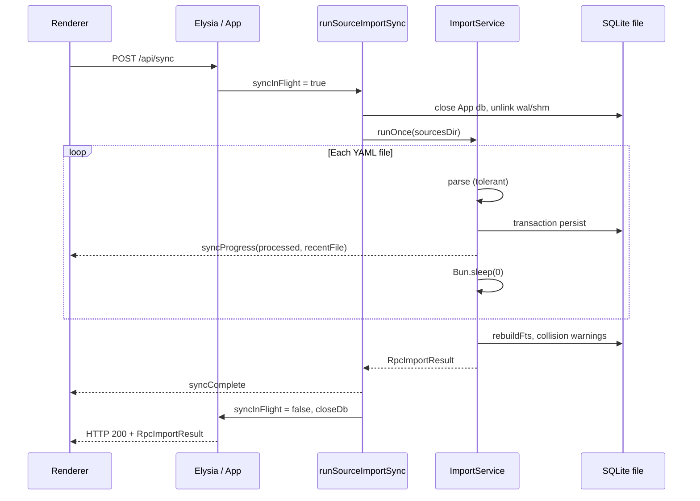

<!-- markdownlint-disable-file -->

# Source sync resilience — Design

## Overview

Sync is a **full rebuild** orchestrated by `runSourceImportSync` (`src/shell/app/lib/app_sync.util.ts`):
close `App` DB handle, delete SQLite files, run `ImportService.runOnce`, emit
`syncProgress` / `syncComplete`, then reopen DB on next query.

This design makes that pipeline **fail-soft and always terminal**:

| Layer           | Responsibility                                                                                  |
| --------------- | ----------------------------------------------------------------------------------------------- |
| **Parse**       | Produce entries + per-entry errors; file-level failure only when the document cannot be parsed. |
| **Persist**     | One transaction per file when possible; file-level rollback on transaction failure.             |
| **Concurrency** | Single writer during sync; renderer must not open `App.getDb()` against the rebuilding file.    |
| **Progress**    | One progress event per file; event-loop yield between files.                                    |
| **Report**      | Stable `RpcImportResult` + `RpcSyncFileResult` consumed by sync modal (sync-ui).                |

## Current gaps (baseline)

| Gap                          | Evidence                                                                                                                     | Target                                                                                       |
| ---------------------------- | ---------------------------------------------------------------------------------------------------------------------------- | -------------------------------------------------------------------------------------------- |
| Whole-file parse abort       | `parseSourceFile` → `toEntryWithSourceHint` throws; first bad key aborts file (`mixed_invalid.yml` omega row never imports). | Entry-level tolerant parse (SY-3).                                                           |
| Concurrent DB during sync    | `App.list()` during rebuild → `SQLITE_IOERR_VNODE` in probe.                                                                 | `syncInFlight` guard on `getDb()` (SY-1).                                                    |
| “Frozen” progress            | `processed` increments per file; large file keeps bar on previous index.                                                     | Document UX + yield between files (SY-5); optional intra-file progress later = out of scope. |
| `filesProcessed` vs progress | `filesProcessed` counts only successful commits; `processed` counts attempts.                                                | Keep; document in modal copy if user confusion persists.                                     |
| Duplicate complete handlers  | `syncRpc().then(onComplete)` + push `syncComplete`.                                                                          | Idempotent `onComplete` (SY-5).                                                              |

**Note:** Partial mitigations may already exist on the implementation branch
(`syncInFlight`, `Bun.sleep(0)`, import DB `close`, stmt cache). Treat this spec
as the **normative target**; tasks verify and close remaining gaps.

---

## Architecture



### Component boundaries

| Unit                                 | Path                                                  | Contract                                                                                                                                 |
| ------------------------------------ | ----------------------------------------------------- | ---------------------------------------------------------------------------------------------------------------------------------------- |
| `ImportService`                      | `src/shell/app/db/import.service.ts`                  | Orchestrates glob, parse, persist, FTS, warnings; **never throws** for per-file/entry business errors—aggregates into `RpcImportResult`. |
| Tolerant parser                      | `src/core/.../source_document.parser.ts` (+ new util) | **New:** `parseSourceFileResilient` or extended `parseSourceFile` returning `{ entries, errors }`.                                       |
| `upsertKnowledgeBundleInTransaction` | `import_bundle_persist.util.ts`                       | Entry-level skip (existing `continue`); errors include path + key.                                                                       |
| `App.sync`                           | `src/shell/app/app.ts`                                | Sets `syncInFlight`, delegates `runSourceImportSync`, clears flag, `closeDb()` in `finally`.                                             |
| `SyncDatabaseBusyError`              | `src/shell/app/lib/sync_database_busy.error.ts`       | Thrown from `getDb()` while sync runs; RPC maps to 503 or structured error (see below).                                                  |
| Sync modal                           | `sync_modal.component.tsx`                            | Displays `fileLog` / `summary.errors`; no change to pipeline beyond consuming RPC.                                                       |

---

## Decision: Entry-level vs file-level failure

**Context:** Users asked to import “whatever is possible” or skip the file.

**Options:**

1. **File-level only** — Keep throw-on-first-parse-error. Simple, but loses valid rows (rejects SY-3).
2. **Entry-level tolerant parse (recommended)** — Parse each map key in isolation; collect errors; persist valid rows in one transaction.
3. **Two-pass** — Parse YAML to AST, validate each node. Heavier; defer unless Bun.YAML.parse lacks section isolation.

**Decision:** **Option 2.**

**Rationale:** Matches user intent and `data-layer` fixture intent for `mixed_invalid.yml`.
File-level remains for document-level YAML failures and unreadable files.

### Parse API (normative)

Add to functional core (no I/O):

```ts
export type SourceParseResult = {
  entries: Entry[]
  errors: string[] // each: `${filePath}: entry "${key}": …` or file-level prefix
}

export function parseSourceFileResilient(filePath: string, content: string): SourceParseResult
```

Rules:

- IF `Bun.YAML.parse` throws OR returns non-object → return `{ entries: [], errors: [fileLevelMsg] }` (caller treats as file-level bundle error).
- FOR each section in `SECTION_ENTRY_TYPES`, FOR each key in section map:
  - TRY `toEntryWithSourceHint` → push to `entries`.
  - CATCH → push formatted error string; **continue** next key.
- `parseSourceFile` (legacy) MAY delegate to resilient variant and throw if `errors.length` for callers that need fail-fast; **ImportService uses resilient only**.

`ImportService.loadParsedSourceBundleForPath`:

- Replace single try/catch around `parseSourceFile` with resilient parse.
- IF document-level error (no entries, only one file-level error, zero sections parsed): return `{ filePath, error }` bundle (file skip).
- IF mixed entries + errors: return `{ filePath, items: entries }` and **also** append parse errors to `result.errors` during persist phase (or merge in `persistParsedSourceBundle`).

---

## Decision: Database concurrency during sync

**Context:** Second connection during unlink/rebuild caused I/O errors and apparent hang.

**Decision:** `App.syncInFlight` boolean; `getDb()` throws `SyncDatabaseBusyError` while true.

**RPC behavior:** Elysia handlers that call `getDb()` during sync SHALL return HTTP **503** with body `{ error: 'Database is busy: source sync in progress' }` (or project-standard envelope). Renderer list refresh during sync may fail once; `onComplete` triggers `refreshList`.

**Alternative rejected:** Shared connection between `App` and `ImportService` — larger refactor; defer.

**ImportService** opens its own `openDatabase(dbPath)` and **closes** in `finally` after `runOnce` (already specified in tasks).

---

## Decision: Event-loop yield

**Decision:** `await Bun.sleep(0)` after each file in `runOnce` loop.

**Rationale:** Allows Electrobun to deliver `syncProgress` and process RPC health checks while import runs on main thread.

**Out of scope:** Per-entry progress (would spam UI on 400+ row files).

---

## Error taxonomy and messages

| Class             | Example                | File `ok`                      | In `RpcImportResult.errors` |
| ----------------- | ---------------------- | ------------------------------ | --------------------------- |
| Unreadable        | `EACCES`               | false                          | `path: message`             |
| YAML document     | syntax error           | false                          | `path: message`             |
| Entry parse       | invalid tag on one key | true if others persist         | `path: entry "key": …`      |
| Entry persist min | missing desc           | true partial                   | same pattern                |
| Transaction       | SQLITE constraint      | false                          | `path: message`             |
| Post-process      | FTS rebuild throw      | **sync fails** (rare); RPC 500 | single error string         |

**Formatting:** Reuse `formatBundleError(filePath, message)`; entry errors MUST include `filePath` and preferably `entry "key"`.

**devbox reproduction fixture** (`src/__tests__/fixtures/sync/devbox_like.yml`):

- Section `bookmarks` with ≥ 2 valid keys and one key like `https://github.com/...` with invalid `tags: [OpenValidation]` to trigger tag regex error at a stable line.

---

## RPC and UI contract (unchanged shapes)

```ts
// src/shared/rpc/desktop_rpc_schema.ts — no field additions required for v1
RpcImportResult: { filesProcessed, inserted, updated, errors[], warnings[] }
RpcSyncFileResult: { path, label, ok, error?, inserted, updated }
```

**Semantics:**

- `filesProcessed`: files with **successful** transaction commit (current behavior).
- Progress `processed`: files **attempted** (including failed).
- Modal file log: append every `recentFile` from progress (existing handler).

---

## Testing strategy

### Unit (`bun:test`)

| Suite                                 | Focus                                                                       |
| ------------------------------------- | --------------------------------------------------------------------------- |
| `parse_source_file_resilient.spec.ts` | Entry isolation; devbox_like; malformed doc                                 |
| `import.service.spec.ts`              | Rewritten expectations for partial file; timeout completion; progress count |
| `app_sync_concurrency.spec.ts`        | Busy guard during sync                                                      |
| `app_sync.util.spec.ts` (optional)    | Emit order: progress × N, then complete                                     |

**Fixture directory:** `src/__tests__/fixtures/sync/`

| File                      | Purpose                      |
| ------------------------- | ---------------------------- |
| `partial_valid.yml`       | Valid / invalid / valid keys |
| `devbox_like.yml`         | Production tag-key failure   |
| `malformed_yaml.yml`      | Document-level fail          |
| `all_entries_invalid.yml` | No commits                   |
| `empty_sections.yml`      | Edge: empty maps             |

**Timeout test pattern:**

```ts
const result = await Promise.race([
  svc.runOnce(syncFixtureDir),
  Bun.sleep(30_000).then(() => { throw new Error('timeout') })
])
expect(result).toBeDefined()
```

### E2e (Playwright BDD)

New `assets/features/e2e/sync_resilience.feature` tagged `@spec:sync` `@p1`:

1. **Completes with error corpus** — Given harness writes `partial_valid.yml` + `malformed_yaml.yml`; When sync; Then modal done + errors visible + valid title still listed.
2. **Inspect error shows path** — Failed row shows basename and detail text.
3. **No hang** — Scenario timeout ≤ 60 s (Playwright default or explicit).

Update `settings_and_sync.feature` invalid-file scenario tags: add `@spec:sync`.

**Step catalog** additions in `assets/docs/specs/e2e/step-catalog.md`:

- `Given the fixture sources include the sync resilience corpus`
- `Then sync finishes within 60 seconds`
- `Then sync modal lists failed file {name}`
- `Then sync error detail mentions {text}`

**Fixture manifest:** optional `sources/sync/` copies from test fixtures at harness setup.

---

## Files to touch (implementation map)

| File                                          | Change                                          |
| --------------------------------------------- | ----------------------------------------------- |
| `source_document.parser.ts`                   | Resilient parse                                 |
| `import.service.ts`                           | Wire resilient parse; document-level vs partial |
| `import_bundle_persist.util.ts`               | Ensure entry errors aggregated                  |
| `app.ts`                                      | `syncInFlight` (verify complete)                |
| `sync_database_busy.error.ts`                 | RPC mapping if needed                           |
| `import.service.spec.ts`                      | New cases                                       |
| `fixtures/sync/*`                             | Corpus                                          |
| `assets/features/e2e/sync_resilience.feature` | New                                             |
| `e2e/steps/*`                                 | Step defs                                       |
| `e2e/fixture-manifest.md`                     | Corpus table                                    |
| `e2e/step-catalog.md`                         | Phrases                                         |

---

## Relation to other specs

- [`sync-ui`](../sync-ui/design.md) — UI only; must show errors from this pipeline.
- [`data-layer`](../data-layer/design.md) — Update `mixed_invalid.yml` expected behavior when implementation matches SY-3.
- [`foundation/design.md`](../foundation/design.md) — Import remains shell concern, not renderer.

---

## Follow-up — Sync modal error UX (SY-7)

**Problem:** Pipeline resilience (SY-1–SY-6) is implemented; the modal still
buried errors. Success rows dominate the scroll area; summary duplicates
`RpcImportResult.errors` in a truncated list below the fold; partial-import
files (`ok: true` + entry errors) look like successes.

**Scope:** Renderer + CSS only. **No** RPC or import pipeline changes required
for v1 (group errors client-side). Optional RPC enrichment in Phase 7.2.

### Decision: Client-side error grouping (recommended)

**Context:** `RpcSyncFileResult` has one optional `error`; entry-level messages
live in `RpcImportResult.errors[]` with `filePath:` prefix.

**Decision:** Pure function in renderer:

```ts
// sync_modal_errors.util.ts (new)
export type FileLogRowView = RpcSyncFileResult & {
  issues: string[]       // all messages for this file, deduped
  hasIssues: boolean     // ok === false OR issues.length > 0
}

export function buildFileLogViews(
  fileLog: RpcSyncFileResult[],
  summaryErrors: string[]
): FileLogRowView[]
```

Match rule: error string `startsWith(file.path)` OR equals file-level `error`.
File basename fallback only when path is relative in error string.

**Alternative rejected:** Extend `RpcSyncFileResult` with `entryErrors[]` —
cleaner long-term but requires main + preview server + types; defer to Task 7.2
if grouping proves fragile.

### Summary layout (normative)

Replace bullet list under “Sync finished” with a **stats strip**:

```txt
Files processed: 64 · Imported: 57 · With errors: 7
Rows inserted: 4029 · updated: 10
Collision warnings: 0
```

Definitions:

| Label           | Source                                                  |
| --------------- | ------------------------------------------------------- |
| Files processed | `model.processed` (or `fileLog.length`)                 |
| Imported        | `fileLogViews.filter(r => r.ok && !r.hasIssues).length` |
| With errors     | `fileLogViews.filter(r => r.hasIssues).length`          |

Keep row insert/update counts from `RpcImportResult`. Remove
`cmp-sync-modal-summary-errors` `<ul>` entirely (SY-7 AC5).

### File log accordion (normative)

Refactor `SyncModalFileLog` → disclosure pattern:

| Element       | Behavior                                                                                                              |
| ------------- | --------------------------------------------------------------------------------------------------------------------- |
| Row container | `role="button"` or `<button type="button">` wrapping row when `hasIssues`; else static div                            |
| Error bar     | `.cmp-sync-modal-file-row--error` — `border-left: 4px solid var(--color-error)` + subtle error tint background        |
| Chevron       | `▸` collapsed / `▾` expanded (CSS rotate or text)                                                                     |
| Panel         | `pre.cmp-sync-modal-error-detail` — `max-height: min(40vh, 240px)`; full width; monospace optional                    |
| Keyboard      | Row in tab order; `ArrowRight`/`Enter` expand; `ArrowLeft`/`Escape` collapse; only one expanded at a time (accordion) |

Remove separate **Inspect error** link — whole row is the control (SY-7 AC3).

On `phase === 'done'` and `withErrors > 0`: `useEffect` scrolls first
`hasIssues` row into view; optionally auto-expand first error row.

### CSS changes (`sync.css`)

- Increase error bar visibility (4px → consider 4px + `background` tint).
- Ensure `.cmp-sync-modal-log` flex layout leaves room for summary + actions at
  680×600 — `max-height: min(45vh, 320px)` acceptable.
- Error detail: `word-break: break-word`; remove tiny `0.6875rem` if unreadable
  — use `0.8125rem` minimum.

### Testing (SY-7)

| Layer     | File                                    | Coverage                                       |
| --------- | --------------------------------------- | ---------------------------------------------- |
| Unit      | `sync_modal_errors.util.spec.ts`        | Grouping paths, partial file, dedupe           |
| Component | `sync_modal.component.spec.tsx`         | Stats strip, accordion, no summary-errors list |
| E2e       | `sync_resilience.feature`               | New scenarios for totals + expand              |
| E2e steps | `step-catalog.md` § Sync modal error UX | Phrases below                                  |

### Files to touch (Phase 7)

| File                            | Change                                             |
| ------------------------------- | -------------------------------------------------- |
| `sync_modal.component.tsx`      | Stats strip, accordion rows, remove summary-errors |
| `sync_modal_errors.util.ts`     | Group errors by file                               |
| `sync.css`                      | Error bar, accordion, detail typography            |
| `sync_modal.component.spec.tsx` | SY-7 cases                                         |
| `sync_resilience.feature`       | Summary + accordion scenarios                      |
| `e2e/step-catalog.md`           | New steps                                          |
| `sync-ui/design.md` (optional)  | Cross-link SY-7 — do not duplicate full contract   |

### Optional RPC enrichment (Task 7.2)

Add to `RpcSyncFileResult`:

```ts
entryErrors?: string[]  // populated during import for partial files
```

Populate in `ImportService.persistParsedSourceBundle` from `parseErrors`.
Renderer prefers `entryErrors` when present; falls back to grouping.
