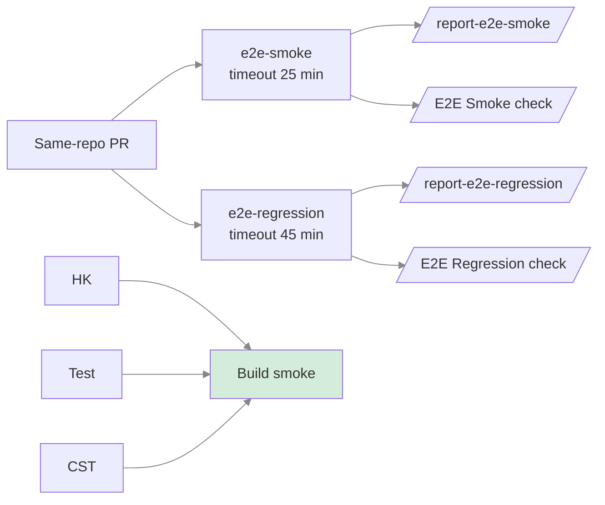

# CI review e2e — Design

## Overview

The e2e suite is already green locally (smoke 20/20, regression 44/44). This
design wires it into `review.yml` as parallel, non-blocking bootstrap jobs,
then hardens them into a gate after stability evidence.

## Architecture



## Job specification

### e2e-smoke

| Field           | Value                                                    |
| --------------- | -------------------------------------------------------- |
| `runs-on`       | `ubuntu-24.04`                                           |
| `timeout-minutes` | 25                                                     |
| `if`            | `github.event.pull_request.head.repo.full_name == github.repository` |
| Command         | `CI=true NODE_ENV=test mise run test e2e --smoke --metrics-report` |
| Artifact        | `report-e2e-smoke` (7 days)                              |
| Check name      | `E2E Smoke`                                              |

### e2e-regression

| Field           | Value                                                    |
| --------------- | -------------------------------------------------------- |
| `runs-on`       | `ubuntu-24.04`                                           |
| `timeout-minutes` | 45                                                     |
| `if`            | `github.event.pull_request.head.repo.full_name == github.repository` |
| Command         | `CI=true NODE_ENV=test mise run test e2e --regression --metrics-report` |
| Artifact        | `report-e2e-regression` (7 days)                         |
| Check name      | `E2E Regression`                                         |

## Bootstrap vs hard-gate

| Phase    | build.needs                     | metrics-compare | Draft runs | PR blocks |
| -------- | ------------------------------- | --------------- | ---------- | --------- |
| Bootstrap (item 4) | `[hk, test, cst]`     | No              | Yes        | No        |
| Hard gate (item 5) | `[hk, test, cst, e2e-smoke, e2e-regression]` | Yes | No         | Yes       |

During bootstrap, e2e jobs are informational only. build.needs remains
unchanged so e2e failures never block the preview build.

## Composite action: setup-e2e-preview

```yaml
steps:
  1. actions/checkout@v4
  2. ./.github/actions/setup-bun-project (setup_mode: mise)
  3. actions/cache@v4 on ~/.cache/ms-playwright
     key: playwright-${{ runner.os }}-${{ runner.arch }}-${{ hashFiles('bun.lock') }}
  4. bun run e2e:preview:install
  5. bunx playwright install-deps chromium
```

Steps 4–5 install Chromium browser binaries and system dependencies needed
by Playwright on the Ubuntu runner.

## Evidence collection

7 consecutive green runs are required for each tier before enabling the hard
gate. Runs are counted per-workflow-execution; when both jobs pass in the
same run, both tiers get credit.

Evidence is recorded in `tasks.md` Phase 5 precondition table:

| # | workflow_run_url | commit_sha | E2E Smoke | E2E Regression | date_utc |
