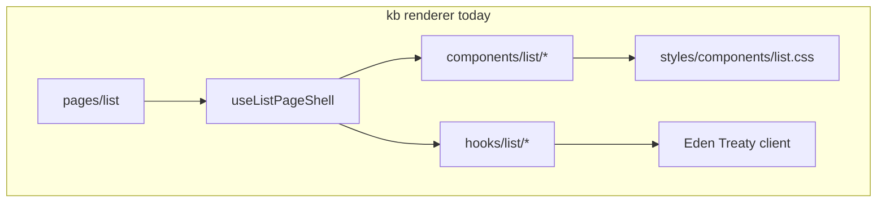

<!-- markdownlint-disable-file -->
# Presentation Layer — Literature Review

Research initiative for the architectural review of `src/shell/renderer/`. This document
synthesizes key concepts from cited industry patterns and maps them to kb. It does **not**
prescribe code changes — it is discussion material for the presentation-layer track.

**Related inputs:**

- [`../claude/presentation_layer.md`](../claude/presentation_layer.md) — kb-specific findings
- [`presentation.md`](presentation.md) — review brief
- [`assets/guides/STYLING_GUIDE.md`](../../../../guides/STYLING_GUIDE.md) — Andromeda Void / `cmp-*`
- [`assets/guides/CODESTYLE_GUIDE.md`](../../../../guides/CODESTYLE_GUIDE.md) — suffix vocabulary

---

## Document map

```
PresentationLayerLiteratureReview/
├── 1_ExecutiveSummary
├── 2_kbSnapshot
├── 3_FolderOrganization/
│   ├── KentDodds_Colocation
│   ├── Redux_FeatureFolders
│   ├── BulletproofReact
│   ├── shadcn_ui
│   └── WhenNOT_FeatureFolders
├── 4_HookComposition/
│   ├── ReactDocs_CustomHooks
│   ├── TkDodo_ScreenHook
│   └── Abramov_SecondCaller
├── 5_ContainerPresenter/
│   ├── Abramov_SmartDumb
│   └── CoryHouse_Container
├── 6_DesktopApps/
│   ├── Linear_ModelView
│   └── Tana_Obsidian_Plugins
├── 7_Composition/
│   └── KentDodds_CompoundComponents
├── 8_SkillsInventory
├── 9_RecommendedStance
└── 10_OpenQuestions
```

---

## 1. Executive summary

kb's renderer is **organizationally tired, not broken**. The UI works; the tension is that
**CSS is already colocated by surface** while **TypeScript is split by artifact kind**
(`hooks/list/`, `components/list/`, `pages/list/`).

Literature from mid-size React apps converges on a **hybrid** model — not a wholesale
[Bulletproof React](https://github.com/alan2207/bulletproof-react) migration:

| Keep horizontal (layer-first)                                   | Verticalize by screen (feature-first)           |
| --------------------------------------------------------------- | ----------------------------------------------- |
| `styles/theme.css`, `cmp-*` tokens                              | `list`, `shortcuts`, `detail`, `sync` workflows |
| `components/shared/` primitives                                 | Screen hooks + screen-specific components       |
| Cross-cutting hooks (`use_debounced_value`, `use_action_toast`) | Entry actions, task sheet, command palette      |

**Hook policy:** one orchestration hook per screen (`useListPageShell` is the right shape);
extract smaller hooks only on **second caller** or **proven isolation value**; run `jscpd`
before creating new abstractions.

**Container/presenter in the Hooks era:** custom hooks = container logic; components = markup
+ props. Eden Treaty stays in hooks, not leaf components.

**FCIS boundary unchanged:** renderer → Eden Treaty only; domain logic stays in `core/`;
I/O in `shell/app/`.

---

## 2. kb snapshot

### 2.1 Current layout

| Layer         | Pattern                 | Example                                                                                                                                                                                  |
| ------------- | ----------------------- | ---------------------------------------------------------------------------------------------------------------------------------------------------------------------------------------- |
| TS folders    | By artifact kind        | [`hooks/list/`](../../../../../src/shell/renderer/hooks/list/) (27 hooks), [`components/list/`](../../../../../src/shell/renderer/components/list/)                                      |
| CSS           | By UI surface           | [`styles/components/list.css`](../../../../../src/shell/renderer/styles/components/list.css), `shortcuts.css`, `task_sheet.css`                                                          |
| Orchestration | Screen hook + thin page | [`use_list_page_shell.hook.ts`](../../../../../src/shell/renderer/hooks/list/use_list_page_shell.hook.ts); [`list.page.tsx`](../../../../../src/shell/renderer/pages/list/list.page.tsx) |
| Data boundary | Eden Treaty only        | No `renderer/` → `shell/app/` imports                                                                                                                                                    |

### 2.2 Data flow (today)



### 2.3 List page wiring (actual code)

```tsx
// src/shell/renderer/pages/list/list.page.tsx
export function ListPage() {
  const [showSettings, setShowSettings] = useState(false)
  const listPageRef = useRef<HTMLDivElement>(null)
  const p = useListPageShell({ showSettings, onOpenSettings: () => setShowSettings(true) })
  const { onListPageKeyDownCapture } = useListPageFocusRing({ /* ... */ })

  return (
    <div ref={listPageRef} className="cmp-list-page" onKeyDownCapture={onListPageKeyDownCapture}>
      <ListMain p={p} showSettings={showSettings} setShowSettings={setShowSettings} />
    </div>
  )
}
```

### 2.4 List hooks inventory (27 files)

```
hooks/list/
├── use_list_page_shell.hook.ts      ← orchestrator (composes ~15 hooks)
├── use_list_page_data.hook.ts
├── use_list_page_filters.hook.ts
├── use_list_page_rows.hook.ts
├── use_list_page_focus_ring.hook.ts
├── use_list_page_stats_sync.hook.ts
├── use_list_selection.hook.ts
├── use_list_filter_overlay.hook.ts
├── use_list_surface_keydown.hook.ts
├── use_list_surface_wheel_scroll.hook.ts
├── use_list_surface_scroll_restore.hook.ts
├── use_list_sentinel_pagination.hook.ts
├── use_virtual_list_window.hook.ts
├── use_list_pointer_selection.hook.ts
├── use_list_main_entry_keys.hook.ts
├── use_entry_action_keys.hook.ts
├── use_command_palette.hook.ts
├── use_compact_filter_overlay.hook.ts
├── use_compact_filter_overlay_rows.hook.ts
├── use_filter_dropdown_stats.hook.ts
├── use_task_sheet.hook.ts
├── use_task_drag_drop.hook.ts
├── use_task_keyboard.hook.ts
├── use_view_navigation.hook.ts
├── use_record_detail_visit.hook.ts
├── use_window_view_nav_keys.hook.ts
└── use_window_drag.hook.ts
```

> **kb comment:** Many of these have a single caller (`useListPageShell` or `ListMain`).
> Literature (Abramov second-caller, TkDodo screen hook) suggests inlining until reuse
> is proven — not deleting tests, but reducing file-hopping during onboarding.

### 2.5 Alignment vs divergence

| Aspect                   | Aligns with literature                   | Diverges                                 |
| ------------------------ | ---------------------------------------- | ---------------------------------------- |
| Screen hook orchestrator | `useListPageShell`                       | 17+ satellite single-caller hooks        |
| CSS colocation           | Surface partials in `styles/components/` | TS not colocated with CSS surfaces       |
| FCIS / model-view        | Eden Treaty boundary; `core/` pure       | `ListMain` mixes layout + prop fan-out   |
| Primitives layer         | `cmp-*`, `components/shared/`            | `shared/` also holds feature-ish sync UI |
| No global state library  | Hook-passed state at kb scale            | Hook fragmentation, not missing Redux    |

---

## 3. Folder organization

### 3.1 Kent C. Dodds — Colocation

**URL:** https://kentcdodds.com/blog/colocation

#### Tree view

```
app/
└── AuthenticatedApp/
    ├── index.js              ← public entry (re-export)
    └── AuthenticatedApp.js   ← implementation + colocated helpers
        ├── useAuth()         ← private hook (example)
        └── styles.css
```

**Anti-pattern (layer-first by file type):**

```
components/
hooks/
utils/
styles/     ← everything separated by TYPE, not by CHANGE UNIT
```

#### Key concepts

- **Unit of change = unit of organization** — code that changes together lives together.
- **Colocation beats premature abstraction** — shared folders often outlive their reuse.
- **Move/delete is cheap** — wrong folder placement is easier to fix than wrong abstraction.
- **Applies to tests and styles** — not only components.

#### Snippets

```js
// Before: scattered
// hooks/use-authenticated.js
export function useAuthenticated() { /* ... */ }

// components/authenticated-app.js
import { useAuthenticated } from '../hooks/use-authenticated'

// After: colocated
// components/authenticated-app/authenticated-app.js
function useAuthenticated() { /* private */ }
export function AuthenticatedApp() {
  const user = useAuthenticated()
  return user ? <div>Welcome {user.name}</div> : null
}
```

#### kb comment

CSS already follows Dodds (`list.css` with list UI). TS could mirror surface names
(`list`, `shortcuts`, `detail`) while keeping suffix rules (`*.hook.ts`, `*.component.tsx`).

---

### 3.2 Redux Style Guide — Feature folders

**URL:** https://redux.js.org/style-guide/#structure-files-as-feature-folders-with-single-file-logic

#### Tree view

```
src/
├── app/                    ← store setup, root layout
├── common/                 ← truly generic utilities
└── features/
    ├── todos/
    │   ├── todosSlice.ts
    │   └── Todos.tsx
    └── comments/
        ├── commentsSlice.ts
        └── Comments.tsx
```

**Deprecated:**

```
src/actions/ + src/reducers/ + src/components/   ← folder-by-type
```

#### Key concepts

- **Feature folder** — one user-facing capability, one subtree.
- **Ducks / slice** — colocate reducer logic with actions (Redux-specific; folder idea transfers).
- **Three tiers:** `/app` (shell), `/common` (shared), `/features` (vertical).
- **Logic in reducers** — pure transitions in one testable place (parallel: FCIS `core/`).

#### Snippets

```ts
// features/todos/todosSlice.ts (Redux Toolkit)
const todosSlice = createSlice({
  name: 'todos',
  initialState: [],
  reducers: {
    toggleTodo(state, action) {
      const todo = state.find(t => t.id === action.payload.id)
      if (todo) todo.completed = !todo.completed
    },
  },
})
```

#### kb comment

No Redux in kb. A `renderer/features/list/` slice could mirror `styles/components/list.css`
if adopted — must respect ls-lint suffix contract and dependency-cruiser (renderer → RPC only).

---

### 3.3 Bulletproof React — `src/features/`

**URL:** https://github.com/alan2207/bulletproof-react/blob/master/docs/project-structure.md

#### Tree view

```
src/
├── app/              ← routes, providers, router
├── components/       ← SHARED components only
├── features/         ← most application code
│   └── awesome-feature/
│       ├── api/
│       ├── components/
│       ├── hooks/
│       ├── stores/
│       ├── types/
│       └── utils/
├── hooks/            ← SHARED hooks
├── lib/
├── types/
└── utils/
```

**Import direction:**

```
shared (components, hooks, utils)
    ↑ imported by
features/*
    ↑ imported by
app/*
```

#### Key concepts

- **Guide, not template** — principles over copying folder names.
- **No cross-feature imports** — compose at `app/`; ESLint zones enforce boundaries.
- **Avoid barrel files** — direct imports help tree-shaking.
- **Include only subfolders a feature needs** — not every feature needs `api/` + `stores/`.

#### Snippets

```js
// Cross-feature import ban (ESLint)
'import/no-restricted-paths': ['error', {
  zones: [{
    target: './src/features/auth',
    from: './src/features',
    except: ['./auth'],
  }],
}]

// Unidirectional: features must not import from app
{ target: './src/features', from: './src/app' }
```

#### kb comment

Partial adoption: `renderer/screens/list/` as vertical slice + global `components/primitives/`
for cross-surface chrome. kb already has dependency-cruiser for FCIS — same idea for feature zones.

---

### 3.4 shadcn/ui — Layer-first primitives

#### Tree view

```
src/
├── components/ui/          ← horizontal PRIMITIVES
│   ├── button.tsx
│   ├── dialog.tsx
│   └── input.tsx
└── features/dashboard/     ← vertical features COMPOSE ui/*
```

#### Key concepts

- **Primitives are the product** for a design system — stay layer-first.
- **Copy-into-repo** — components are owned and editable.
- **Features consume `ui/`** — vertical slices sit above horizontal atoms.

#### Snippets

```tsx
// components/ui/button.tsx — presentational primitive
export function Button({ className, variant, ...props }: ButtonProps) {
  return <button className={cn(buttonVariants({ variant }), className)} {...props} />
}

// features/billing/components/invoice-row.tsx
import { Button } from '@/components/ui/button'
```

#### kb comment

Maps to `components/shared/`, `cmp-*`, and [`STYLING_GUIDE.md`](../../../../guides/STYLING_GUIDE.md).
Do **not** feature-folder every atom (kbd, overlay shell, brand icons).

---

### 3.5 When *not* to use feature folders (MUI, Mantine, Chakra)

#### Tree view

```
design-system-library/
└── components/           ← ALL horizontal; library IS the layer
    ├── Button/
    ├── TextField/
    └── Dialog/
```

#### Key concepts

- **Layer-first when the work *is* a reusable layer.**
- **App primitives stay horizontal** — cross-feature chrome, tokens, semantic classes.
- **Feature folders for screens/workflows** — not for every design token.

#### kb comment

Andromeda Void + `theme.css` + `cmp-*` matches this model. Slice **screens**, not every semantic helper.

---

## 4. Hook composition

### 4.1 React docs — Reusing Logic with Custom Hooks

**URL:** https://react.dev/learn/reusing-logic-with-custom-hooks

#### Tree view

```
Component
├── useOnlineStatus()     ← hides browser API noise
├── useChatRoom()         ← hides subscription lifecycle
└── JSX                   ← intent / markup
```

#### Key concepts

- **Custom Hook = reusable stateful logic**, not shared state (each call is independent).
- **Extract to hide external-system noise** (browser APIs, RPC subscriptions).
- **Don't extract trivial `useState` wrappers.**
- **Name by intent** — hard naming → logic may belong in the component.
- **Compose small hooks** for complex effects.

#### Snippets

```tsx
function useOnlineStatus() {
  const [isOnline, setIsOnline] = useState(true)
  useEffect(() => {
    const on = () => setIsOnline(true)
    const off = () => setIsOnline(false)
    window.addEventListener('online', on)
    window.addEventListener('offline', off)
    return () => {
      window.removeEventListener('online', on)
      window.removeEventListener('offline', off)
    }
  }, [])
  return isOnline
}
```

React also allows extraction for **conceptual clarity** — higher bar than "component got long."

---

### 4.2 TkDodo — Screen hook & effect simplification

**URLs:**

- https://tkdodo.eu/blog/simplifying-use-effect
- React Query patterns series: https://tkdodo.eu/blog/

#### Tree view

```
ListPage.tsx                    ← thin markup + 1–2 hook calls
└── useListScreen()             ← composition root
    ├── useListData()
    ├── useListFilters()
    ├── useTitleSync()          ← effect encapsulated inside
    └── returns { rows, filters, setFilter, ... }
```

**Encapsulation levels:**

```
Level 1: useEffect in component
Level 2: useTitleSync — effect only in hook
Level 3: useTitle — state + effect, minimal public API (setter only)
```

#### Key concepts

- **>50% hook calls in a component** → named screen hook.
- **Encapsulate what belongs together** — don't expose state the consumer never reads.
- **Name effects** — named function inside `useEffect` helps debugging.
- **Lazy init:** `useState(() => expensive())` — once per mount.
- **Functional updates:** `setState(prev => ...)` — when next depends on previous.

#### Snippets

```tsx
function ListPage() {
  const screen = useListScreen()
  return <ListView {...screen} />
}

function useDocumentTitle(initialTitle: string) {
  const [title, setTitle] = useState(initialTitle)
  useEffect(() => { document.title = title }, [title])
  return setTitle  // minimal API when title isn't rendered
}

// Lazy init
const [state] = useState(() => buildExpensiveInitialState())
```

#### kb comment

`useListPageShell` is the screen hook. Question: do 17 satellite hooks each earn a file, or
should bodies live in the shell until a second caller appears?

---

### 4.3 Dan Abramov — Second-caller rule (informal)

**Source:** Recurring Discord/X guidance; no single canonical post.

#### Tree view

```
First use case → inline in component or screen hook
Second caller  → extract useSharedThing()
```

#### Key concepts

- **YAGNI for hooks** — extraction costs indirection and file-hopping.
- **Reuse is the default justification** — clarity alone needs a strong case.
- **One orchestrator may grow** — one `biome-ignore` beats seventeen one-liner files.

#### Snippets

```tsx
// First caller — keep inline
function ListPage() {
  const [focused, setFocused] = useState(false)
  useEffect(() => { /* focus ring */ }, [focused])
}

// Second caller — extract
function useFocusRing(active: boolean) { /* shared by ListPage + DetailPage */ }
```

#### kb comment

Pair with `jscpd` and `dry-principle` skills — measure duplication before extracting.

---

## 5. Container / presenter

### 5.1 Dan Abramov — Smart vs dumb components (2015)

**Names deprecated after Hooks; separation survives.**

#### Tree view

```
Hooks era:
  useListScreen()  ← container (logic, RPC, effects)
  ListMain(props)  ← presenter (markup)

Classic:
  ListContainer ──props──► ListView
```

#### Key concepts

- **Wire vs render** — fetching/handlers vs JSX.
- **Presenters snapshot easily** — pure functions of props.
- **Hooks replaced HOC/class containers** — same split, different mechanism.
- **Avoid "presenters" that still call Eden Treaty.**

#### Snippets

```tsx
function ListPage() {
  const { rows, selectRow } = useListScreen()
  return <ListView rows={rows} onSelect={selectRow} />
}

function ListView({ rows, onSelect }) {
  return (
    <ul>
      {rows.map(r => (
        <li key={r.id} onClick={() => onSelect(r.id)}>{r.title}</li>
      ))}
    </ul>
  )
}
```

#### kb comment

`useListPageShell` = container; `ListMain` should trend markup-heavy. Today `ListMain` still
receives a large `p` bag — Cory House / compound patterns address that.

---

### 5.2 Cory House — Container components

#### Tree view

```
ScreenContainer
├── owns state + side effects
├── fetches via services / RPC
└── children (presentational)
    ├── Header
    ├── Body
    └── Footer
```

#### Key concepts

- **One container per screen** coordinates children.
- **Data down, events up.**
- **Prop drilling** → composition or **screen-scoped** context, not global app context.

#### Snippets

```tsx
function DashboardContainer() {
  const [range, setRange] = useState('7d')
  const stats = useStats(range)
  return (
    <>
      <DashboardHeader range={range} onRangeChange={setRange} />
      <DashboardCharts stats={stats} />
    </>
  )
}
```

---

## 6. Desktop-app patterns

### 6.1 Linear — Model / view separation

**Source:** Podcasts and conference talks (no single canonical doc).

#### Tree view

```
Linear (conceptual)
├── Model — entities, transitions, sync
└── View  — React, keyboard → dispatches to model, zero business rules
```

#### Key concepts

- **View is disposable** — model survives UI rewrites.
- **Keyboard-first** — shortcuts call model commands.
- **Typed view-models at boundaries** — not raw persistence shapes.

#### kb comment

`core/` + `shell/app/` ≈ model; `renderer/` ≈ view; Eden Treaty is the boundary.
Keyboard hooks (`use_window_view_nav_keys`, `use_list_surface_keydown`) dispatch intent, not domain rules.

---

### 6.2 Tana / Obsidian — Plugin-style features

#### Tree view

```
Obsidian (conceptual)
├── core/           ← platform APIs
└── plugins/        ← vertical: UI + commands + folder
    ├── daily-notes/
    └── graph-view/

Tana (conceptual)
├── core engine
└── feature modules (nodes, fields, queries)
```

#### Key concepts

- **Feature = plugin** — self-contained UI + commands + types.
- **Core vs UI** — mirrors FCIS / desktop shell.
- **Organize by user capability** — not global `hooks/` vs `components/`.

#### kb comment

Analogues: shortcuts overlay, task sheet, entry actions, sync modal → candidate
`features/shortcuts`, `features/tasks` if TS colocation proceeds.

---

## 7. Compound components (Kent C. Dodds)

**From Advanced React Patterns.**

#### Tree view

```
<ListShell>                    ← Provider
├── <ListShell.Search />
├── <ListShell.Results />
├── <ListShell.Footer />
└── <ListShell.Overlays />

vs

<ListMain searchProps={...} resultsProps={...} footerProps={...} />  ← prop fan-out
```

#### Key concepts

- **Implicit shared state via Context** — flexible child order.
- **Better ergonomics** when prop-spreading hurts.
- **Ceremony cost** — optional at kb's current scale.

#### Snippets

```tsx
const ListShellContext = createContext(null)

function ListShell({ children, value }) {
  return (
    <ListShellContext.Provider value={value}>
      <div className="cmp-list-shell">{children}</div>
    </ListShellContext.Provider>
  )
}

ListShell.Search = function Search() {
  const { query, setQuery } = useContext(ListShellContext)
  return <input value={query} onChange={e => setQuery(e.target.value)} />
}
```

#### kb comment

[`presentation_layer.md`](../claude/presentation_layer.md) §6.3 flags `list_main.component.tsx`
prop-spreading as the trigger for evaluating this pattern.

---

## 8. Skills inventory

Registry source of truth: [`assets/guides/SKILLS.yml`](../../../../guides/SKILLS.yml).

### 8.1 When to load which skill

| When discussing…               | Load first                    | Path                                                                                        | Optional companions                                      | Path                                                                         |
| ------------------------------ | ----------------------------- | ------------------------------------------------------------------------------------------- | -------------------------------------------------------- | ---------------------------------------------------------------------------- |
| Any renderer / FCIS work       | `app-context`                 | [`.agents/skills/app-context/SKILL.md`](../../../../../.agents/skills/app-context/SKILL.md) | Styling                                                  | [`assets/guides/STYLING_GUIDE.md`](../../../../guides/STYLING_GUIDE.md)      |
| Hook extraction / screen hooks | `react-dev`                   | `~/.agents/skills/react-dev/SKILL.md`                                                       | `dry-principle`, `jscpd`                                 | `~/.agents/skills/dry-principle/SKILL.md`, `~/.agents/skills/jscpd/SKILL.md` |
| Component API / prop drilling  | `vercel-composition-patterns` | `~/.agents/skills/vercel-composition-patterns/SKILL.md`                                     | `solid-principles`                                       | `~/.agents/skills/solid-principles/SKILL.md`                                 |
| Performance / rerenders        | `vercel-react-best-practices` | `~/.agents/skills/vercel-react-best-practices/SKILL.md`                                     | —                                                        | —                                                                            |
| a11y / UX audit                | `web-design-guidelines`       | `~/.agents/skills/web-design-guidelines/SKILL.md`                                           | —                                                        | —                                                                            |
| Large refactor sequencing      | `refactor-plan`               | `~/.agents/skills/refactor-plan/SKILL.md`                                                   | `improve-codebase-architecture`, `receiving-code-review` | `~/.agents/skills/improve-codebase-architecture/SKILL.md`                    |
| Duplication judgment           | `jscpd`, `dry-principle`      | global paths above                                                                          | `dry-refactoring`                                        | `~/.agents/skills/dry-refactoring/SKILL.md`                                  |
| Design → component             | `stitch-design`               | `~/.agents/skills/stitch-design/SKILL.md`                                                   | `react:components`                                       | `~/.agents/skills/react-components/SKILL.md`                                 |
| Tests when refactoring         | `app-testing`                 | [`.agents/skills/app-testing/SKILL.md`](../../../../../.agents/skills/app-testing/SKILL.md) | —                                                        | —                                                                            |
| Discover new skills            | `find-skills`                 | `~/.agents/skills/find-skills/SKILL.md`                                                     | `npx skills find "<topic>"`                              | —                                                                            |

### 8.2 Skill tree (topic → skill)

```
SkillsByTopic/
├── Always
│   └── app-context          (.agents/skills/app-context/)
├── Folder / architecture
│   ├── refactor-plan        (~/.agents/skills/refactor-plan/)
│   ├── improve-codebase-architecture
│   └── solid-principles
├── Hooks / React
│   ├── react-dev
│   ├── vercel-react-best-practices
│   └── vercel-composition-patterns
├── Duplication judgment
│   ├── dry-principle
│   ├── jscpd
│   └── dry-refactoring
├── UI / a11y
│   ├── web-design-guidelines
│   ├── tailwind-css-patterns
│   └── stitch-design / react:components
└── Process
    ├── brainstorming
    ├── receiving-code-review
    └── find-skills
```

---

## 9. Recommended kb stance (for discussion)

**Hybrid: screen slices + horizontal primitives** — not full Bulletproof React.

1. **Keep horizontal:** `styles/theme.css`, `components/shared/` (or future `primitives/`),
   cross-cutting hooks (`use_debounced_value`, `use_action_toast`).
2. **Verticalize by screen when touch count is high:** e.g. `screens/list/{hooks,components,utils}`
   mirroring CSS surfaces — **list first** (27 hooks).
3. **Enforce boundaries:** dependency-cruiser + zone rules (Bulletproof pattern); no renderer → app.
4. **Hook policy:** second-caller rule + jscpd before extraction; one `use*Shell` per page.
5. **Composition over props:** compound patterns for overlay hosts, filter chrome, detail layout —
   load `vercel-composition-patterns` before refactors.

### 9.1 One-page mental model

```
┌─────────────────────────────────────────────────────────┐
│  HORIZONTAL — theme.css · cmp-* · shared/ · ui/         │
│  When: cross-feature, design-system, no domain          │
└─────────────────────────────────────────────────────────┘
                          ▲ composes
┌─────────────────────────────────────────────────────────┐
│  VERTICAL — list/ · shortcuts/ · detail/ · sync/        │
│  When: changes together, keyboard workflow, screen      │
└─────────────────────────────────────────────────────────┘
                          ▲ wired by
┌─────────────────────────────────────────────────────────┐
│  SCREEN HOOK — useListPageShell                         │
└─────────────────────────────────────────────────────────┘
                          ▲ renders
┌─────────────────────────────────────────────────────────┐
│  VIEW — ListMain, compound children, markup only        │
└─────────────────────────────────────────────────────────┘
                          ▲ boundary
┌─────────────────────────────────────────────────────────┐
│  MODEL — core/ · shell/app/ · Eden Treaty               │
└─────────────────────────────────────────────────────────┘
```

### 9.2 Heuristics cheat sheet

| Question                     | Lean toward…                         |
| ---------------------------- | ------------------------------------ |
| Second caller for this hook? | No → inline in screen hook           |
| CSS + TS for same screen?    | Colocate (Dodds)                     |
| Button, kbd, overlay chrome? | Horizontal primitives (shadcn logic) |
| Whole list workflow?         | Vertical slice (Bulletproof)         |
| 80 lines of `p.*` props?     | Compound components (Kent)           |
| Business rule?               | `core/`, not renderer                |

### 9.3 What literature suggests skipping (for kb scale)

From [`presentation_layer.md`](../claude/presentation_layer.md) §9 — aligned with literature:

- **Redux / Zustand / Jotai** — hook fragmentation is the pain, not missing global store.
- **TanStack Query / SWR** — Eden Treaty is request/response shaped; cache library premature.
- **Atomic design (atoms/molecules/organisms)** — `primitives/` + features covers same ground.
- **Storybook** — premature before primitives folder exists.
- **Tailwind utilities in JSX** — `cmp-*` + `.semantic-*` already working.

---

## 10. Open questions for team discussion

1. **TS colocation trigger:** At what feature count (~8?) does `renderer/features/` beat kind-first folders?
2. **Single-caller hooks:** Document a "must justify isolation" rule in testing guide, or ast-grep heuristic?
3. **`components/shared/` split:** `primitives/` vs `sync/` feature folder — order of operations?
4. **Compound `ListShell`:** Worth ceremony now, or wait until `list_main` grows again?
5. **Page vs component ownership:** Should `ListPage` absorb focus-ring wiring entirely and shrink `ListMain` to layout-only?
6. **Cross-feature imports:** If vertical slices land, enforce zones in dependency-cruiser or ESLint?
7. **Naming:** Rename `use_list_page_*` cluster so orchestrator vs data hooks are obvious?

---

## 11. Suggested next steps (optional — no implementation in this doc)

| Step | Action                                                                                       | Output                                     |
| ---- | -------------------------------------------------------------------------------------------- | ------------------------------------------ |
| 1    | Team review of §9 stance + §10 questions                                                     | Decision log in architectural SDD          |
| 2    | If approved, Tier A items from [`presentation_layer.md`](../claude/presentation_layer.md) §7 | Small PRs (inline hooks, file moves)       |
| 3    | If approved, Tier B (`primitives/` + `sync/` split)                                          | Structural PR + ls-lint updates            |
| 4    | Tier C (full feature folders)                                                                | Defer to v0.11+ or feature-count threshold |

---

## 12. Source bibliography

| Topic                    | Reference                                                                                                                       |
| ------------------------ | ------------------------------------------------------------------------------------------------------------------------------- |
| Colocation               | [Kent C. Dodds — Colocation](https://kentcdodds.com/blog/colocation)                                                            |
| Feature folders          | [Redux Style Guide](https://redux.js.org/style-guide/#structure-files-as-feature-folders-with-single-file-logic)                |
| Mid-size React structure | [Bulletproof React — project-structure.md](https://github.com/alan2207/bulletproof-react/blob/master/docs/project-structure.md) |
| Primitives layer         | [shadcn/ui](https://ui.shadcn.com/) (`components/ui/`)                                                                          |
| Custom hooks             | [React docs — Reusing Logic with Custom Hooks](https://react.dev/learn/reusing-logic-with-custom-hooks)                         |
| Screen hooks / effects   | [TkDodo — Simplifying useEffect](https://tkdodo.eu/blog/simplifying-use-effect)                                                 |
| Second-caller heuristic  | Dan Abramov (informal; Discord/X)                                                                                               |
| Container/presenter      | Dan Abramov (2015); Cory House — container components                                                                           |
| Compound components      | Kent C. Dodds — Advanced React Patterns                                                                                         |
| Desktop                  | Linear (talks/podcasts); Tana / Obsidian plugin layout                                                                          |
| Layer-first DS           | MUI, Mantine, Chakra codebases                                                                                                  |

---

*Research document only. Does not modify `src/`, guides, or quality gates. Last updated: 2026-06-02.*
