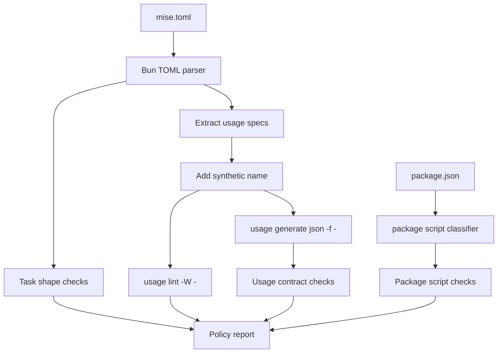

<!-- markdownlint-disable-file -->
# Mise usage policy — Design

## Overview

The policy system has two goals: make the project task surface easier to use,
and make future drift visible before it reaches documentation or CI. It keeps
Mise as the executable source of truth and layers a small read-only checker over
the existing toolchain.

The first implementation must report findings only. Once the findings are
accurate and intentional exceptions are encoded, the checker can become a
blocking lint and quality-gate step.

## Architecture

The system has four layers:

1. **Guide layer:** `assets/guides/MISE_GUIDE.md` defines human policy for task
   authoring, Usage specs, standalone scripts, and verification.
2. **Runtime layer:** root `mise.toml` remains the executable task source of
   truth.
3. **Policy layer:** a small Bun script parses `mise.toml`,
   `package.json`, and policy configuration, then reports violations.
4. **Documentation layer:** README, agent files, Cursor guidance, guides, and
   active specs point to canonical commands.

The checker must not execute project workflows. It validates task metadata,
embedded Usage specs, and references that can be checked safely.

## Components and interfaces

### `MISE_GUIDE.md`

The guide is concise and normative. It explains:

- when to use Mise instead of package scripts or direct commands,
- how to define inline task objects,
- how to write embedded Usage/KDL specs,
- how to merge similar task families,
- what standalone scripts are allowed to do,
- how to verify task changes.

### Policy configuration

The implementation may start with constants in the checker. If the rules become
large, move them to a small data file such as `assets/guides/MISE_POLICY.yml`.

The policy needs these data sets:

- allowed table-style task exceptions,
- canonical action-driven task families,
- allowed split task families and reasons,
- deprecated task and script removal expectations,
- destructive task expectations,
- allowed complex package scripts,
- allowed standalone implementation scripts.

### Policy checker

Implement the checker as a Bun task because the repo already uses Bun and
`Bun.TOML.parse` can parse `mise.toml` without adding a dependency.

The checker performs these checks:

1. Run or mirror `tombi check mise.toml`.
2. Parse `mise.toml` with `Bun.TOML.parse`.
3. Extract each task with a `usage` field.
4. Prefix each embedded Usage spec with `name "<task>"`.
5. Run `usage lint -W -`.
6. Run `usage generate json -f -`.
7. Inspect generated JSON for action args, choices, and required flags.
8. Check repo-specific task shape rules.
9. Parse `package.json` and classify complex scripts.
10. Report findings with severity, file, task or script name, and suggested
    next action.

### Mise task entrypoint

Expose the checker through a canonical task:

```sh
mise run policy check
```

The task must support at least:

```kdl
arg "<action>" help="Policy action" {
  choices "check" "report"
}
flag "--format <format>" help="Output format" default="text" {
  choices "text" "json"
}
flag "--strict" help="Treat findings as failures"
```

The first version may make `check` and `report` equivalent if the output is
clear. Strict behavior must become blocking only after intentional exceptions
are captured.

## Data flow



## Error handling

The checker reports all findings it can discover in one run. It must not stop
after the first policy violation unless parsing fails so early that later checks
would be misleading.

Failure categories:

- **Parse failure:** TOML, JSON, or Usage output could not be parsed.
- **Usage failure:** `usage lint -W -` returned an error or warning.
- **Policy failure:** task shape, grouping, deprecated entrypoint,
  destructive task, package script, or standalone script rule failed.
- **Configuration failure:** an allowlist entry points to a task or script that
  no longer exists.

## Testing strategy

Use focused tests for pure policy logic and command smoke checks for the CLI
path.

Recommended verification:

```sh
bun run lint:mise
mise run policy check
mise run policy check --strict
mise run policy check --format=json
mise tasks validate
mise tasks --hidden
git diff --check
```

Before declaring final completion:

```sh
bash .agents/skills/kb-quality-gate/scripts/gate.sh
```

Dangerous tasks must be validated through metadata, help output, or dry-run
paths, not by executing destructive behavior.

## Rollout strategy

1. Rewrite the guide.
2. Add this SDD spec.
3. Add a read-only checker that reports current findings.
4. Encode intentional exceptions with reasons.
5. Refactor `mise.toml`, `package.json`, and docs in small task families.
6. Verify every changed or merged task through help output and safe smoke or
   dry-run paths.
7. Add the checker to `bun run lint`.
8. Add the checker to the kb quality gate.
9. Consider a small project skill only if agents continue to need routing help.

## Decision: Implement locally instead of handing off

**Context:** The policy spans docs, `mise.toml`, package scripts, agent
instructions, and the quality gate. A different agent would need the full
conversation context to avoid preserving the wrong exceptions.

**Options considered:**

1. Hand off implementation to another agent. Pros: conserves this thread. Cons:
   high context loss and higher risk around policy nuance.
2. Implement locally in this thread. Pros: keeps the POC, rationale, and user
   decisions together. Cons: requires careful phased execution.
3. Stop after docs. Pros: lowest immediate risk. Cons: leaves enforcement
   missing.

**Decision:** Implement locally after the guide and SDD artifacts are reviewed.

**Rationale:** The checker is small, and the main risk is preserving the policy
intent. Keeping the implementation in this thread reduces ambiguity.
