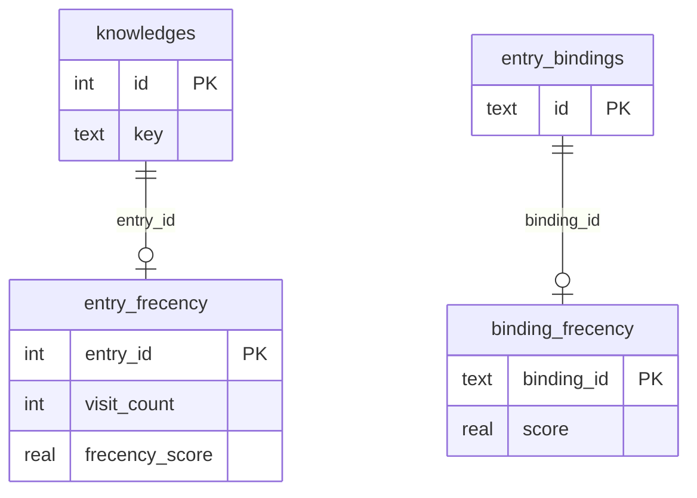

# Data model: Sync frecency preserve

**Feature**: `003-sync-frecency-preserve` | **Date**: 2026-06-03

## Overview

Two **learned** tables (local-only, not in YAML) survive sync via snapshot/restore.
All **projection** tables rebuild from YAML as today.

## Projection tables (rebuildable — unchanged)

| Table            | Role                            |
| ---------------- | ------------------------------- |
| `knowledges`     | Catalog entries from YAML       |
| `knowledges_fts` | FTS index (rebuilt post-import) |
| `entry_bindings` | Shortcut bindings from YAML     |

## Learned tables (preserve via snapshot)

### `entry_frecency`

| Column            | Type             | Notes                                   |
| ----------------- | ---------------- | --------------------------------------- |
| `entry_id`        | INTEGER PK       | FK → `knowledges(id)` ON DELETE CASCADE |
| `visit_count`     | INTEGER NOT NULL | Monotonic visit counter                 |
| `last_visited_at` | INTEGER NOT NULL | Epoch ms                                |
| `frecency_score`  | REAL NOT NULL    | Drives list `ORDER BY`                  |

**Snapshot row**: `EntryFrecencySnapshot = EntryFrecencyRow` (all columns).

**Restore rule**: Insert/update only if `EXISTS (SELECT 1 FROM knowledges WHERE id = entry_id)`.

**List sort** (unchanged): `ORDER BY COALESCE(f.frecency_score, 0) DESC, ...` — missing row ⇒ score 0.

### `binding_frecency`

| Column          | Type          | Notes                       |
| --------------- | ------------- | --------------------------- |
| `binding_id`    | TEXT PK       | Matches `entry_bindings.id` |
| `score`         | REAL NOT NULL | Shortcut ranking            |
| `last_event_at` | TEXT NOT NULL | ISO timestamp string        |

**Snapshot row**: `BindingFrecencySnapshot = BindingFrecencyRow`.

**Restore rule**: Insert/update only if `EXISTS (SELECT 1 FROM entry_bindings WHERE id = binding_id)`.

## Ephemeral types (implementation)

```typescript
// frecency_snapshot.util.ts — not exported from package boundary
type LearnedSnapshot = {
  entries: EntryFrecencyRow[]
  bindings: BindingFrecencyRow[]
}
```

## State transitions

### Entry usage (surviving id)

```text
[visited] --sync--> snapshot --import rebuild--> restore --> [same visit_count, scores]
```

### Entry removed from YAML

```text
[visited] --sync--> snapshot --import (no row)--> restore skipped --> [no frecency row, not in list]
```

### New entry in YAML

```text
[no visits] --sync--> (not in snapshot) --import--> [no frecency row, score 0 in list]
         --user opens--> recordEntryVisit --> [frecency row created]
```

### Sync with import errors (partial catalog)

```text
[visited] --sync--> snapshot --import partial--> restore full snapshot filtered -->
  surviving ids keep scores; catalog matches partial import
```

## Relationships



## Validation rules (from spec)

| Rule                                                             | Source   |
| ---------------------------------------------------------------- | -------- |
| Relative sort order among surviving entries unchanged after sync | SF-1 AC1 |
| Removed entry absent; no ghost ordering influence                | SF-1 AC2 |
| New entry score 0 until first visit                              | SF-1 AC3 |
| Surviving binding scores unchanged                               | SF-2 AC1 |
| Removed binding absent                                           | SF-2 AC2 |
| Usage restored on failed/partial import                          | SF-3 AC4 |

## Out of scope (data model)

- Changing `bumpFrecency` weights/decay (`src/core/helpers/frecency/`)
- Frecency migration when YAML id changes but semantic entry persists
- Durable snapshot file on disk
