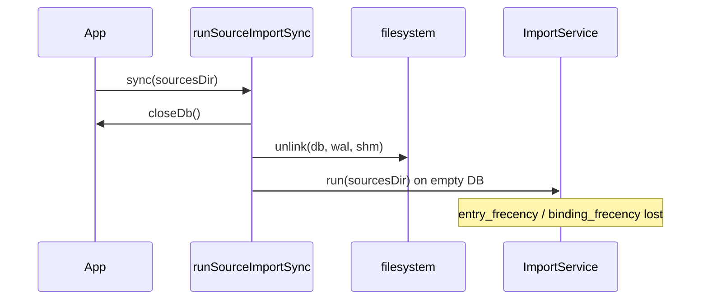
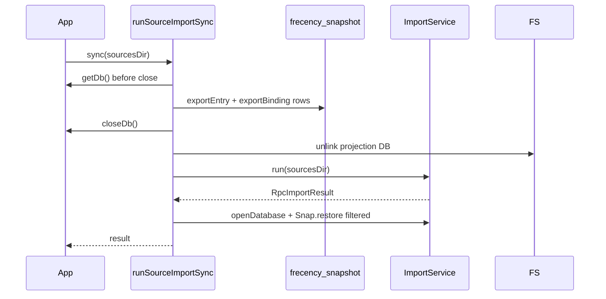

# Implementation Plan: Sync frecency preserve

**Branch**: `003-sync-frecency-preserve` | **Date**: 2026-06-03 | **Spec**: [spec.md](./spec.md)

**Input**: When I sync, I want sources in sync and my frecency/usage to stay the same

## Summary

Full source sync (`runSourceImportSync` in `src/shell/app/lib/app_sync.util.ts`) currently
deletes the SQLite projection and rebuilds from YAML, which wipes `entry_frecency` and
`binding_frecency`. This feature adds a **snapshot before rebuild** and **filtered restore
after import** so surviving entries and bindings keep pre-sync usage scores, while removed
items stay gone and new items rank neutrally until first visit. On import failure, catalog
content reflects how far import progressed; learned usage is always restored from the
pre-sync snapshot (Clarify Option D).

## Technical Context

**Language/Version**: TypeScript on Bun (repo-pinned via mise)

**Primary Dependencies**: `bun:sqlite`, `ImportService`, existing `frecency.repository` /
`binding_frecency.repository`, Eden Treaty RPC (unchanged surface)

**Storage**: SQLite projection at `loaded.database.path`; learned tables
`entry_frecency`, `binding_frecency` (not in YAML)

**Testing**: `bun:test`; `:memory:` SQLite; integration spec
`src/shell/app/lib/app_sync_frecency.spec.ts` (release gate); e2e stretch via
`assets/features/e2e/sync_frecency.feature`

**Target Platform**: Electrobun desktop (macOS + Linux); shell/app only for this feature

**Project Type**: Desktop app — FCIS layers (`core` pure, `shell/app` I/O, renderer via RPC)

**Performance Goals**: Snapshot/restore MUST stay within normal sync duration (no second
full DB copy on disk; in-memory row export only)

**Constraints**: No RPC/schema changes; no Drizzle/Zod; no renderer → `shell/app` imports;
preserve constitution Principle III (YAML = source of truth; learned state explicit)

**Scale/Scope**: Two tables, O(n) rows on visit history size; touch `app_sync.util.ts` +
new snapshot util + one integration spec file

## Constitution Check

*GATE: Must pass before Phase 0 research. Re-check after Phase 1 design.*

| Principle                         | Status   | Notes                                                                       |
| --------------------------------- | -------- | --------------------------------------------------------------------------- |
| I Product (keyboard, local-first) | **PASS** | No UI change; list/shortcut order preserved after sync                      |
| II FCIS                           | **PASS** | Snapshot/restore in shell; `bumpFrecency` stays in core                     |
| III Source-of-truth               | **PASS** | YAML rebuild unchanged; learned state migrated explicitly via snapshot      |
| IV TypeBox                        | **PASS** | No new RPC routes                                                           |
| V Test-first                      | **PASS** | Spec names `app_sync_frecency.spec.ts` + co-located util spec               |
| VI Conventions                    | **PASS** | New `*.util.ts` + `*.spec.ts`; snake_case segments                          |
| VII Renderer                      | **PASS** | No renderer changes                                                         |
| VIII Observability                | **PASS** | Use existing `getLogger(['kb', 'app', 'sync'])` for snapshot/restore phases |
| IX Electrobun                     | **PASS** | Not in scope                                                                |

**Post-design re-check**: PASS — design stays in `shell/app/lib` and `shell/app/db` only.

## Project Structure

### Documentation (this feature)

```text
assets/specs/003-sync-frecency-preserve/
├── spec.md
├── plan.md              # This file
├── research.md
├── data-model.md
├── quickstart.md
├── contracts/
│   └── sync-learned-state.md
├── checklists/
│   └── requirements.md
├── handoff.md
└── tasks.md
```

### Source Code (repository root)

```text
src/shell/app/
├── app.ts                           # sync() delegates to runSourceImportSync (unchanged signature)
├── lib/
│   ├── app_sync.util.ts             # wire snapshot → delete/rebuild → restore
│   ├── app_sync_frecency.spec.ts      # SF-1..SF-3 integration tests (new)
│   ├── frecency_snapshot.util.ts      # export + restore learned tables (new)
│   └── frecency_snapshot.util.spec.ts
└── db/
    ├── schema.ts                      # entry_frecency, binding_frecency (existing)
    ├── frecency.repository.ts
    └── binding_frecency.repository.ts

src/core/helpers/frecency/
└── bump_frecency.util.ts            # unchanged algorithm

assets/features/e2e/
└── sync_frecency.feature              # stretch; already declared
```

**Structure Decision**: Single-project kb layout; all implementation in imperative shell
(`src/shell/app`). No new Elysia routes or preview-server mirror.

## Design

### Current behavior



### Target behavior



### Snapshot format (in-memory)

| Export  | Row shape                                                    | Join on restore                  |
| ------- | ------------------------------------------------------------ | -------------------------------- |
| Entry   | `{ entry_id, visit_count, last_visited_at, frecency_score }` | `knowledges.id = entry_id`       |
| Binding | `{ binding_id, score, last_event_at }`                       | `entry_bindings.id = binding_id` |

Use `INSERT ... ON CONFLICT DO UPDATE` (same as repositories) inside a single transaction
after import. Skip rows whose join key is absent — implements “gone is gone” without
orphan rows.

### Failure semantics (SF-3 AC4)

- Import today **does not throw** on per-file errors; it returns `RpcImportResult` with
  `errors[]` while keeping prior bundles committed.
- **Catastrophic failure** (e.g. thrown before restore): `finally` MUST still run restore
  when a snapshot exists.
- Restore runs **even when** `result.errors.length > 0`, as long as a DB file exists after
  `ImportService.run` (partial catalog is valid per spec).

### New-item ranking (SF-1 AC3)

No `entry_frecency` row after restore → list SQL uses
`COALESCE(f.frecency_score, 0)` (`entry_repository.const.ts`) → new entries sort below
visited entries until `recordEntryVisit`.

### Testing strategy

| AC                           | Approach                                                                                                                                                                                                                                |
| ---------------------------- | --------------------------------------------------------------------------------------------------------------------------------------------------------------------------------------------------------------------------------------- |
| SF-1 preserve / remove / new | Temp sources dir + `:memory:` or temp file DB; seed visits via repositories; `App.sync()`; assert `findAll` order / row absence                                                                                                         |
| SF-2 binding                 | `recordBindingVisit` + binding fixtures in YAML                                                                                                                                                                                         |
| SF-3 unchanged semantics     | Existing `import.service.spec.ts` / `app.spec.ts` still pass                                                                                                                                                                            |
| SF-3 partial failure         | **Chosen:** optional test-only `RunSourceImportSyncOptions.testHooks` on `runSourceImportSync` (e.g. inject a failing bundle after N files) so the test exercises export → partial import → restore without bypassing the sync pipeline |

### Logging

Add structured log lines: `frecency_snapshot_export` (counts),
`frecency_snapshot_restore` (restored/skipped counts).

## E2e traceability

| Requirement | Feature file                                | Scenario                                            | Notes                                                     |
| ----------- | ------------------------------------------- | --------------------------------------------------- | --------------------------------------------------------- |
| SF-1        | `assets/features/e2e/sync_frecency.feature` | Frequently opened items keep their place after sync | `@spec:sync-frecency`; stretch — integration spec is gate |
| SF-2        | —                                           | —                                                   | Integration gate only this increment                      |
| SF-3        | —                                           | —                                                   | Integration gate only this increment                      |

Normative Gherkin text lives in the feature file only (plain-language pilot per
BDD guide). Step catalog / fixture manifest updates deferred until e2e steps are wired
(stretch).

## Complexity Tracking

> No constitution violations requiring justification.

| Violation | Why Needed | Simpler Alternative Rejected Because |
| --------- | ---------- | ------------------------------------ |
| —         | —          | —                                    |
