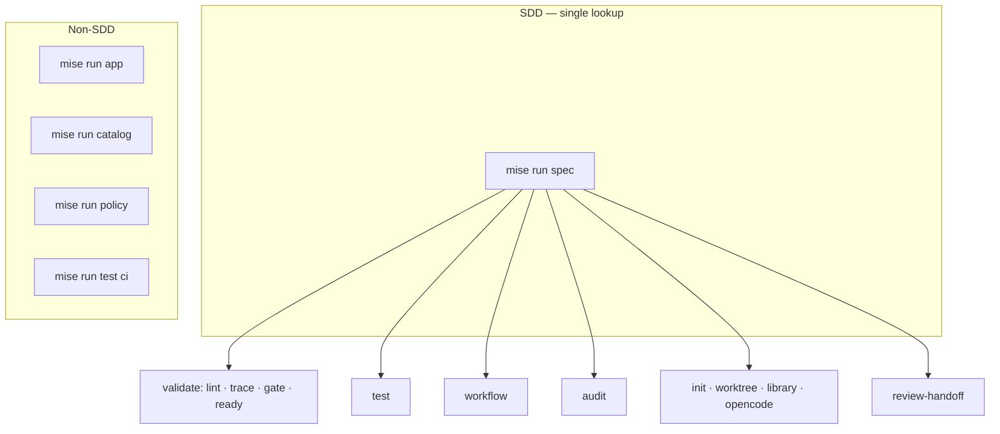
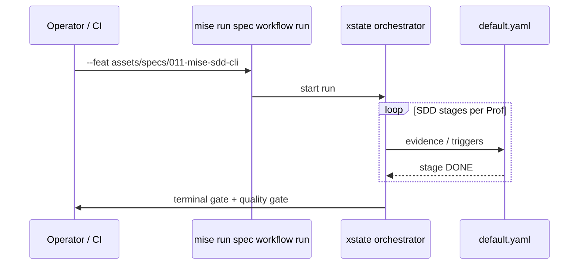

<!-- markdownlint-disable-file -->

# Plan — `011-mise-sdd-cli`

**Spec:** [`spec.md`](./spec.md) — MSC-1 … MSC-10.
**Predecessor:** [`010-workflow-packages`](../010-workflow-packages/) merged on `main`.

**Delivery:** **one PR**, `feature/011-mise-sdd-cli`. **Closeout:** orchestrator dogfood (MSC-9).

---

## Summary

1. Introduce `task_runner` (TTY gum spin + `--raw` machine lines).
2. Reorganize mise tasks: **all SDD commands under `spec`**; narrow top-level `test` to repo CI; extract `app` / `policy` to `tools/bin/`.
3. Update `default.yaml` bindings to post-migration command names.
4. Validate by running **full orchestrator workflow** on this feature dir (xstate stages → terminal gate).

---

## Mise CLI reorganization

### Top-level tasks (after 011)



**Removed:** top-level `mise run audit` (→ `spec audit`).

**Narrowed:** `mise run test` — repo-wide `ci` (and optional `unit` whole tree); feature-scoped testing moves to `spec test`.

### `spec` command tree (normative)

See [`spec.md`](./spec.md) MSC-2 and the flat invocation table in the prior 010 plan — unchanged intent:

| Group        | Command                                                                                             |
| ------------ | --------------------------------------------------------------------------------------------------- |
| **Validate** | `mise run spec lint …` · `trace` · `gate` · `ready`                                                 |
| **Test**     | `mise run spec test` · `spec test --unit` · `--e2e` · `--smoke` · `--regression` · `--feat <dir>`   |
| **Workflow** | `mise run spec workflow run` · `resume` · `runs …` · `handoff generate` · `handoff scrub` · `bench` |
| **Audit**    | `mise run spec audit docs rogue-refs` · `audit feature <dir>` · `audit security …`                  |
| **Scaffold** | `mise run spec init` · `worktree add` · `library manifest` · `opencode check`                       |
| **Review**   | `mise run spec review-handoff classify\|…`                                                          |

---

## Output contract (`task_runner`)

**Module:** `tools/support/lib/cli/task_runner.script.ts`

```ts
type StepResult = {
  id: string
  title: string
  ok: boolean
  exit: number
  duration_ms: number
  log_tail?: string
}

type TaskRunReport = {
  task: string
  command: string
  ok: boolean
  duration_ms: number
  steps: StepResult[]
}
```

**Flags:** default TTY → pretty; non-TTY or `--raw` → machine lines. Extend [`render_mode.script.ts`](../../../tools/support/lib/cli/render_mode.script.ts).

**First consumers:** `spec gate`, `spec ready`, `app gates all`, `catalog validate`.

---

## `spec test` implementation

**Facade:** `tools/governance/specs/spec_test.script.ts` — delegates to `bun test` globs + [`tag.script.ts`](../../../tools/governance/registries/catalog/tag.script.ts) for e2e tags.

---

## Migration map (breaking)

| Removed                                       | Replacement                               |
| --------------------------------------------- | ----------------------------------------- |
| `mise run audit rogue-refs`                   | `mise run spec audit docs rogue-refs`     |
| `mise run spec audit <dir>`                   | `mise run spec audit feature <dir>`       |
| `mise run spec security …`                    | `mise run spec audit security …`          |
| `mise run spec feature-init`                  | `mise run spec init`                      |
| `mise run spec worktree-add`                  | `mise run spec worktree add`              |
| `mise run spec library-manifest`              | `mise run spec library manifest`          |
| `mise run spec handoff-generate`              | `mise run spec workflow handoff generate` |
| `mise run spec handoff-scrub`                 | `mise run spec workflow handoff scrub`    |
| `mise run spec workflow orchestrated-handoff` | `mise run spec workflow run`              |
| `mise run spec workflow perf`                 | `mise run spec workflow bench`            |
| `mise run spec workflow smoke` / `spec smoke` | `mise run spec test --smoke`              |
| `mise run test tag <key> --e2e` (SDD docs)    | `mise run spec test --feat … --e2e`       |
| `mise run app --kill` etc.                    | `mise run app lifecycle kill`             |
| `mise run app gates --quality --policy`       | `mise run app gates all`                  |

**Ripgrep pass:** `mise.toml`, `assets/guides/**`, `.github/**`, `.agents/**`, `CLAUDE.md`, `AGENTS.md`, `assets/specs/**`, `tools/**`, `default.yaml`.

---

## Orchestrator dogfood (MSC-8, MSC-9)



**Operator recipe (closeout):**

```sh
# .specify/feature.json → 011, or:
mise run spec workflow run --feat assets/specs/011-mise-sdd-cli
mise run spec gate assets/specs/011-mise-sdd-cli
bash .agents/skills/app-quality-gate/scripts/gate.sh
```

Human-gated stages (`handoff-generate`, `review`) may require operator approval during the run — document run id in PR.

---

## Traceability

| Req     | Primary touch                                                |
| ------- | ------------------------------------------------------------ |
| MSC-1   | `task_runner.script.ts`, `render_mode.script.ts`             |
| MSC-2…6 | `mise.toml`, `tools/bin/spec.script.ts`, remove `audit` task |
| MSC-3   | `spec_test.script.ts`, `smoke.yml`                           |
| MSC-4…5 | spec workflow + init dispatch, `default.yaml`                |
| MSC-7   | `tools/bin/app.script.ts`, `policy.script.ts`                |
| MSC-8…9 | workflow run log, handoff verify                             |
| MSC-10  | `MISE_GUIDE.md`, CI, agent docs                              |

---

## Verification

See [`handoff.md`](./handoff.md).
