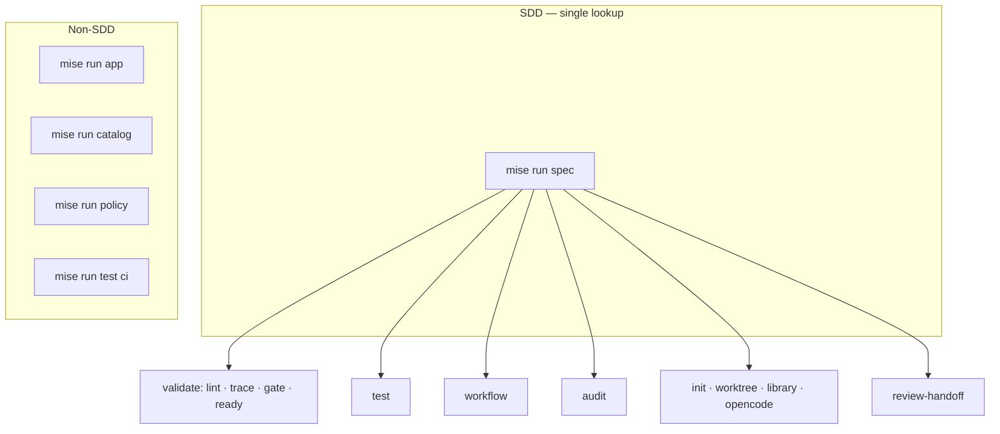
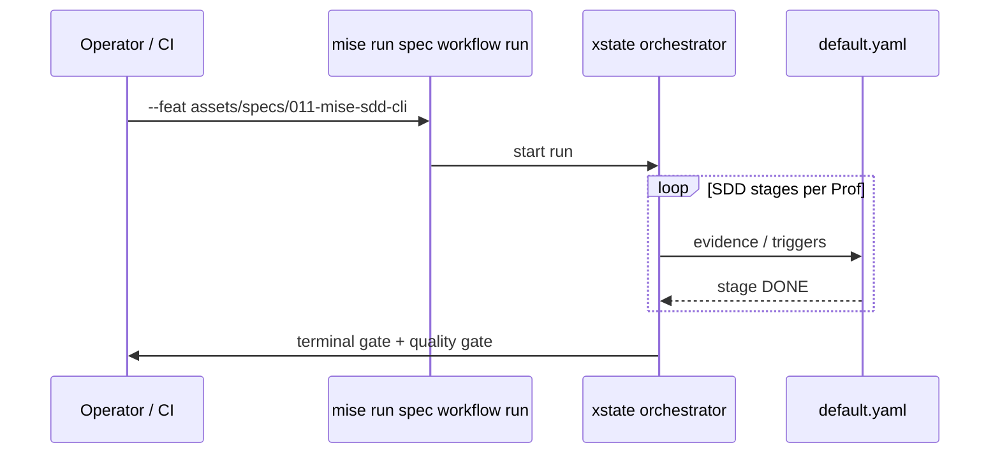

<!-- markdownlint-disable-file -->

# Plan — `011-mise-sdd-cli`

**Spec:** [`spec.md`](./spec.md) — MSC-1 … MSC-10.
**Predecessor:** [`010-workflow-packages`](../010-workflow-packages/) merged on `main`.

**Delivery:** **one PR**, `feature/011-mise-sdd-cli`. **Closeout:** orchestrator dogfood (MSC-9).

---

## Summary

1. Introduce `task_runner` (TTY gum spin + `--raw` machine lines).
2. Reorganize mise tasks: **all SDD commands under `spec`**; narrow top-level `test` to repo CI; extract `app` / `policy` to `tools/bin/`.
3. Update `default.yaml` bindings to post-migration command names.
4. Validate by running **full orchestrator workflow** on this feature dir (xstate stages → terminal gate).

---

## Mise CLI reorganization

### Top-level tasks (after 011)



**Removed:** top-level `mise run audit` (→ `spec audit`).

**Narrowed:** `mise run test` — repo-wide `ci` (and optional `unit` whole tree); feature-scoped testing moves to `spec test`.

### `spec` command tree (normative)

See [`spec.md`](./spec.md) MSC-2 and the flat invocation table in the prior 010 plan — unchanged intent:

| Group        | Command                                                                                             |
| ------------ | --------------------------------------------------------------------------------------------------- |
| **Validate** | `mise run spec lint …` · `trace` · `gate` · `ready`                                                 |
| **Test**     | `mise run spec test [scope]` (`scope` = `unit\|e2e\|smoke\|regression` choices enum) · `--feat <dir>` |
| **Workflow** | `mise run spec workflow run` · `resume` · `runs …` · `handoff generate` · `handoff scrub` · `bench` |
| **Audit**    | `mise run spec audit docs rogue-refs` · `audit feature <dir>` · `audit security …`                  |
| **Scaffold** | `mise run spec init` · `worktree add` · `library manifest` · `opencode check`                       |
| **Review**   | `mise run spec review-handoff classify\|…`                                                          |

### Usage spec structure (native nested `cmd` + global flags)

Per spec Clarifications 2026-06-10, the `spec` task models the tree as **native nested `cmd` blocks** in its `usage` (the [usage spec](https://usage.jdx.dev/spec/) supports arbitrary `cmd` nesting; a `cmd` may carry both subcommands and its own args/flags). Cross-cutting flags are declared **once** as `global` flags at the task root. mise then validates routing and provides per-level `--help`; the thin `run = "bun tools/bin/spec.script.ts"` dispatches on the resolved `usage_*` chain.

```kdl
# mise.toml  "spec" usage (skeleton — depth as the tree requires)
flag "--raw"  global=#true help="Machine output (no gum styling)"
flag "--feat <dir>" global=#true help="Feature dir (default: resolveActiveFeatureDir())"
flag "--json" global=#true help="Machine-readable JSON where supported"

cmd "lint"  { flag "--all"; flag "--strict"; arg "[target]" }
cmd "trace" { arg "<feature_dir>"; flag "--strict" }
cmd "gate"  { arg "[feature_dir]" }
cmd "ready" { arg "[feature_dir]"; flag "--key <key>" }
cmd "init"  { flag "--id <id>"; flag "--slug <slug>" }

cmd "test" {
  arg "[scope]" help="omitted = default composite" { choices "unit" "e2e" "smoke" "regression" }   # enum validated by mise; no script-side exclusion
}

cmd "workflow" {
  cmd "run"    { }
  cmd "resume" { arg "[runId]"; flag "--answer <kv>"; flag "--approve <stage>" }
  cmd "runs"   { arg "<action>" { choices "list" "show" "tail" "prune" }; arg "[runId]" }
  cmd "bench"  { }
  cmd "handoff" {
    cmd "generate" {
      flag "--focus <kind>"  default="gherkin"  { choices "gherkin" "catalog" "e2e-fix" }
      flag "--worker <name>" default="opencode" { choices "opencode" }
      flag "--dispatch"; flag "--dry-run"
    }
    cmd "scrub"    { flag "--body <text>" }
  }
}

cmd "audit" {
  cmd "docs"     { cmd "rogue-refs" { } }
  cmd "feature"  { arg "<feature_dir>" }
  cmd "security" { flag "--strict"; flag "--changed-only"; flag "--base <sha>" }
}

cmd "worktree" { cmd "add" { arg "<feature>" } }
cmd "library"  { cmd "manifest" { flag "--dry-run"; flag "--verify" } }
cmd "opencode" { cmd "check" { } }
cmd "review-handoff" { arg "<action>" { choices "classify" "extract-evidence" "prepare" "scaffold-audit" }; flag "--handoff <path>" }
```

Notes:

- **`global` flags** (`--raw`, `--feat`, `--json`) are declared once; do **not** redeclare per subcommand (current `spec` task redeclares `--raw`/`--json` on individual cmds — DRY them).
- **Mutual exclusion** of `spec test` scope flags is **not** expressible in the usage subset → the dispatch script enforces it (MSC-TEST-02) and exits non-zero with a diagnostic.
- **`run` stays one line** (`bun tools/bin/spec.script.ts`); the script routes on the **positional subcommand chain from `process.argv`** (its existing `usage_cmd ?? args.shift()` fallback — robust for nested `cmd`, which may not flatten into a single `usage_cmd`) and reads flags (incl. `global`) from `usage_*` env vars. No inline bash dispatch (MSC-7).
### Advanced `usage` features — adoption matrix

| Feature | Adopt in 011? | Where |
| ------- | ------------- | ----- |
| **`choices` enum** | **Yes** | `test [scope]`; `workflow runs <action>`; `review-handoff <action>`; `handoff generate --focus`/`--worker`. mise validates + lists in `--help`; removes script-side checks. |
| **`default=`** | **Yes** (retain) | `--focus`=`gherkin`, `--worker`=`opencode`, `--base`=`HEAD~1`, `lint --root`=`assets/specs`. |
| **`global` flags** | **Yes** | `--raw` / `--feat` / `--json` at `spec` root. |
| **required vs optional** (`<x>`/`[x]`) | **Yes** | `<feature_dir>` required for `audit feature`; `[feature_dir]` optional for `gate`/`ready` (auto-resolve). |
| **`count` flag** (`-v`) | **Optional (deferred)** | `task_runner` verbosity (`-v`/`-vv` → more `log_tail`). Nice-to-have; not required this PR. |
| **`var=#true` variadic** | **Optional (deferred)** | `lint [targets…]`, `audit feature <dir…>` for batch runs. `--all` + single target already covers the common case. |
| **`negate=`** (`--no-…`) | **No** | `--raw` already expresses "no styling"; a `--no-color` negate would be redundant. |
| **`complete`** | **Optional (deferred)** | dynamic completion for `--feat <dir>` and `runs [runId]`. |
| **task `alias`** | **Optional (deferred)** | shortcuts for `spec gate` / `spec test`. |

The **Yes** rows are normative for MSC-SPEC-01 / MSC-TEST-02. **Optional (deferred)** rows are documented so a future PR can adopt them without re-discovery; they are explicitly **out of scope** for 011 to keep the migration focused.

---

## Output contract (`task_runner`)

**Module:** `tools/support/lib/cli/task_runner.script.ts`

```ts
type StepResult = {
  id: string
  title: string
  ok: boolean
  exit: number
  duration_ms: number
  log_tail?: string
}

type TaskRunReport = {
  task: string
  command: string
  ok: boolean
  duration_ms: number
  steps: StepResult[]
}
```

**Flags:** default TTY → pretty; non-TTY or `--raw` → machine lines. Extend [`render_mode.script.ts`](../../../tools/support/lib/cli/render_mode.script.ts).

**Raw line grammar (prefixed text, stable — per spec Clarifications 2026-06-10):** one line per step, then one summary line, written to stdout in order:

```text
STEP <id> <ok|fail|skip> exit=<int> ms=<int> <title>
TASK <task> <ok|fail> ms=<int> steps=<int> failed=<int>
```

- Tokens are single-space separated; `<title>` is the trailing free-text field (may contain spaces, no newlines).
- `<id>`/`<task>`/`<title>` contain no spaces except `<title>` (last field).
- Step status: `ok` (exit 0), `fail` (exit ≠ 0), `skip` (not run, e.g. prior failure). One `STEP` line per `StepResult`; the final `TASK` line mirrors `TaskRunReport` (`failed` = count of `fail` steps).
- Pretty mode renders the same data as `gum spin` + a summary table; the underlying `TaskRunReport` is identical across modes. `task_runner.script.spec.ts` asserts this grammar verbatim.

**First consumers:** `spec gate`, `spec ready`, `app gates all`, `catalog validate`.

---

## `spec test` implementation

**Facade:** `tools/governance/specs/spec_test.script.ts` — delegates to `bun test` globs + [`tag.script.ts`](../../../tools/governance/registries/catalog/tag.script.ts) for e2e tags.

**Feature resolution:** active dir via `resolveActiveFeatureDir()` (`.specify/feature.json`; `--feat <dir>` overrides). Feature-scoped specs run against committed **fixture** feature-dirs under `tools/__tests__/fixtures/<feature>/` (e.g. `000-feature-demo`) with Fishery `factoryFor` — **never** live `assets/specs/NNN-*` (per spec Clarifications 2026-06-10).

**Scope matrix** — positional `[scope]` is a `choices` enum (`arg "[scope]" { choices "unit" "e2e" "smoke" "regression" }`); omitted = default composite. mise validates the enum (unknown value rejected before dispatch); exclusivity is inherent to a single positional, so **no script-side enforcement**.

| `[scope]` | Runs | Discovery |
| --------- | ---- | --------- |
| _(omitted)_ | unit + governance specs for the feature **+** e2e if the feature has a catalog tag | `bun test --config /dev/null` over the feature's governance/`src` co-located specs (fixture-backed) + `tag.script.ts` |
| `unit` | unit + governance specs only (no e2e) | `bun test --config /dev/null` over the feature's co-located specs |
| `e2e` | e2e scenarios for the feature's catalog tag only | `tag.script.ts <key> --e2e` (no-op + notice if keyless) |
| `smoke` | orchestrator smoke over the committed smoke fixture dir | drives `spec workflow run` on `tools/__tests__/fixtures/workflow/smoke-feature/` (010 SMOKE-01) |
| `regression` | full repo `bun test` (regression guard) | repo-wide `bun test` |

`--feat <dir>` composes with any `[scope]`.

---

## Migration map (breaking)

| Removed                                       | Replacement                               |
| --------------------------------------------- | ----------------------------------------- |
| `mise run audit rogue-refs`                   | `mise run spec audit docs rogue-refs`     |
| `mise run spec audit <dir>`                   | `mise run spec audit feature <dir>`       |
| `mise run spec security …`                    | `mise run spec audit security …`          |
| `mise run spec feature-init`                  | `mise run spec init`                      |
| `mise run spec worktree-add`                  | `mise run spec worktree add`              |
| `mise run spec library-manifest`              | `mise run spec library manifest`          |
| `mise run spec handoff-generate`              | `mise run spec workflow handoff generate` |
| `mise run spec handoff-scrub`                 | `mise run spec workflow handoff scrub`    |
| `mise run spec workflow orchestrated-handoff` | `mise run spec workflow run`              |
| `mise run spec workflow perf`                 | `mise run spec workflow bench`            |
| `mise run spec workflow smoke` / `spec smoke` | `mise run spec test smoke`                |
| `mise run test tag <key> --e2e` (SDD docs)    | `mise run spec test e2e --feat …`         |
| `mise run app --kill` etc.                    | `mise run app lifecycle kill`             |
| `mise run app gates --quality --policy`       | `mise run app gates all`                  |

**Ripgrep pass:** `mise.toml`, `assets/guides/**`, `.github/**`, `.agents/**`, `CLAUDE.md`, `AGENTS.md`, `assets/specs/**`, `tools/**`, `default.yaml`.

---

## Orchestrator dogfood (MSC-8, MSC-9)



**Operator recipe (closeout):**

```sh
# .specify/feature.json → 011, or:
mise run spec workflow run --feat assets/specs/011-mise-sdd-cli
mise run spec gate assets/specs/011-mise-sdd-cli
bash .agents/skills/app-quality-gate/scripts/gate.sh
```

Human-gated stages (`handoff-generate`, `review`) may require operator approval during the run — document run id in PR.

---

## Traceability

| Req     | Primary touch                                                |
| ------- | ------------------------------------------------------------ |
| MSC-1   | `task_runner.script.ts`, `render_mode.script.ts`             |
| MSC-2…6 | `mise.toml`, `tools/bin/spec.script.ts`, remove `audit` task |
| MSC-3   | `spec_test.script.ts`, `smoke.yml`                           |
| MSC-4…5 | spec workflow + init dispatch, `default.yaml`                |
| MSC-7   | `tools/bin/app.script.ts`, `policy.script.ts`                |
| MSC-8…9 | workflow run log, handoff verify                             |
| MSC-10  | `MISE_GUIDE.md`, CI, agent docs                              |

---

## Verification

See [`handoff.md`](./handoff.md).
