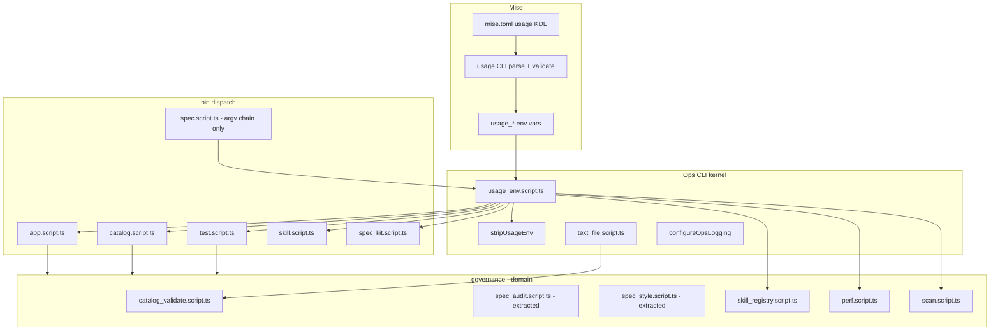

# Implementation Plan: Ops CLI kernel (014)

**Branch**: `014-ops-cli-kernel` | **Date**: 2026-06-19 | **Spec**: [spec.md](file:///Users/roalcantara/Work/bun/kb/assets/specs/014-ops-cli-kernel/spec.md)

**Input**: Feature specification from `assets/specs/014-ops-cli-kernel/spec.md`

## Summary

Introduce a small **ops CLI kernel** under `packages/ops/src/support/lib/` so mise-invoked scripts stop duplicating parsers and file I/O. **Mise remains the sole CLI contract**; Bun scripts **trust** `usage_*` and only apply **semantic** checks mise cannot express.

**Single delivery:** bin stubs, extracted test governance, text-file DRY, governance CLIs (`skill_registry`, `perf`, `scan`, `spec_kit`), and removal of npm `yaml` in one PR on branch `014-ops-cli-kernel`.
No third-party CLI library on the mise path — fewer lines than today, not more.

### How we measure success

Capture baselines at branch start (`OCK-BASE-03`); re-run the same commands at closeout (`OCK-DONE-04`).

#### 1. Less duplicate code (primary)

| Metric                                          | Baseline (2026-06-03)    | Target                                               | How to measure                                                                  |
| ----------------------------------------------- | ------------------------ | ---------------------------------------------------- | ------------------------------------------------------------------------------- |
| `function envBool` copies in `packages/ops/src` | **5** files              | **0**                                                | `rg -l 'function envBool' packages/ops/src --glob '*.ts' \| wc -l`              |
| Hand-rolled `parseCli` in governance            | **1** (`skill_registry`) | **0**                                                | `rg 'function parseCli' packages/ops/src`                                       |
| `hasCliFlag` in `spec_kit.script.ts`            | present                  | **0** for mise-declared flags                        | `rg 'hasCliFlag' packages/ops/src/bin/spec_kit.script.ts`                       |
| `split('\n')[0]` first-line reads               | **4** prod files         | **0** (use `firstLine`)                              | `rg "split\\('\\\\n'\\)\\[0\\]" packages/ops/src --glob '*.ts' -g '!*.spec.ts'` |
| `process.argv` flag scans in `bin/`             | **16** matches           | **≤ 4** (only `spec` nested chain + debug fallbacks) | `rg 'process\.argv' packages/ops/src/bin -c \| awk -F: '{s+=$2} END {print s}'` |
| `yaml` npm imports in `packages/ops/src`        | **2** files              | **0**                                                | `rg "from 'yaml'" packages/ops/src`                                             |
| `"yaml"` in `package.json` dependencies         | **1**                    | **0**                                                | `rg '"yaml"' package.json`                                                      |

#### 2. Smaller, clearer entrypoints

| Metric                                         | Baseline                                              | Target                                              | How to measure                              |
| ---------------------------------------------- | ----------------------------------------------------- | --------------------------------------------------- | ------------------------------------------- |
| `bin/test.script.ts` LOC                       | **~375**                                              | **≤ 150**                                           | `wc -l packages/ops/src/bin/test.script.ts` |
| `bin/*.script.ts` total LOC                    | **~2024**                                             | **Net −200** (new kernel ~+120, extract/move ~−320) | `wc -l packages/ops/src/bin/*.script.ts`    |
| Each thin bin stub (`app`, `catalog`, `skill`) | varies                                                | **≤ 80** LOC each                                   | `wc -l` per file                            |
| Governance targets after migration             | **~1397** (`skill_registry`+`scan`+`perf`+`spec_kit`) | **Net −150** LOC parser/env boilerplate             | `wc -l` on those four files                 |

**Files:** expect **+6** new kernel/extract modules (with co-located specs). **Not** a goal to shrink file count — goal is **one responsibility per file** and **no duplicate helpers**.

#### 3. Safer subprocess hygiene

| Metric                                         | Baseline                               | Target                                                  | How to measure                                                                 |
| ---------------------------------------------- | -------------------------------------- | ------------------------------------------------------- | ------------------------------------------------------------------------------ |
| Child spawns leaking `usage_*`                 | unverified                             | **0**                                                   | `spawnInherit` / `runInherit` strip via `stripUsageEnv`; spec asserts env keys |
| `console.*` in migrated bin + governance paths | **~52** hits in bin + `skill_registry` | **0** in touched files                                  | `rg 'console\.(log\|error\|warn)' <touched paths>`                             |
| Structured logging                             | ad hoc                                 | **100%** migrated `main()` call `configureOpsLogging()` | code review + `ops_logging.script.spec.ts`                                     |

#### 4. Performance (no regression)

| Metric                                 | Baseline              | Target                                                | How to measure                                            |
| -------------------------------------- | --------------------- | ----------------------------------------------------- | --------------------------------------------------------- |
| `mise run catalog validate` wall time  | record once           | **≤ baseline + 5%**                                   | `/usr/bin/time -p mise run catalog validate` (warm cache) |
| `mise run test spec-audit`             | record once           | **≤ baseline + 5%**                                   | same                                                      |
| `mise run skill list`                  | record once           | **≤ baseline + 5%**                                   | same                                                      |
| Double file reads in catalog tag paths | 2× read in some paths | **1× read** per file in `collectMembershipTagsInFile` | unit spec + read count in test                            |

**Not** optimizing CI e2e job duration here — out of scope unless a change accidentally adds subprocess overhead.

#### 5. Behaviour unchanged (fitness)

| Check            | Command                                                |
| ---------------- | ------------------------------------------------------ |
| Policy           | `mise run policy check`                                |
| Unit             | `mise run test unit`                                   |
| Spec audit/style | `mise run test spec-audit` / `spec-style`              |
| Catalog          | `mise run catalog validate`                            |
| App gates        | `mise run app gates --quality`                         |
| Full gate        | `bash .agents/skills/app-quality-gate/scripts/gate.sh` |

**Success =** all fitness commands exit 0 **and** primary metrics (§1–2) meet targets **and** no performance regression (§4).

### Architecture



### Module contracts

#### `packages/ops/src/support/lib/cli/dispatch.script.ts`

Thin mise entrypoints fall into **three patterns**. One kernel module covers them; **do not** merge all tasks into a single router file (mise still points at `bin/<task>.script.ts` for stable paths and stack traces).

| Pattern             | Examples today                       | Kernel API                                                                   |
| ------------------- | ------------------------------------ | ---------------------------------------------------------------------------- |
| **Forward**         | `skill.script.ts`                    | `forwardToScript(relativePath, { passCmd, extraArgs? })`                     |
| **Route table**     | `audit.script.ts`, `hooks.script.ts` | `routeByUsageCmd({ task, routes: Record<cmd, string[]> })`                   |
| **Domain dispatch** | `catalog`, `app`, `test`, `spec`     | Stay in bin file; use `usage_env` + imports (too much logic to config-drive) |

Shared helpers (same module):

- `runBinMain(fn)` — `import.meta.main` guard + LogTape error exit (replaces copy-pasted `main().catch(console.error)`). Supports async `fn` returning `Promise<void | number>` or `void | number`.
- `usageCmdExtraArgv({ drop?: string[] })` — `usage_cmd` + filtered `argv` for bash wrappers that pass `"$CMD" "$@"`

**`skill.script.ts` after migration (~8 LOC):**

```ts
#!/usr/bin/env bun
import { forwardToScript, runBinMain } from '../support/lib/cli/dispatch.script'

runBinMain(() =>
  forwardToScript('governance/registries/skill/skill_registry.script.ts', { passCmd: true })
)
```

**`audit.script.ts` after migration (~12 LOC):**

```ts
runBinMain(() =>
  routeByUsageCmd({
    task: 'audit',
    routes: {
      'rogue-refs': ['bun', 'packages/ops/src/governance/policies/rogue_refs.script.ts']
    }
  })
)
```

**Not grouped with bin entries:** `shim_spawn.script.ts` is a **test harness** (`spawnScript`, `REPO_ROOT` for `app.script.spec.ts`). Move to `support/lib/testing/spawn_bin.script.ts` — not a mise entry, not part of `dispatch`.

**Anti-patterns:**

- One `bin/router.script.ts` + env var per task — opaque stack traces, harder to grep entrypoints
- Config file listing all routes — duplicates `mise.toml` usage `cmd` blocks
- Merging `catalog` / `test` into route table — domain imports and switches belong in their bin files

#### `packages/ops/src/support/lib/cli/usage_env.script.ts`

| Export                       | Role                                                       |
| ---------------------------- | ---------------------------------------------------------- |
| `usageFlag(env, name)`       | `env[\`usage_${name}\`] === 'true'` — no TypeBox           |
| `usageOptString(env, name)`  | Trim; `undefined` if empty                                 |
| `usageFlags(env, keys)`      | Batch-parse multiple boolean variables                     |
| `usageStrings(env, keys)`    | Batch-parse multiple string variables                      |
| `usageCmd(env, fallback?)`   | `usage_cmd` trim or fallback for direct `bun bin/…` debug  |
| `rawJsonConflict(raw, json)` | Move from `spec.script.ts`; sole cross-flag mutex helper   |
| `stripUsageEnv(env)`         | Delete all `usage_*` keys; return new env object           |
| `readTestUsage(env)` etc.    | Thin typed structs (interfaces), not runtime re-validation |

**Explicit non-goals:** `Value.Check` per flag; argv scanning for flags in usage spec.

#### `packages/ops/src/support/lib/shared/text_file.script.ts`

```ts
import { Result } from 'neverthrow'

export function readTextFile(path: string): Promise<Result<string, Error>>

export function firstLine(text: string): string
export function lines(text: string): string[]

export function readTextLines(path: string, mode: 'first'): Promise<Result<string, Error>>
export function readTextLines(path: string, mode: 'all'): Promise<Result<string[], Error>>
```

Implementation uses **function overloads** (or conditional type `ReadLinesResult<M>`) so call sites get correct return types without two named functions.

**Refactor targets:**

| File                         | Change                                                                                 |
| ---------------------------- | -------------------------------------------------------------------------------------- |
| `catalog_validate.script.ts` | Replace `readFirstLine` / `readAllLines`; single read in `collectMembershipTagsInFile` |
| `tag.script.ts`              | Use `firstLine(readTextFile(...))`                                                     |
| `e2e_metrics.script.ts`      | Use `firstLine` helper                                                                 |

#### `packages/ops/src/support/lib/cli/ops_logging.script.ts`

- `configureOpsLogging()` — stderr sink, `LOG_LEVEL` from env
- Category prefix `['kb', 'ops', '<area>']`
- Bin entry: call once at top of `main()` in migrated stubs

#### Codegen (OCK-6 — not in 014)

Deferred to a future spec. Do not implement `policy codegen-usage` in this PR.

#### Bun YAML (OCK-7 — remove npm `yaml`)

Project standard is **`Bun.YAML.parse` / `Bun.YAML.stringify`**. The npm `yaml` package is redundant for the two remaining call sites.

| File                                             | Today                                       | Target                                                       |
| ------------------------------------------------ | ------------------------------------------- | ------------------------------------------------------------ |
| `governance/security/allowlist.loader.script.ts` | `import { parse } from 'yaml'`              | `Bun.YAML.parse(text) as unknown` → `validateAllowlistShape` |
| `governance/specs/resolve_catalog_key.script.ts` | `import { parse as parseYaml } from 'yaml'` | `Bun.YAML.parse(catalogText) as unknown` in `collectKeys`    |

**Do not use** npm `yaml` for: Document API, custom tags, or stringify — not used today. **Do not add** TOML/JSON5/Markdown/Secrets APIs for this task; they are unrelated.

**New spec file:** `allowlist.loader.script.spec.ts` (missing today; required for OCK-7).

**Root `package.json`:** remove `"yaml": "^2.9.0"` from `dependencies`; run `bun install` to refresh lockfile.

**Conformance note:** Bun’s YAML parser targets YAML 1.2; `catalog.yaml` and handoff allowlists are plain mappings — within supported subset.

## Feature deltas

Only list what **differs** from the baseline for this feature.

| Topic | Delta |
| --- | --- |
| CLI Kernel | New support helpers: `usage_env`, `dispatch`, `text_file`, `ops_logging` under `packages/ops/src/support/lib/` |
| Dependencies | Remove `yaml` npm package from `package.json` in favor of `Bun.YAML`; add `neverthrow` to support libraries |
| Bin Stubs | Migrate bin stubs (`app`, `catalog`, `test`, `skill`, etc.) to use kernel and action map command routing |
| Governance | Migrate `skill_registry`, `perf`, `scan`, `allowlist.loader`, `resolve_catalog_key` to use kernel, native Bun YAML, and/or `neverthrow` |
| Test Harness | Move `bin/shim_spawn.script.ts` to `support/lib/testing/spawn_bin.script.ts` |
| E2e | N/A (Pure infrastructure, no user-facing UI or features) |

## Technical Context

**Language/Version**: Bun 1.1+ / TypeScript

**Primary Dependencies**: `@shared/logging` (LogTape), `Bun.YAML` (replacing npm `yaml` package), `neverthrow` (functional error handling)

**Storage**: N/A

**Testing**: `bun:test`

**Target Platform**: macOS / Linux (running via Bun runtime)

**Project Type**: CLI / Build Tools / Infrastructure

**Performance Goals**:
- No regression on `mise run catalog validate` wall time (warm cache ≤ baseline + 5%)
- No regression on `mise run test spec-audit` wall time (warm cache ≤ baseline + 5%)
- No regression on `mise run skill list` wall time (warm cache ≤ baseline + 5%)
- Double file reads in catalog tag paths: 1× read per file in `collectMembershipTagsInFile`

**Constraints**:
- Bin stubs (`app`, `catalog`, `skill`) ≤ 80 LOC each
- `bin/test.script.ts` ≤ 150 LOC
- `packages/ops/src/bin/*.script.ts` total LOC Net −200 (new kernel ~+120, extract/move ~−320)
- Zero `console.*` in migrated paths (use stderr logger `getLogger(['kb', 'ops', ...])`)
- Subprocesses spawned from bin/planners must strip `usage_*` keys using `stripUsageEnv`

**Scale/Scope**: Net negative LOC in `packages/ops/src/bin`, removal of 1 external npm dependency (`yaml`), creation of 6 new kernel/extracted modules with co-located specs.

## Constitution Check

*GATE: Must pass before Phase 0 research. Re-check after Phase 1 design.*

The following gates are established from `.specify/memory/constitution.md`:

| Principle | Checkpoint / Requirement | Touchpoint in this Plan | Conformance Status |
| --- | --- | --- | --- |
| **Principle II: Functional Core, Imperative Shell** | Keep pure core logic decoupled from shell I/O. | Support libraries under `packages/ops/src/support/lib/` are pure helpers. Bin stubs act as the thin shell dispatchers. | **Conforms**. |
| **Principle IV: Type-Safe Contracts (TypeBox-only)** | Zod is not a dependency. All validation uses TypeBox. | Transport and domain payloads in tasks will utilize TypeBox if validation is required. No Zod will be used. | **Conforms**. |
| **Principle V: Test-First & Evidence** | Every file under `src/` must have a co-located `.spec.ts(x)`. Release-gating ACs must name Measure and Evidence. | All new files (`usage_env`, `dispatch`, `text_file`, `ops_logging`, `spec_audit`, `spec_style`, `allowlist.loader.script.spec.ts`) will have co-located tests. | **Conforms**. |
| **Principle VI: Conventions** | Suffix declares role. One artifact per file. | All files follow standard names (e.g. `<name>.script.ts` and `<name>.script.spec.ts`). | **Conforms**. |
| **Principle VIII: Observability** | Use `getLogger` from `@shared/logging`. `console.*` forbidden. | Migrated files will call `configureOpsLogging()` and use `getLogger(['kb', 'ops', '<area>'])`. No `console.*` logs. | **Conforms**. |
| **Principle IX: Electrobun** | Security enforcement: `mise run spec security` is required. | Run security gate during verification. | **Conforms**. |

## Project Structure

### Documentation (this feature)

```text
assets/specs/014-ops-cli-kernel/
├── spec.md              # Normative
├── plan.md              # Normative (this file)
└── tasks.md             # Normative
```

No data-model.md, contracts/, or quickstart.md since it's pure developer/internal infra.

### Source Code (repository root)

```text
packages/ops/src/
├── bin/
│   ├── app.script.ts
│   ├── audit.script.ts
│   ├── catalog.script.ts
│   ├── hooks.script.ts
│   ├── shim_spawn.script.ts (to be deleted/moved)
│   ├── skill.script.ts
│   ├── spec.script.ts
│   ├── spec_kit.script.ts
│   └── test.script.ts
├── governance/
│   ├── registries/
│   │   └── skill/
│   │       └── skill_registry.script.ts
│   ├── security/
│   │   ├── allowlist.loader.script.ts
│   │   └── scan.script.ts
│   └── specs/
│       ├── resolve_catalog_key.script.ts
│       ├── spec_audit.script.ts (NEW)
│       └── spec_style.script.ts (NEW)
├── metrics/
│   └── harnesses/
│       └── perf/
│           └── perf.script.ts
└── support/
    └── lib/
        ├── cli/
        │   ├── dispatch.script.ts (NEW)
        │   ├── ops_logging.script.ts (NEW)
        │   └── usage_env.script.ts (NEW)
        ├── shared/
        │   └── text_file.script.ts (NEW)
        └── testing/
            └── spawn_bin.script.ts (NEW)
```

**Structure Decision**: Infrastructure-only package structure. Extends packages/ops/src/support/lib and migrates bin/ and governance/ files.

## E2e traceability

| Requirement | Feature file | Scenario | Notes |
| ----------- | ------------ | -------- | ----- |
| OCK-1       | N/A          | N/A      | Pure developer/infra refactor |
| OCK-2       | N/A          | N/A      | Pure developer/infra refactor |
| OCK-3       | N/A          | N/A      | Pure developer/infra refactor |
| OCK-4       | N/A          | N/A      | Pure developer/infra refactor |
| OCK-5       | N/A          | N/A      | Pure developer/infra refactor |
| OCK-7       | N/A          | N/A      | Pure developer/infra refactor |

*Note: Since no user-facing features or UI changes occur in this release, e2e Gherkin scenarios are out of scope (marked N/A).*

## Complexity Tracking

*No violations. All principles and constraints are fully respected.*

### File touch list

#### New

| Path                                                   | Purpose                                              |
| ------------------------------------------------------ | ---------------------------------------------------- |
| `support/lib/cli/usage_env.script.ts` + `.spec.ts`     | Kernel                                               |
| `support/lib/cli/dispatch.script.ts` + `.spec.ts`      | Forward + route-table bin stubs                      |
| `support/lib/shared/text_file.script.ts` + `.spec.ts`  | I/O DRY                                              |
| `support/lib/cli/ops_logging.script.ts` + `.spec.ts`   | LogTape bootstrap                                    |
| `governance/specs/spec_audit.script.ts` + `.spec.ts`   | Extracted from `test.script.ts`                      |
| `governance/specs/spec_style.script.ts` + `.spec.ts`   | Extracted from `test.script.ts`                      |
| `governance/security/allowlist.loader.script.spec.ts`  | Co-located spec for OCK-7                            |
| `support/lib/testing/spawn_bin.script.ts` + `.spec.ts` | Relocate from `bin/shim_spawn.script.ts` (test-only) |

#### Modified — bin + kernel consumers

| Path                                                       | Change                                              |
| ---------------------------------------------------------- | --------------------------------------------------- |
| `bin/test.script.ts`                                       | Dispatch-only; import extracted modules             |
| `bin/app.script.ts`                                        | `usage_env`                                         |
| `bin/catalog.script.ts`                                    | `usage_env`; drop argv action parse where redundant |
| `bin/skill.script.ts`                                      | `forwardToScript` via `dispatch`                    |
| `bin/audit.script.ts`                                      | `routeByUsageCmd` via `dispatch`                    |
| `bin/hooks.script.ts`                                      | `routeByUsageCmd` via `dispatch`                    |
| `bin/spec.script.ts`                                       | Use shared `stripUsageEnv`, `rawJsonConflict`       |
| `bin/spec_kit.script.ts`                                   | `usage_env`; drop `hasCliFlag` for mise flags       |
| `support/lib/shared/spawn_inherit.script.ts`               | Strip `usage_*` in default child env                |
| `governance/registries/catalog/catalog_validate.script.ts` | `text_file` helper                                  |
| `governance/registries/catalog/tag.script.ts`              | `text_file` helper                                  |
| `metrics/harnesses/e2e-quality/e2e_metrics.script.ts`      | `firstLine`                                         |
| `assets/guides/MISE_GUIDE.md`                              | § Ops CLI kernel + trust mise                       |

#### Modified — governance CLI (OCK-5)

| Path                                                   | Change                                    |
| ------------------------------------------------------ | ----------------------------------------- |
| `governance/registries/skill/skill_registry.script.ts` | Remove `parseCli`; `usage_env`            |
| `metrics/harnesses/perf/perf.script.ts`                | Remove local `envBool`; `usage_env`       |
| `governance/security/scan.script.ts`                   | Shrink `parseArgs`; mise flags via kernel |
| `governance/security/allowlist.loader.script.ts`       | `Bun.YAML.parse`; drop `yaml` import      |
| `governance/specs/resolve_catalog_key.script.ts`       | `Bun.YAML.parse`; drop `yaml` import      |
| `package.json` + `bun.lock`                            | Remove `yaml` dependency                  |

#### Unchanged contract

- `mise.toml` `usage` blocks remain source of truth
- `spec.script.ts` argv chain for nested subcommands (011)
- stdout JSON/raw output shapes

## Verification Plan

### Automated Tests

Run the following commands to confirm clean linting, typechecking, testing, and full quality gate compliance:

```sh
# Baseline / closeout metrics (save output in PR description)
rg -l 'function envBool' packages/ops/src --glob '*.ts' | wc -l
rg 'function parseCli' packages/ops/src
rg "from 'yaml'" packages/ops/src
rg '"yaml"' package.json
wc -l packages/ops/src/bin/test.script.ts packages/ops/src/bin/*.script.ts

# Fitness
mise run policy check
mise run test unit
mise run test spec-audit
mise run test spec-style
mise run catalog validate
mise run skill list
mise run app gates --quality
bash .agents/skills/app-quality-gate/scripts/gate.sh
```

### Manual Verification

1. Run direct debug executions (e.g. `bun bin/test.script.ts`) to ensure argv subcommand fallback behaves as expected.
2. Verify invalid enum error output when calling a subcommand directly with invalid options.
3. Audit warning log output on stderr during executions.
