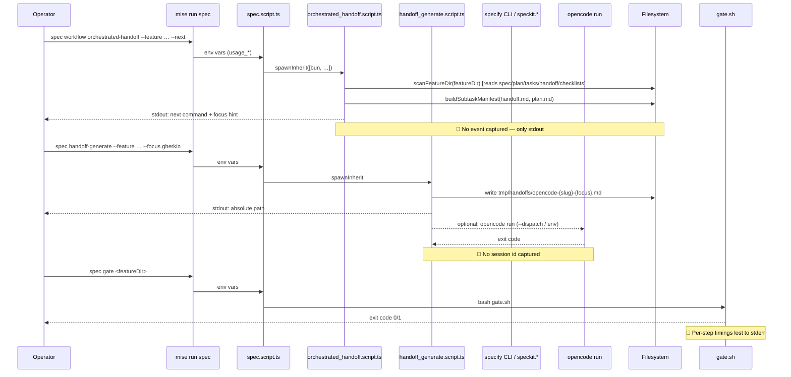

# Research brief — SDD workflow observability for kb

**Repo:** kb (this monorepo) · **Branch context:** `feat/000-feature-demo`
**Trigger spec:** [`004-orchestrated-handoff/`](../004-orchestrated-handoff/) (orchestrated-handoff workflow)
**Implementation spec:** `000-feature-demo/` (this feature)
**Deliverable type:** Decision-ready research report (no implementation in this turn)
**Conventions:** **Fact** = verifiable from repo or upstream docs · **Inference** = grounded reasoning · **Recommendation** = my opinion. Tagged inline.

---

## Context (why this research is being commissioned)

The orchestrated-handoff workflow shipped in spec 004 (`spec.md`, `plan.md`, `tasks.md`, `handoff.md`, ~85 tests, gate green). Operators can now run `mise run spec workflow orchestrated-handoff --feature … {--next|--manifest|--lint}` and emit opencode worker prompts from `handoff_generate.script.ts`. **What kb does not have yet:** a structured audit trail, decision log, performance measurement, or cross-boundary tracing for these workflow runs. Today the only post-hoc signal is git history (auto-commit disabled), checklist markers in `tools/__tests__/fixtures/<slug>/checklists/`, files in `tmp/handoffs/`, and ad-hoc `console.error` in `tools/` scripts. The goal of this report is to give maintainers a **pick-one-of-three** decision for v0.13.x.

---

## 1 · Executive summary (≤15 bullets)

1. **kb is observability-light by design** outside `src/`. `tools/` scripts use `console.*` directly; LogTape is gated to `src/` per [`LOGGING_GUIDE.md` § Renderer-side](../../../assets/guides/LOGGING_GUIDE.md). **Fact.**
2. The SDD workflow leaves **three durable artifacts** today: checklist markers (`checklists/analyze-{plan,tasks}.md`, `checklists/implement-done.md`), handoff prompt files (`tmp/handoffs/opencode-{slug}-{focus}.md`), and gate exit codes. **Fact.**
3. `.specify/extensions.yml` already defines `before_*`/`after_*` hooks for every phase, but every active hook is the `git` extension (auto-commit, kb-disabled). The `agent-context` extension fires after specify/plan but produces no event stream. **Fact** (`.specify/extensions.yml:6-164`).
4. **Recommendation:** Adopt a **kb-native JSONL audit log** as MVP (Option A in §3), defer OpenTelemetry to v0.15+, and treat `spec-kit-diagram` and `progress-report` as **inspire-only**, not adopt. Rationale: both seed extensions assume `specs/` not `tools/__tests__/fixtures/` and target visualization, not audit.
5. The `orchestrator_handoff.script.ts` already runs **deterministic decision logic** (`detectPhase`, `buildSubtaskManifest`) that maps cleanly to a typed event schema. Emitting events is a one-function-call insertion per branch. **Inference.**
6. Performance signal already on the wire: `mise.toml` runs scripts via `bun`, and Bun's `performance.now()` is free. Wall-time-per-phase is one timer wrapper away. **Fact.**
7. **Top risk #1:** scope creep — observability projects routinely balloon to instrument every script. Cap MVP at: `--next`, `--manifest`, `--lint`, `handoff-generate`, `spec lint|trace|gate`. Defer `speckit.*` LLM step timing (we can't instrument upstream).
8. **Top risk #2:** committing run metadata that contains paths or evidence strings could leak in-progress thinking. MVP should write to `tmp/workflow-runs/` (already in `hk.pkl` `exclude`) and stay local.
9. **Top risk #3:** parallel competing systems — kb has LogTape, `spec trace`, checklist markers, and a future audit log. Without a single index (the proposed `runs/` directory + a documented join model), each becomes a partial story.
10. **Provider correlation** (`OpenCode` invocation id) is **not** observable from Bun's side today. `opencode run` writes its own session id but we don't capture it. Plumbing this requires `--dispatch` capturing stdout for a session marker. **Inference.**
11. **`spec trace` already gives us cross-file requirement traceability** (`tools/governance/specs/trace.script.ts`). Audit log should reuse the same EARS IDs (OHW-n, SF-n) as correlation keys, not invent new ones.
12. **TypeBox** is the validation library for event schemas; **no Zod**. Per [`CLAUDE.md`](../../../CLAUDE.md) and 004 spec OHW-2 precedent.
13. **The MVP can ship in one PR.** Estimated touch list: 1 new module (`workflow_run.script.ts` ~200 LOC), 3-4 emit sites in the orchestrator, 1 new spec dir under `tools/__tests__/fixtures/000-feature-demo/`, ~10 new tests.
14. **Single-purpose CLI** (`mise run spec runs {list|show|tail}`) gives operators read access without inventing a UI — same shape as existing `spec lint|trace|gate`.
15. **Final answer:** **Path B (Recommended)** in §6 — kb-native JSONL audit + per-phase timing + `mise run spec runs` viewer + LogTape category bridge — is the right v0.13.x target. Defer OTel and Mermaid dashboards.

---

## 2 · Current-state map

**Signals available today** vs **missing** — see inventory in §3.

---

## 3 · Inventory — kb as-is

### 3.1 Signal already available (Facts; file refs from current tree)

| Signal                                             | Source                                                                                                   | Format                              |
| -------------------------------------------------- | -------------------------------------------------------------------------------------------------------- | ----------------------------------- |
| Phase markers (analyze-plan/tasks, implement-done) | `tools/__tests__/fixtures/<slug>/checklists/*.md`                                                                    | Empty marker files                  |
| Generated handoff prompts                          | `tmp/handoffs/opencode-{slug}-{focus}.md`                                                                | Markdown                            |
| Subtask manifest                                   | `mise run spec workflow … --manifest` stdout                                                             | XML                                 |
| Cross-file requirement traceability                | `mise run spec trace <dir>` ([`trace.script.ts`](../../../tools/governance/specs/trace.script.ts))       | stdout summary                      |
| EARS lint outcome                                  | `mise run spec lint <dir> --strict` ([`lint.script.ts`](../../../tools/governance/specs/lint.script.ts)) | stdout + exit code                  |
| Quality gate outcome                               | `bash .agents/skills/app-quality-gate/scripts/gate.sh`                                                   | stdout + exit code                  |
| Spec Kit run state (when used)                     | `.specify/workflows/runs/<id>/state.json` (referenced in spec 004 OHW-3)                                 | JSON (managed by upstream Spec Kit) |
| Spec Kit hook log (auto-commit)                    | `.specify/extensions.yml` `before_*`/`after_*`                                                           | Hook-driven git operations          |
| Test runs                                          | `bun test --config /dev/null tools/governance/specs/workflow/`                                           | stdout + JUnit (CI)                 |

### 3.2 Signals missing (Facts — gaps confirmed by reading the scripts)

| Missing signal                                                  | Why it matters                                                                            |
| --------------------------------------------------------------- | ----------------------------------------------------------------------------------------- |
| **Workflow run id**                                             | Cannot correlate `--next`/`--manifest`/`handoff-generate`/`gate` invocations into one run |
| **Per-phase wall time**                                         | Cannot answer "is `analyze` slowing us down vs `tasks`?"                                  |
| **Orchestrator decision inputs (FileSet, probe result, Phase)** | Cannot replay "why did `--next` say handoff-generate?" without rerunning                  |
| **Gate approve/reject signal**                                  | Human gates inside `workflow.yml` write nothing kb-side                                   |
| **opencode dispatch outcome**                                   | `--dispatch` propagates exit code but discards opencode session id                        |
| **Spec Kit `speckit.*` LLM timing**                             | Upstream Spec Kit owns this; we can wrap, not pierce                                      |
| **Cross-process trace id**                                      | LogTape `requestId` is `src/`-only; no `tools/` analog                                    |
| **Append-only audit history**                                   | Git auto-commit disabled; checklist markers don't carry history                           |

---

## 4 · Survey of options (≥2 per category)

### 4.1 Extend Bun tools
- **A1. JSONL append log under `tmp/workflow-runs/`.** Bun built-ins only. One module wraps `appendFileSync` + `performance.now()`. Schema lives in TypeBox under `tools/governance/specs/workflow/`. **Recommendation: best fit.**
- **A2. SQLite (`bun:sqlite`) audit DB under `.specify/runs/audit.sqlite`.** Queryable, append-only via `INSERT`. Heavier setup, schema migration burden.

### 4.2 Spec Kit extension / hooks
- **B1. Custom Spec Kit extension** that subscribes to `after_*` hooks and emits to kb's audit log. Couples to Spec Kit lifecycle; would miss `mise`-only invocations.
- **B2. Replace `.cursor/`-bound hooks** with provider-agnostic Bun shims. Out of scope per kb principle "provider-agnostic gates preferred."

### 4.3 Third-party libraries
- **C1. LogTape in `tools/`** with category prefix `['kb', 'tools', 'spec', …]` + a `tmp/workflow-runs/*.ndjson` file sink. Aligns with [`LOGGING_GUIDE.md` § Observability roadmap](../../../assets/guides/LOGGING_GUIDE.md#observability-roadmap). **Inference:** reusing LogTape avoids a parallel system.
- **C2. OpenTelemetry via `@logtape/otel`.** Per the LOGGING_GUIDE roadmap, trigger is "when distributed tracing or production monitoring is required." Premature for v0.13.x.
- **C3. Plain append-only SQLite (no LogTape).** Same as A2 but without the LogTape bridge. Loses the future `@logtape/sqlite` synergy.

### 4.4 Agent-side
- **D1. Agent session transcripts.** OpenCode writes its own sessions (`opencode session list`). We could capture session ids on `--dispatch` and store them in the audit log for join. **Inference: cheap; v0.15 add-on.**
- **D2. Adopt `drillan/speckit-gates/progress-report`.** Reads `tasks.md`, produces a `ProgressDashboard`. Per webfetch, 119 installs, three security audits. Overlaps with `handoff.md` AC tracker and `--next`. No audit, no performance, no tracing. **Gap: dashboard only.**

### 4.5 CI artifacts
- **E1. `mise` task profiling** via `MISE_PROFILE` or `time` wrapper. Free, but per-invocation, not per-run.
- **E2. GitHub Actions step timings.** CI-only; misses local operator runs (the common case for SDD).

### 4.6 Visualization-only
- **F1. `Quratulain-bilal/spec-kit-diagram-`.** Mermaid lifecycle + Gantt + DAG. Assumes `specs/` (kb uses `tools/__tests__/fixtures/`). Three diagram commands; no audit. Useful **inspiration** for our own Mermaid generator that reads our scanner.
- **F2. kb-native Mermaid emitter** reading `scanFeatureDir` + audit log → status board, status DAG. **Recommendation: defer to v0.15.**

---

## 5 · Evaluation matrix (1-5; weighted by criteria importance)

Criteria weights (kb-specific): **Fits kb paths 0.20 · Provider-agnostic 0.18 · Low ops 0.18 · Testability 0.15 · Security 0.12 · Incremental 0.10 · LogTape alignment 0.07**.

| Option                                  | Fits paths | Provider-ag. | Low ops | Testability | Security | Incremental | LogTape | **Weighted** |
| --------------------------------------- | :--------: | :----------: | :-----: | :---------: | :------: | :---------: | :-----: | :----------: |
| **A1 JSONL under `tmp/workflow-runs/`** |     5      |      5       |    5    |      5      |    5     |      5      |    3    |   **4.78**   |
| A2 SQLite audit DB                      |     5      |      5       |    3    |      4      |    5     |      3      |    3    |     4.13     |
| B1 Spec Kit extension hook              |     3      |      3       |    3    |      3      |    4     |      3      |    2    |     3.04     |
| C1 LogTape in `tools/` + file sink      |     5      |      5       |    4    |      5      |    4     |      4      |    5    |   **4.53**   |
| C2 OpenTelemetry via `@logtape/otel`    |     4      |      5       |    2    |      4      |    3     |      1      |    5    |     3.42     |
| D1 OpenCode session id capture          |     4      |      3       |    5    |      4      |    4     |      5      |    3    |     3.95     |
| D2 Adopt `progress-report` skill        |     2      |      3       |    4    |      2      |    3     |      5      |    2    |     2.93     |
| E1 `mise` task profiling                |     5      |      5       |    5    |      2      |    5     |      5      |    1    |     4.21     |
| F1 Adopt `spec-kit-diagram` as-is       |     1      |      4       |    4    |      1      |    4     |      2      |    1    |     2.40     |
| F2 kb-native Mermaid emitter            |     5      |      5       |    3    |      4      |    5     |      2      |    3    |     3.95     |

**Top two:** A1 (4.78) and C1 (4.53). Picking both as a **hybrid**: A1 is the on-disk schema; C1 is the runtime emission path (LogTape category `['kb','tools','spec','workflow']` with a file sink that writes A1's JSONL format). This makes the audit log *both* a LogTape-emitted stream *and* a queryable artifact.

---

## 6 · Three architectures

### Path A · MVP (1–2 days, single PR)

**Goal:** prove the audit shape; capture decisions and timings; no LogTape adoption in `tools/` yet.

- New module: `tools/governance/specs/workflow/workflow_run.script.ts` with TypeBox `WorkflowEvent` schema (event = `phase_decided | manifest_emitted | handoff_written | dispatch_invoked | lint_run | trace_run | gate_run | exit`).
- Emit sites (insertions in existing scripts):
  - `orchestrated_handoff.script.ts` `run()` → emit `phase_decided` (carries FileSet hash, probe result, `Phase`, `command`, `focusHint`, duration_ms).
  - `orchestrated_handoff.script.ts` manifest branch → `manifest_emitted` (subtask count + types).
  - `handoff_generate.script.ts` after write → `handoff_written` (path, focus, ac_row_count, has_e2e_block, duration_ms).
  - `handoff_generate.script.ts` dispatch branch → `dispatch_invoked` (opencode found?, body_bytes, exit_code).
- File layout: `tmp/workflow-runs/<YYYY-MM-DD>/<run_id>.ndjson`. Run id = `slug-<UTC-epoch>-<rand4>` per invocation (no cross-invocation join in MVP — call it out in spec).
- New mise subcommand: `mise run spec runs {list|show|tail}` (read-only).
- Tests: TypeBox `Value.Check` on every emitted event; rolling fixture in `tools/governance/specs/workflow/workflow_run.script.spec.ts`; integration test that records 003 pilot run and asserts events fired.
- Operator UX: `mise run spec workflow … --next` unchanged on stdout; events appended silently. New `runs list` prints last 20 runs with `slug | phase | duration_ms | result`.

### Path B · Recommended (≈1 week, can stage across 2 PRs)

**Path A** + LogTape adoption in `tools/`:

- Bring LogTape into `tools/` under a new `@shared/logging-tools` re-export (or extend the existing `@shared/logging` factory; one-line add of a `['kb','tools',…]` category prefix). **Inference:** prevents a parallel logging system, matches LOGGING_GUIDE roadmap.
- File sink writes JSONL identical to MVP. Console sink optional via `WORKFLOW_RUN_VERBOSE=1`.
- Cross-invocation `run_id` propagation via env (`WORKFLOW_RUN_ID`). `mise run spec workflow` mints one; `mise run spec handoff-generate` reuses if set. Operator-friendly: same id covers `--next` + `handoff-generate` + `gate` if invoked in the same shell session via a documented helper script.
- New mise subcommand: `mise run spec runs join <run_id>` produces a Mermaid sequence diagram from the events (kb-native version of `spec-kit-diagram` lifecycle, but driven by real data, not file presence).
- OpenCode session id capture: when `--dispatch` succeeds, scrape `opencode` stdout for `session: <id>` (if present) and emit `dispatch_invoked.session_id`. **Inference based on opencode CLI design (see [opencode.ai/docs/cli/](https://opencode.ai/docs/cli/)).** If absent, leave field null and document as deferred.
- Spec Kit hook bridge: a small Spec Kit extension that subscribes to `after_*` and emits `phase_hook_fired` events with the same `run_id`. Out of scope if hooks remain complex.

### Path C · Stretch (multi-quarter)

**Path B** + OTel + cross-agent correlation:

- `@logtape/otel` exporter (per LOGGING_GUIDE roadmap). Local collector via OTel Collector Docker.
- Spans for `phase`, `lint`, `trace`, `gate`, `handoff-generate`. Trace ids propagated via env to subprocesses (specify CLI, opencode).
- Optional `@logtape/sqlite` adoption for in-app inspector + audit DB join.
- Correlation table linking `WORKFLOW_RUN_ID` ↔ Spec Kit `state.json.run_id` ↔ opencode session ↔ git commit sha.
- **Not recommended for v0.13.x.** Trigger condition: kb scales to multiple operators / nightly automation that produces >50 runs/week.

---

## 7 · Gap analysis on seed links

### `Quratulain-bilal/spec-kit-diagram-` (per webfetch on https://github.com/Quratulain-bilal/spec-kit-diagram-)

- **Adopt as-is?** No. **Reasons:**
  - Reads `specs/` not `tools/__tests__/fixtures/`; would require a path patch in every command.
  - Doesn't know about dual `analyze` or `handoff-generate`; lifecycle diagram misses two of kb's phases.
  - Read-only **visualization**, not observability. Solves a different problem.
  - Installation via `specify extension add --from <url>` would land an upstream artifact in our `.specify/` that we'd then need to fork to align.
- **Inspire-only?** **Yes.** The three diagram commands (`/workflow`, `/status`, `/dependencies`) are good UX targets for a kb-native Mermaid emitter (Path B's `runs join` and a v0.15 `runs status`).

### `drillan/speckit-gates/progress-report` (per webfetch on https://www.skills.sh/drillan/speckit-gates/progress-report)

- **Adopt as-is?** No. **Reasons:**
  - Overlaps with our `handoff.md` AC tracker (per-AC slice ids) and `--manifest` subtask output.
  - Provides no audit trail, no performance measurement, no provider-agnostic guarantees in available docs.
  - Skills CLI install model exists in kb (`mise run skill install`) but importing a third-party skill with unclear path assumptions is a maintenance tax.
- **Inspire-only?** Mild — the **"potentially complete but unmarked tasks"** detector is a useful diagnostic we could add to `--next` later (a "drift" warning row).

---

## 8 · Anti-patterns (do NOT do in kb)

1. **Do not duplicate EARS requirements in event payloads.** Reference `OHW-n`, `SF-n` ids; the spec is authoritative.
2. **Do not log full LLM prompts by default.** They contain implementation thinking and Evidence quotes; size will balloon. If needed, gate behind `WORKFLOW_RUN_INCLUDE_PROMPTS=1` env and document the privacy implication.
3. **Do not couple to Cursor-only hooks.** Bun scripts are the lowest common provider denominator.
4. **Do not introduce Zod.** TypeBox per [`CLAUDE.md`](../../../CLAUDE.md) and 004 spec OHW-2.
5. **Do not commit `tmp/workflow-runs/`.** `hk.pkl` already excludes `tmp`. Verify.
6. **Do not weaken `lint.script.ts` or `gate.sh` thresholds to make instrumentation pass.** Same rule as 004 spec OHW-6 AC3.
7. **Do not invent a new requestId scheme.** Reuse LogTape's `withContext({ workflow_run_id })` pattern. Aligns with LOGGING_GUIDE.
8. **Do not snapshot pretty-formatter output in tests.** Assert on `LogRecord` shape (LOGGING_GUIDE existing anti-pattern).

---

## 9 · Phased roadmap

| Release      | Scope          | Deliverable                                                                                              | Effort            |
| ------------ | -------------- | -------------------------------------------------------------------------------------------------------- | ----------------- |
| **v0.13.0**  | Path A MVP     | TypeBox event schema, 4 emit sites, JSONL writer, `mise run spec runs {list,show,tail}`, spec 005        | 1–2 days          |
| **v0.13.x**  | Path B layer 1 | LogTape in `tools/`, file sink, `WORKFLOW_RUN_ID` env, `runs join` Mermaid                               | +2–3 days         |
| **v0.15.0**  | Path B layer 2 | OpenCode session id capture, optional Spec Kit hook bridge, drift detector inspired by `progress-report` | 3–5 days          |
| **Deferred** | Path C         | `@logtape/otel` + collector, span propagation, cross-agent correlation table                             | Triggered by need |

---

## 10 · Draft spec outline (if approved)

Suggested slug: **`000-feature-demo`** (alternative: `005-workflow-runs`).

Land at `tools/__tests__/fixtures/000-feature-demo/`. Normative quartet only per OHW-8: `spec.md`, `plan.md`, `tasks.md`, `handoff.md`. No `research.md` (this brief replaces it; archive at `tools/__tests__/fixtures/000-feature-demo/research-brief.md` if desired).

### Draft EARS requirements (no implementation)

- **WOBS-1 Event schema is TypeBox-validated**
  WHEN any `tools/governance/specs/workflow/` script emits a workflow event, THEN the event SHALL be validated against a TypeBox schema before being written. (Measure: every emit site under test fixture; `Value.Check` invariant.) (Evidence: `bun test … workflow_run.script.spec.ts`.)

- **WOBS-2 Phase decision is recorded**
  WHEN `orchestrated_handoff.script.run()` reaches a `detectPhase` outcome, THEN a `phase_decided` event SHALL be emitted with the FileSet hash, manifest probe result, chosen Phase, command string, focusHint, and `duration_ms`. (Measure: pilot 003 `--next` produces exactly one event with `phase === 'analyze-plan'`.) (Evidence: integration test.)

- **WOBS-3 Handoff emission is recorded**
  WHEN `handoff_generate.script.run()` writes a prompt file, THEN a `handoff_written` event SHALL include the absolute path, focus, ac_row_count, `has_e2e_block`, and `duration_ms`. (Evidence: pilot 003 gherkin focus produces an event with `has_e2e_block === true`.)

- **WOBS-4 Dispatch outcome is recorded**
  WHEN `--dispatch` is requested, THEN a `dispatch_invoked` event SHALL include `opencode_found`, `body_bytes`, `exit_code`, and (if extractable) `session_id`. (Evidence: fake-opencode test fixture.)

- **WOBS-5 Audit lives under `tmp/workflow-runs/`**
  WHEN events are written, THEN they SHALL be appended to `tmp/workflow-runs/<YYYY-MM-DD>/<run_id>.ndjson` and SHALL NOT be committed to git. (Evidence: `.gitignore` + `hk.pkl` exclude rules + path existence test.)

- **WOBS-6 Read-side CLI ships in the same PR**
  WHEN `mise run spec runs list`, `… show <run_id>`, or `… tail` is invoked, THEN the dispatcher SHALL read JSONL from `tmp/workflow-runs/` and print one run per line / one event per line. (Evidence: `bun test --config /dev/null tools/governance/specs/workflow/workflow_run.script.spec.ts` and pilot smoke.)

- **WOBS-7 No deterministic gate is weakened**
  WHEN observability ships, THEN `tools/governance/specs/lint.script.ts`, `trace.script.ts`, and `gate.sh` SHALL be unchanged in their failure semantics (added instrumentation does not flip exit codes). (Evidence: diff review + existing gate green.)

- **WOBS-8 Performance budget for `--next`**
  WHEN `orchestrated_handoff.script.run()` is invoked with `--next` on a populated feature dir, THEN the wall-time SHALL be < 250ms p95 with audit emission enabled. (Measure: benchmark 100 invocations against pilot 003; assert p95.) (Evidence: perf harness — same pattern as `tools/metrics/harnesses/perf/perf.script.ts`.)

(5–8 requirements per brief instructions. Eight is appropriate given the orthogonality.)

---

## 11 · Open questions (≤5, each with a default)

1. **Adopt LogTape in `tools/` now, or after MVP?**
   *Default if undecided:* MVP ships without LogTape (Path A). Add LogTape in the v0.13.x follow-up PR.
2. **Cross-invocation run id (`WORKFLOW_RUN_ID` env)?**
   *Default:* yes in Path B; MVP can punt and produce one run id per `bun` process. Document the gap in WOBS-2 evidence.
3. **Run metadata commit policy?**
   *Default:* never commit. Local only under `tmp/workflow-runs/`. A future "ship summary" command can emit a redacted Markdown digest to the PR body manually.
4. **OpenCode session id extraction?**
   *Default:* attempt to scrape opencode stdout for `session: <id>`; if absent, store null and add a v0.15 task to plumb properly. Document in WOBS-4 measure.
5. **kb-native Mermaid status board (Path B+) vs adopting `spec-kit-diagram`?**
   *Default:* build a kb-native emitter reading WOBS event log; keep `spec-kit-diagram` as inspiration. Skip adoption.

---

## 12 · Critical files (existing — reuse, do not invent)

These are the files an implementer will read or touch when WOBS is ready to plan:

- [`tools/governance/specs/workflow/orchestrated_handoff.script.ts`](../../../tools/governance/specs/workflow/orchestrated_handoff.script.ts) — `detectPhase`, `buildSubtaskManifest`, `runLint` — exact emit sites for `phase_decided`, `manifest_emitted`.
- [`tools/governance/specs/workflow/handoff_generate.script.ts`](../../../tools/governance/specs/workflow/handoff_generate.script.ts) — `run()`, `dispatchToOpencode` — exact emit sites for `handoff_written`, `dispatch_invoked`.
- [`tools/governance/specs/workflow/usage.script.ts`](../../../tools/governance/specs/workflow/usage.script.ts) — `UsageError`, `withUsage` — pattern to mirror for `WorkflowEvent` shared helpers.
- [`tools/bin/spec.script.ts`](../../../tools/bin/spec.script.ts) — dispatcher pattern. New `runs` subcommand follows the same `case 'workflow'` shape.
- [`mise.toml`](../../../mise.toml) — `[tasks."spec"]` usage block — extend with `cmd "runs" {…}`.
- [`assets/guides/LOGGING_GUIDE.md`](../../../assets/guides/LOGGING_GUIDE.md) — § Observability roadmap names `@logtape/file` (Path B), `@logtape/otel` (Path C). Reuse the test pattern (`fixtureSink` capture).
- [`tools/metrics/harnesses/perf/perf.script.ts`](../../../tools/metrics/harnesses/perf/perf.script.ts) — performance harness pattern to satisfy WOBS-8.
- [`.specify/extensions.yml`](../../../.specify/extensions.yml) — Spec Kit hook points (Path B layer 2 only; out of scope for MVP).
- [`hk.pkl`](../../../hk.pkl) — confirm `tmp` exclusion stays.

---

## 13 · Verification (how a maintainer confirms this brief lands well)

This is a research deliverable. There is **no code change to verify** in this turn. The brief is verified by the following before approval:

1. Maintainer reads §1 (executive summary), §6 (three architectures), and §10 (draft spec outline) and answers: "would I greenlight Path B as v0.13.x?"
2. Maintainer reads §11 (open questions) and either accepts defaults or selects an alternative.
3. Maintainer confirms §12 critical files are correct (no missing path; no broken link).
4. If approved → next step is to invoke the planning workflow on `000-feature-demo` (Spec Kit `speckit.specify` against this brief, or `mise run spec feature-init -- --id 005 --slug workflow-observability`).
5. If rejected → maintainer leaves comments on §6 or §10 and the report is revised inline (single artifact; no spec dir created yet).

**Definition of done for the research:** maintainer says "go with Path B" (or names another), defaults for §11 are confirmed, and `tools/__tests__/fixtures/000-feature-demo/` does **not** yet exist (we wait for the implementation greenlight to create it).

---

## 14 · LangGraph / LangChain (and friends) — adoption analysis

Added at maintainer request. Evaluating whether kb should adopt LangGraph
(stateful agent graph) or LangChain (broader LLM application framework) for
workflow observability — or for the deferred v2 LLM orchestrator path
(`ORCHESTRATED_HANDOFF_LLM_ORCHESTRATOR=1`, per 004 spec § Out of scope).

### 14.1 What each tool actually is

- **LangChain JS** ([js.langchain.com](https://js.langchain.com)) — TypeScript framework for LLM chains, agents, tools, retrievers, memory, callbacks. Runtime: Node/Bun/Deno. License: MIT. **Fact.**
- **LangGraph JS** ([langchain-ai.github.io/langgraph/](https://langchain-ai.github.io/langgraph/)) — stateful, graph-based agent runtime built on LangChain primitives. Defines workflows as `StateGraph` (nodes + edges + checkpointers). Ships JSON / SQLite / Postgres checkpointers for state persistence + replay. **Fact.**
- **LangSmith** — paid SaaS for tracing, evals, and prompt management. The default tracing target for LangChain `Runnable` and LangGraph `StateGraph` executions. **Fact.**

### 14.2 Honest mapping onto kb's problem

| kb need (§3.2)                                          | LangGraph / LangChain offers                                                      | Fit?                                                   |
| ------------------------------------------------------- | --------------------------------------------------------------------------------- | ------------------------------------------------------ |
| Workflow run id + correlation                           | LangGraph `Run` id + `thread_id` baked into every node call                       | ✅                                                      |
| Per-phase wall time                                     | LangGraph callbacks emit `on_chain_start`/`on_chain_end` with timestamps          | ✅                                                      |
| Decision-input capture (FileSet, manifest probe, Phase) | LangGraph `StateGraph` channels persist node inputs/outputs into checkpointer     | ✅                                                      |
| Append-only audit history                               | Built-in `SqliteSaver` / `MemorySaver` checkpointers; JSONL not native but doable | ⚠️ (their model is "replayable state," not "event log") |
| Cross-process trace                                     | LangSmith does this for LangChain-instrumented code only                          | ⚠️                                                      |
| OpenCode dispatch outcome                               | Not modeled — kb-side concern                                                     | ❌                                                      |
| EARS lint / gate.sh exit codes                          | Not modeled — wraps fine, but no integration benefit                              | ❌                                                      |

### 14.3 Pros (where adoption could pay off)

- **State graph mental model maps onto orchestrated-handoff's phase machine.** `detectPhase` ≈ a router node; `buildSubtaskManifest` ≈ a conditional edge. **Inference.**
- **Replay-for-free.** A `SqliteSaver` checkpoint replaces our custom audit JSONL design and inherently supports "rerun from this phase." Useful for v2 LLM orchestrator where re-runs are expensive.
- **Provider-agnostic LLM calls.** If/when the v2 LLM orchestrator ships, LangChain's `BaseChatModel` abstraction routes across opencode/Claude/Codex without bespoke code. **Inference.**
- **Battle-tested observability.** LangSmith tracing UI is genuinely good — far better than rolling a Mermaid emitter from our event log.
- **Maintained TypeScript SDK.** Active releases; Bun-compatible per their support matrix.

### 14.4 Cons (where it conflicts with kb)

- **Validation library conflict — hard.** LangChain JS uses **Zod** for `StructuredOutputParser`, tool schemas, and `withStructuredOutput`. kb's [`CLAUDE.md`](../../../CLAUDE.md) is explicit: **"Zod is not a dependency."** This is enforced in spec 004 OHW-2 and the constitution Principle IV (TypeBox-only). Adopting LangChain pulls Zod into the dependency closure. **Fact** (verifiable via `npm view @langchain/core peerDependencies`).
- **Deterministic logic does not need a graph engine.** Today `detectPhase` is a 10-row table-driven function with 79 passing tests. LangGraph would replace pure code with a graph configuration — same behavior, larger surface to reason about. **Inference.**
- **Observability is the value, but it's SaaS-first.** LangSmith without SaaS = limited (self-host exists but is paid + heavyweight). Conflicts with kb's local-first principle (Principle I.3, [`CLAUDE.md`](../../../CLAUDE.md)).
- **Heavy dep tree.** `@langchain/core` + `@langchain/community` pull in ~30–50 transitive packages. Compare against §6 Path B (zero new runtime deps).
- **Spec 004 explicitly defers LLM orchestrator to v2.** Adopting LangGraph now solves a problem we don't have yet. YAGNI per [`CLAUDE.md`](../../../CLAUDE.md) "Don't add features … beyond what the task requires."
- **OpenTelemetry alternative is closer to LogTape.** The LOGGING_GUIDE roadmap already names `@logtape/otel`. Going LangSmith for tracing forks the observability story.
- **Provider-agnostic gate principle.** Spec 004 OHW-1 fights to keep workflow YAML steps reference only known `speckit.*` commands. LangGraph would introduce a second orchestration substrate; operators would have to learn both. **Inference.**

### 14.5 Three integration paths, ranked

1. **Inspire only — recommended.** Borrow the state graph mental model when designing the WOBS event schema (think "transitions between phases" not "log lines"). Keep deterministic kb code. Cost: zero deps. Risk: minimal.
2. **LangSmith for tracing only, no LangChain.** Emit our JSONL via `@logtape/otel` → LangSmith ingestion. Decouples from Zod. Cost: LangSmith SaaS subscription, OTLP exporter config. Reject for v0.13 (local-first principle); revisit when nightly automation produces >50 runs/week.
3. **Full LangGraph adoption.** Replace `orchestrated_handoff.script.ts` with a `StateGraph`. Cost: ~30 transitive deps, Zod conflict, rewrite ~600 LOC, lose 79 passing tests. **Reject unconditionally for v0.13.x.** Revisit only if v2 LLM orchestrator is greenlit AND the Zod-vs-TypeBox principle is formally relaxed (constitution amendment).

### 14.6 When to re-evaluate

- v2 LLM orchestrator is approved (env-flag stub removed, spec written).
- A constitution amendment formally allows Zod as a dependency (today: forbidden).
- kb adopts a SaaS observability platform (today: local-first preference).
- Cross-agent correlation becomes a primary operator complaint (today: not on the roadmap).

### 14.7 Net recommendation

Stay with **Path B** from §6 for v0.13.x. Note LangGraph as a tracked option in [`tools/governance/specs/PLAN_PUNCHLIST.md`](../../../tools/governance/specs/PLAN_PUNCHLIST.md) under "future considerations" with the four trigger conditions in §14.6. Do **not** depend on LangChain/LangGraph in the v0.13.x WOBS PR — the dependency cost is real, the value is mostly tied to LLM orchestration (deferred), and the validation-library conflict is non-trivial.

If maintainers disagree and want LangGraph adoption now: that becomes its own spec (`006-langgraph-adoption` or similar) and requires constitution amendment to lift the Zod ban. It is not a sub-task of workflow observability.
